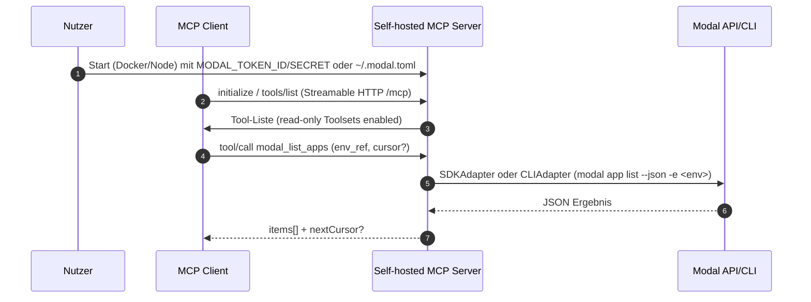
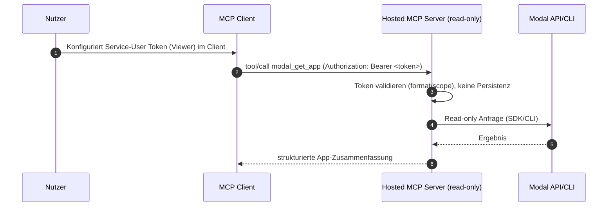
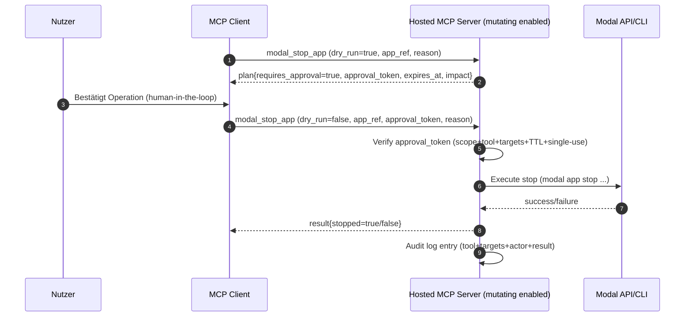

# Implementierungsspezifikation für einen Modal-fokussierten Remote MCP Server

## Executive Summary

Diese Spezifikation beschreibt einen **Modal-fokussierten Remote MCP Server** (Streamable HTTP) mit **Self-Hosting als primärem Betriebsmodell**. Kernidee: ein **kleines, gut kuratiertes Toolset** für die häufigsten Modal-Operativaufgaben (Discovery, Apps, Containers, Logs/Diagnostik, Volumes, Sandboxes) plus zwei **standardmäßig deaktivierte** Toolsets: **Change** (mutierende Ops) und **Expert** (token-effiziente „Code-Mode“-ähnliche Long-Tail-Abdeckung). Diese Architektur kombiniert die Stärken:

- **Toolset-Scoping + Read-only-prioritär** nach dem Muster des GitHub MCP Servers (Toolsets/Tools kombinierbar; Read-only überschreibt Write-Tools). citeturn17view2turn17view0  
- **Token-Effizienz via „Code Mode“-Prinzip** wie Cloudflare MCP (z. B. 2 Tools statt tausender Endpunkt-Tools; klare Token-Kostenargumente). citeturn18view3turn0search9  
- **Strukturiertes, high-signal Outputdesign** wie Playwright MCP (Accessibility-Snapshots statt „Rohdaten“ als Standard; übertragbar auf Logs/Diagnostik). citeturn19view0  
- **Produktisierung der Installation/Distribution** wie Exa MCP (Remote-URL-Setup, Parameter zur Tool-Auswahl/Erweiterung). citeturn2view3

**Empfohlene Implementierungssprache für v1:** **TypeScript/Node**, weil (a) die meisten großen, öffentlich sichtbaren MCP Server primär TypeScript nutzen (Cloudflare MCP, Playwright MCP, Exa MCP; MCP Referenz-Server-Repro hat TS als größten Anteil) und (b) Modal offiziell **JavaScript/TypeScript** (und Go) Client-SDKs anbietet, zusätzlich zu Python als primärer Build-Sprache für Modal Apps. citeturn3view3turn4view0turn3view7turn5view0turn14search19turn14search0turn13view0  
**Wichtig:** GitHubs offizieller MCP Server ist überwiegend **Go** (das ist ein starkes Signal für robuste Distribution als Binary), aber die Modal-spezifische SDK-Integration und die MCP-Ökosystemgewichtung sprechen für TypeScript als Solo-Dev-Default. citeturn3view0turn2view5turn14search0

**Security-/Trust-Default:**  
- v1: **self-hosted, read-only**, BYO Modal Token (`MODAL_TOKEN_ID`/`MODAL_TOKEN_SECRET`) oder `~/.modal.toml`. citeturn15search0  
- Hosted wird erst später empfohlen; falls hosted, dann **read-only** mit **ephemerer Token-Nutzung** und klarer Token-Policy (keine persistente Speicherung ohne Opt-in).  
- Mutierende Tools erfordern **Dry-Run** + **Approval Token** (kurzlebig, 1× nutzbar) + Audit Logging. Tool-Annotations (readOnlyHint, destructiveHint etc.) werden vollständig gesetzt, aber als **untrusted hints** behandelt (Policy wird serverseitig erzwungen). citeturn9view2turn8view0turn7view1

## Sprachwahl und Architekturprinzipien

### Empirie zur Sprachpopularität in großen öffentlichen MCP Servern

Stand **15. April 2026**:

- GitHubs offizieller MCP Server: **Go** dominierend (≈96%). citeturn3view0  
- Cloudflare MCP (Code Mode für Cloudflare API): **TypeScript** dominierend (≈98%). citeturn3view3turn18view3  
- Microsoft Playwright MCP: überwiegend **TypeScript** (plus CSS/JS, Dockerfile; v0.0.70 am 1. April 2026). citeturn4view0  
- Exa MCP Server: überwiegend **TypeScript**. citeturn3view7  
- ModelContextProtocol/servers (Referenz-Server-Sammlung): überwiegend **TypeScript** (≈69%) und **Python** (≈19%). citeturn5view0  

Damit ist TypeScript/Node die **häufigste Primärsprache** unter „major public MCP servers“ in Ihrer Liste, während Go besonders bei GitHub als „production-grade binary“ heraussticht. citeturn3view0turn3view3turn4view0turn3view7turn5view0

### Ecosystem-Fit für Modal

Modal dokumentiert: Python ist die **primäre Sprache** zum Bauen von Modal Apps/Funktionen; zugleich existieren offizielle SDKs für **JavaScript/TypeScript** und **Go**, u. a. für Funktionsaufrufe, Sandboxes und Ressourcenverwaltung. citeturn14search19turn14search0  
Die Modal TypeScript SDK beschreibt einen zentralen `ModalClient` mit Services wie `apps`, `sandboxes`, `volumes`, `secrets` usw. citeturn13view0

**Konsequenz:** TypeScript ist für einen Modal-fokussierten MCP Server technisch plausibel, ohne Python-Only zu sein. Für „Full coverage“ (z. B. CLI-Parität) bleibt ein CLI-Fallback sinnvoll, weil Modal CLI explizit operative Befehle für Apps/Containers/Volumes/Environments hat (inklusive JSON-Output). citeturn23view0turn24view0turn25view0turn22view0

### Architekturprinzipien, abgeleitet aus Cloudflare/GitHub/Playwright

- **Toolset-Minimierung / Token-Effizienz:** Cloudflare zeigt konkret, dass „jedes API-Endpunkt-als-Tool“ Kontextkosten explodieren lässt (z. B. ~2.594 Tools vs. 2 Tools in Code Mode; ~244k Tokens vs. ~1k Tokens). citeturn18view3turn0search9  
  → Unser Server nutzt **kuratiertes v1-Toolset** + optionales **Expert Toolset** (deaktiviert), das Long-Tail-Fälle abdeckt, ohne das Standard-Toolschema aufzublähen.

- **Toolsets + Read-only als harter Default:** GitHub kombiniert Tools, Toolsets und Dynamic Toolsets; „Read-only mode takes priority“. citeturn17view2turn17view0  
  → Unser Server implementiert ein **hartes Server-Policy-Layer**, das Write-Tools (Change/Expert-write) blockiert, sobald `readOnly=true` konfiguriert ist.

- **High-signal Outputs:** Playwright MCP arbeitet primär über **strukturierte Accessibility-Snapshots** statt Screenshots („no vision models required“) und ermöglicht dadurch robustere Agenteninteraktion. citeturn19view0  
  → Für Modal übertragen: Standardantworten liefern **strukturierte Zusammenfassungen** (Fehlersignaturen, Deploy-Deltas, Ressourcenstatus) statt „unformatierter CLI-Ausgabe“.

### Sprachvergleichstabelle

Die Tabelle bewertet **Go, Python, TypeScript/Node, Rust** für dieses Projekt (Remote MCP + Modal-Fokus, Self-hosting-first). Die Kriterien sind praxisorientiert für Solo-Entwicklung und Betrieb.

| Kriterium | Go | Python | TypeScript/Node | Rust |
|---|---|---|---|---|
| Ökosystem für MCP Server (SDKs, Middleware) | gut (GitHub-Server als Signal) citeturn3view0 | gut (offizielles Python SDK + FastMCP Beispiele) citeturn20view0 | sehr gut (offizielles TypeScript SDK inkl. Streamable HTTP & Auth Helpers, Express/Hono Middleware) citeturn2view5 | aufstrebend, aber weniger standardisiert im MCP Core-Ökosystem |
| Modal SDK Support | Go SDK vorhanden (Beta; offiziell) citeturn14search0turn13view0 | primär für Modal Apps/Funktionen citeturn14search19 | TS SDK vorhanden (offiziell) citeturn14search0turn13view0 | kein offizielles Modal SDK (typisch CLI/API-Fallback nötig) |
| Concurrency-Modell | Goroutines/channels (stark), einfache Parallelität | asyncio (gut, aber Pitfalls bei Blocking) | event loop (gut), Worker Threads optional | async/await (sehr stark), aber höhere Komplexität |
| Binary-Distribution | exzellent (single binary) → gut für self-hosting | schwächer (Interpreter/venv), Docker üblich | mittel (Node runtime), Docker üblich | exzellent (single binary) |
| Dependencies/Reife | sehr reif | sehr reif | sehr reif | reif, aber häufiger „sharp edges“ |
| Learning curve (Solo Dev) | niedrig-mittel | niedrig | niedrig-mittel | hoch |
| Community MCP Usage (aus major server Stichprobe) | sichtbar bei GitHub MCP Server citeturn3view0 | stark in Referenzservern (Anteil ~19%) citeturn5view0 | dominant in Cloudflare/Exa/Playwright & Referenzservern citeturn3view3turn4view0turn3view7turn5view0 | gering in „major public“ Beispielen |
| Empfehlung für Solo Dev (dieses Projekt) | gut, wenn Binary-first + wenig Modal-API-Komplexität | gut, wenn Python-first + FastMCP-Stack | **sehr gut**: Ökosystem + Modal TS SDK + MCP TS SDK | nur sinnvoll bei explizitem Rust-Fokus |

**Empfehlung:** **TypeScript/Node** für v1, mit einer klaren Adapter-Schicht (SDKAdapter+CliAdapter), um SDK-Gaps abzufedern. citeturn2view5turn14search0turn25view0turn24view0turn23view0

## Repository-Layout, Build und Release Automation

### Monorepo-Layout (TypeScript/Node, self-hosting-first)

Ziel: **ein Repo**, das (a) Docker/Compose Self-hosting, (b) optional Helm/Kubernetes, (c) optional Modal-Deploy und (d) später optional Cloudflare Workers Build (read-only subset) ermöglicht.

Empfohlenes Layout:

```text
modal-mcp-server/
  README.md
  SECURITY.md
  LICENSE
  CHANGELOG.md

  docs/
    architecture.md
    threat-model.md
    self-hosting.md
    hosted-service.md
    toolsets.md
    policy.md
    troubleshooting.md

  packages/
    server/
      src/
        index.ts
        http/
          mcpHandler.ts
          authMiddleware.ts
          requestContext.ts
          rateLimit.ts
        config/
          env.ts
          toolsetConfig.ts
          policyConfig.ts
        domain/
          refs.ts
          cursor.ts
          types.ts
          normalize.ts
          errors.ts
        toolsets/
          discovery.ts
          apps.ts
          containers.ts
          logs.ts
          volumes.ts
          sandboxes.ts
          change.ts          # compiled but disabled by default
          expert.ts          # compiled but disabled by default
        adapters/
          sdk/
            modalSdkAdapter.ts
          cli/
            modalCliAdapter.ts
            cliParsers.ts
        audit/
          auditLogger.ts
          approvalTokens.ts
          eventStore.ts
        observability/
          logger.ts
          metrics.ts
          tracing.ts
        util/
          redact.ts
          time.ts
          validation.ts
      test/
        unit/
        contract/
        fixtures/
        integration/
      package.json
      tsconfig.json

    cli/
      src/
        main.ts              # optional: local launcher / config helper
      package.json

  schema/
    mcp-tools.v1.json        # generated tool descriptors (input+output schema + annotations)
    mcp-tools.v1.md          # human readable snapshot (optional)

  deploy/
    docker/
      Dockerfile
      docker-compose.yml
      entrypoint.sh
    kubernetes/
      helm/
        Chart.yaml
        values.yaml
        templates/
          deployment.yaml
          service.yaml
          ingress.yaml
          configmap.yaml
          secret.yaml
    modal/
      app.py                 # optional: self-host on own Modal account (wrapper)
    cloudflare/
      worker.ts              # optional: read-only deployment target

  .github/
    workflows/
      ci.yml
      release.yml
      container.yml
      security.yml
```

### Tooling, CI und Release-Mechanik

**CI (GitHub Actions):**
- Lint/Format: ESLint + Prettier (fail-fast).
- Typing: `tsc --noEmit`.
- Unit Tests: Vitest/Jest.
- Contract Tests: Snapshot-Tests der Tool-Schemas (siehe unten).
- Security: Dependency Audit + SAST (z. B. CodeQL) + Container Scan (Trivy o. ä.).  
Als Referenz: große MCP Server Repos zeigen i. d. R. `.github/workflows` + Dockerfile im Repo (z. B. Playwright MCP). citeturn4view4

**Release:**
- Versionierung via Changesets (oder semantic-release).
- Artefakte:
  - NPM Package: `@your-scope/modal-mcp-server` (Self-hosting via `npx ...` analog zu MCP Referenzservern/Exa). citeturn5view0turn2view3turn19view0  
  - Container Image: `ghcr.io/<org>/modal-mcp-server:<version>` (Self-hosting default). (GitHub MCP Server nutzt GHCR als öffentliches Image). citeturn17view4
- Reproducible Build: Lockfile (pnpm/yarn/npm), SBOM optional.

**Self-hosting Credentials:**  
Modal Tokens werden entweder über `modal token set` in `~/.modal.toml` oder via env vars `MODAL_TOKEN_ID` / `MODAL_TOKEN_SECRET` gesetzt (env vars haben Vorrang). citeturn15search0turn15search1  
Das ist zentral, weil es ein konsistentes Betriebsmodell für Docker/K8s/Modal-Deploy erlaubt.

## MCP Toolsets und v1 Tool-Schemas

### MCP-Transport, Tool-Metadaten und Pagination als Designgrundlage

- Unser Server nutzt **Streamable HTTP** (HTTP POST/GET; optional SSE für Server-zu-Client Streaming). citeturn1search2  
- Tool-Definitionen folgen dem MCP Schema: `inputSchema` ist Pflicht; `outputSchema` ist optional und beschreibt die Struktur in `structuredContent` eines Tool-Results; Tool-`annotations` enthalten u. a. `readOnlyHint`, `destructiveHint`, `idempotentHint`, `openWorldHint`. citeturn9view0turn9view1turn8view0turn8view3  
- Tool-Annotations sind **nur hints**; Clients dürfen sie bei untrusted Servern nicht als Security-Garantie nutzen. citeturn9view2  
- Für List-Operationen verwenden wir **cursor-basierte Pagination** (opaque cursor; Client darf keine feste Page-Size annehmen). citeturn6search3turn9view5turn9view3

### Gemeinsame Typen für v1 (Refs, Cursor, Zeitfenster)

**Opaque Refs** (server-signierte Tokens) sind der Standard. Sie kapseln native IDs (z. B. App ID) und Scope (Workspace/Environment) und verhindern, dass Clients IDs „raten“ oder versehentlich cross-environment operieren.

- `Ref` Format: `mref1.<payload_b64url>.<sig_b64url>`  
- `Cursor` Format: `mc1.<payload_b64url>.<sig_b64url>`  

(Implementationsdetails: HMAC-SHA256 über payload mit `MCP_SIGNING_KEY`; payload enthält minimal notwendige Felder, z. B. `{k:"app", id:"ap-...", env:"prod"}`.)

### Tool-Übersichtstabelle (v1)

Die Tabelle listet Tools pro Toolset. Annotations folgen dem MCP Schema (siehe oben). citeturn8view0turn9view1turn9view2  

| Tool | Toolset | Zweck | Inputs (Kurz) | Outputs (Kurz) | Annotations (Kurz) |
|---|---|---|---|---|---|
| `modal_whoami` | Discovery | Prüft Credentials, zeigt Workspace/Env-Kontext | optional `workspace_ref` | `actor`, `workspaces[]`, `policy` | readOnly=true, openWorld=true |
| `modal_list_workspaces` | Discovery | Listet Workspaces | `cursor?` | `items[]`, `nextCursor?` | readOnly=true |
| `modal_list_environments` | Discovery | Listet Environments eines Workspace | `workspace_ref`, `cursor?` | `items[]`, `nextCursor?` | readOnly=true |
| `modal_get_environment` | Discovery | Environment Summary | `environment_ref` | `environment` | readOnly=true |
| `modal_list_apps` | Apps | Listet Apps (deployed/running/recent) | `environment_ref`, Filter, `cursor?` | `items[]`, `nextCursor?` | readOnly=true |
| `modal_get_app` | Apps | App Summary | `app_ref` | `app` | readOnly=true |
| `modal_list_app_deployments` | Apps | Deployment-History | `app_ref`, `cursor?` | `items[]`, `nextCursor?` | readOnly=true |
| `modal_get_app_logs` | Apps | App-Logs (tail/search/timerange) | `app_ref`, `tail?`, `since?`, `until?`, `search?`, `cursor?` | `entries[]`, `nextCursor?`, `summary` | readOnly=true |
| `modal_list_containers` | Containers | Listet laufende Container | `environment_ref`, optional `app_ref`, `cursor?` | `items[]`, `nextCursor?` | readOnly=true |
| `modal_get_container` | Containers | Container Summary | `container_ref` | `container` | readOnly=true |
| `modal_get_container_logs` | Containers | Container Logs | `container_ref`, Log-Filter, `cursor?` | `entries[]`, `nextCursor?`, `summary` | readOnly=true |
| `modal_search_logs` | Logs/Diag | Suche über Logs (App+Container optional) | `environment_ref`, `query`, Scopes, `cursor?` | `matches[]`, `nextCursor?` | readOnly=true |
| `modal_summarize_failures` | Logs/Diag | Gruppiert Error-Signaturen | `app_ref`, optional Zeitfenster | `signatures[]`, `top_causes[]` | readOnly=true |
| `modal_compare_deployments` | Logs/Diag | Diff zweier Deployments | `deployment_ref_a`, `deployment_ref_b` | `diff` | readOnly=true |
| `modal_diagnose_app_startup` | Logs/Diag | Diagnose Startprobleme | `app_ref`, optional `since` | `diagnosis`, `evidence[]` | readOnly=true |
| `modal_list_volumes` | Volumes | Listet Volumes | `environment_ref`, `cursor?` | `items[]`, `nextCursor?` | readOnly=true |
| `modal_ls_volume` | Volumes | Listet Pfad in Volume | `volume_ref`, `path?`, `cursor?` | `entries[]`, `nextCursor?` | readOnly=true |
| `modal_read_volume_text` | Volumes | Liest Textdatei (safe-capped) | `volume_ref`, `path`, `max_bytes?` | `content`, `truncated` | readOnly=true |
| `modal_stat_volume_path` | Volumes | Metadaten zu Pfad | `volume_ref`, `path` | `stat` | readOnly=true |
| `modal_list_sandboxes` | Sandboxes | Listet Sandboxes | `environment_ref`, Filter, `cursor?` | `items[]`, `nextCursor?` | readOnly=true |
| `modal_get_sandbox` | Sandboxes | Sandbox Summary | `sandbox_ref` | `sandbox` | readOnly=true |
| `modal_get_sandbox_stdio` | Sandboxes | Stdout/Stderr tail (wenn verfügbar) | `sandbox_ref`, `tail_bytes?` | `stdout`, `stderr`, `truncated` | readOnly=true |
| `modal_stop_app` | Change (off) | Stoppt App (destruktiv) | `app_ref`, `dry_run`, `approval_token?` | `plan` oder `result` | readOnly=false, destructive=true |
| `modal_rollback_app` | Change (off) | Rollback Deployment | `app_ref`, `target_version?`, `dry_run`, `approval_token?` | `plan` oder `result` | readOnly=false, destructive=false |
| `modal_stop_container` | Change (off) | Stoppt Container (SIGINT) | `container_ref`, `dry_run`, `approval_token?` | `plan` oder `result` | readOnly=false, destructive=true |
| `modal_terminate_sandbox` | Change (off) | Terminiert Sandbox | `sandbox_ref`, `dry_run`, `approval_token?` | `plan` oder `result` | readOnly=false, destructive=true |
| `modal_expert_search` | Expert (off) | Sucht „Operationen“/Capabilities | `text`, optional Scope | `operations[]` | readOnly=true |
| `modal_expert_execute` | Expert (off) | Führt „Plan/DSL“ aus | `program`, Scope, `dry_run?`, `approval_token?` | `result` | readOnly=true (v1), später write möglich |

**Hinweis zu Modal-Op-Definitionen (CLI-Parität):** Die Grundlage für App/Container/Volume/Environment Ops ist im Modal CLI dokumentiert (z. B. `modal app list/logs/rollback/stop/history`, `modal container list/logs/exec/stop`, `modal volume list/ls/...`, `modal environment list/...`). citeturn23view0turn24view0turn25view0turn22view0  
Zusätzlich beschreibt Modal, dass „Stop app“ destruktiv ist und Apps nicht „restartbar“ sind. citeturn11view2

### Exakte v1 Tool Schemas (MCP Tool Descriptors)

Unten sind die **exakten** Tool-Descriptors (Name/Description/InputSchema/OutputSchema/Annotations) als JSON (komprimiert, aber vollständig felddefiniert). Diese Struktur basiert direkt auf dem MCP Schema: `inputSchema` Pflicht; `outputSchema` optional; `annotations` mit hints. citeturn9view0turn9view1turn8view0turn9view2

```json
{
  "version": "v1",
  "common": {
    "Ref": {
      "type": "string",
      "description": "Opaque, server-signed reference token. Do not parse.",
      "pattern": "^mref1\\.[A-Za-z0-9_-]+\\.[A-Za-z0-9_-]+$"
    },
    "Cursor": {
      "type": "string",
      "description": "Opaque pagination cursor. Do not parse.",
      "pattern": "^mc1\\.[A-Za-z0-9_-]+\\.[A-Za-z0-9_-]+$"
    },
    "IsoOrRelativeTime": {
      "type": "string",
      "description": "ISO 8601/RFC3339 timestamp or relative duration like 2h, 30m, 1d.",
      "anyOf": [
        { "format": "date-time" },
        { "pattern": "^[0-9]+(s|m|h|d|w)$" }
      ]
    }
  },
  "tools": [
    {
      "name": "modal_whoami",
      "description": "Validate the current Modal credentials and return the accessible workspace/environment context plus server policy (readOnly/toolsets).",
      "inputSchema": {
        "type": "object",
        "properties": {
          "workspace_ref": { "$ref": "#/common/Ref" }
        },
        "required": []
      },
      "outputSchema": {
        "type": "object",
        "properties": {
          "actor": {
            "type": "object",
            "properties": {
              "kind": { "type": "string", "enum": ["account_token", "service_user_token", "unknown"] },
              "display": { "type": "string" }
            },
            "required": ["kind", "display"]
          },
          "workspaces": {
            "type": "array",
            "items": {
              "type": "object",
              "properties": {
                "workspace_ref": { "$ref": "#/common/Ref" },
                "name": { "type": "string" },
                "type": { "type": "string", "enum": ["personal", "shared", "unknown"] }
              },
              "required": ["workspace_ref", "name", "type"]
            }
          },
          "active": {
            "type": "object",
            "properties": {
              "workspace_ref": { "$ref": "#/common/Ref" },
              "environment_ref": { "$ref": "#/common/Ref" }
            },
            "required": []
          },
          "policy": {
            "type": "object",
            "properties": {
              "read_only": { "type": "boolean" },
              "enabled_toolsets": { "type": "array", "items": { "type": "string" } },
              "disabled_toolsets": { "type": "array", "items": { "type": "string" } }
            },
            "required": ["read_only", "enabled_toolsets", "disabled_toolsets"]
          }
        },
        "required": ["actor", "workspaces", "policy"]
      },
      "annotations": { "title": "Modal: Who am I?", "readOnlyHint": true, "openWorldHint": true }
    },

    {
      "name": "modal_list_workspaces",
      "description": "List Modal workspaces accessible under the current credentials (paginated).",
      "inputSchema": {
        "type": "object",
        "properties": { "cursor": { "$ref": "#/common/Cursor" } },
        "required": []
      },
      "outputSchema": {
        "type": "object",
        "properties": {
          "items": { "type": "array", "items": { "type": "object",
            "properties": {
              "workspace_ref": { "$ref": "#/common/Ref" },
              "name": { "type": "string" },
              "type": { "type": "string", "enum": ["personal", "shared", "unknown"] }
            },
            "required": ["workspace_ref", "name", "type"]
          }},
          "nextCursor": { "$ref": "#/common/Cursor" }
        },
        "required": ["items"]
      },
      "annotations": { "title": "Modal: List workspaces", "readOnlyHint": true, "openWorldHint": true }
    },

    {
      "name": "modal_list_environments",
      "description": "List environments in a workspace (paginated).",
      "inputSchema": {
        "type": "object",
        "properties": {
          "workspace_ref": { "$ref": "#/common/Ref" },
          "cursor": { "$ref": "#/common/Cursor" }
        },
        "required": ["workspace_ref"]
      },
      "outputSchema": {
        "type": "object",
        "properties": {
          "items": { "type": "array", "items": { "type": "object",
            "properties": {
              "environment_ref": { "$ref": "#/common/Ref" },
              "name": { "type": "string" },
              "is_restricted": { "type": "boolean" }
            },
            "required": ["environment_ref", "name", "is_restricted"]
          }},
          "nextCursor": { "$ref": "#/common/Cursor" }
        },
        "required": ["items"]
      },
      "annotations": { "title": "Modal: List environments", "readOnlyHint": true, "openWorldHint": true }
    },

    {
      "name": "modal_get_environment",
      "description": "Get environment details (including whether it is restricted) and safe operational hints.",
      "inputSchema": {
        "type": "object",
        "properties": { "environment_ref": { "$ref": "#/common/Ref" } },
        "required": ["environment_ref"]
      },
      "outputSchema": {
        "type": "object",
        "properties": {
          "environment": { "type": "object",
            "properties": {
              "environment_ref": { "$ref": "#/common/Ref" },
              "name": { "type": "string" },
              "is_restricted": { "type": "boolean" },
              "notes": { "type": "string" }
            },
            "required": ["environment_ref", "name", "is_restricted"]
          }
        },
        "required": ["environment"]
      },
      "annotations": { "title": "Modal: Get environment", "readOnlyHint": true, "openWorldHint": true }
    },

    {
      "name": "modal_list_apps",
      "description": "List deployed/running or recently stopped apps in an environment (paginated). Mirrors modal app list semantics safely.",
      "inputSchema": {
        "type": "object",
        "properties": {
          "environment_ref": { "$ref": "#/common/Ref" },
          "status": { "type": "string", "enum": ["deployed", "running", "stopped", "any"], "default": "any" },
          "search": { "type": "string" },
          "cursor": { "$ref": "#/common/Cursor" }
        },
        "required": ["environment_ref"]
      },
      "outputSchema": {
        "type": "object",
        "properties": {
          "items": { "type": "array", "items": { "type": "object",
            "properties": {
              "app_ref": { "$ref": "#/common/Ref" },
              "name": { "type": "string" },
              "state": { "type": "string" },
              "last_deploy_time": { "type": "string", "format": "date-time" }
            },
            "required": ["app_ref", "name", "state"]
          }},
          "nextCursor": { "$ref": "#/common/Cursor" }
        },
        "required": ["items"]
      },
      "annotations": { "title": "Modal: List apps", "readOnlyHint": true, "openWorldHint": true }
    },

    {
      "name": "modal_get_app",
      "description": "Get a compact operational summary of an app: state, last deployments, endpoints (if available), and container counts.",
      "inputSchema": {
        "type": "object",
        "properties": { "app_ref": { "$ref": "#/common/Ref" } },
        "required": ["app_ref"]
      },
      "outputSchema": {
        "type": "object",
        "properties": {
          "app": { "type": "object",
            "properties": {
              "app_ref": { "$ref": "#/common/Ref" },
              "name": { "type": "string" },
              "state": { "type": "string" },
              "active_container_count": { "type": "integer", "minimum": 0 },
              "latest_deployment_ref": { "$ref": "#/common/Ref" }
            },
            "required": ["app_ref", "name", "state"]
          }
        },
        "required": ["app"]
      },
      "annotations": { "title": "Modal: Get app", "readOnlyHint": true, "openWorldHint": true }
    },

    {
      "name": "modal_list_app_deployments",
      "description": "List deployments (history) for an app (paginated).",
      "inputSchema": {
        "type": "object",
        "properties": {
          "app_ref": { "$ref": "#/common/Ref" },
          "cursor": { "$ref": "#/common/Cursor" }
        },
        "required": ["app_ref"]
      },
      "outputSchema": {
        "type": "object",
        "properties": {
          "items": { "type": "array", "items": { "type": "object",
            "properties": {
              "deployment_ref": { "$ref": "#/common/Ref" },
              "version": { "type": "integer", "minimum": 0 },
              "created_at": { "type": "string", "format": "date-time" },
              "trigger": { "type": "string", "enum": ["deploy", "rollback", "unknown"] }
            },
            "required": ["deployment_ref", "version", "created_at", "trigger"]
          }},
          "nextCursor": { "$ref": "#/common/Cursor" }
        },
        "required": ["items"]
      },
      "annotations": { "title": "Modal: List app deployments", "readOnlyHint": true, "openWorldHint": true }
    },

    {
      "name": "modal_get_app_logs",
      "description": "Fetch app logs with search + time range + tail, returning structured entries and summarized error signatures. Default is non-streaming.",
      "inputSchema": {
        "type": "object",
        "properties": {
          "app_ref": { "$ref": "#/common/Ref" },
          "tail": { "type": "integer", "minimum": 1, "maximum": 5000, "default": 200 },
          "since": { "$ref": "#/common/IsoOrRelativeTime" },
          "until": { "$ref": "#/common/IsoOrRelativeTime" },
          "search": { "type": "string" },
          "cursor": { "$ref": "#/common/Cursor" }
        },
        "required": ["app_ref"]
      },
      "outputSchema": {
        "type": "object",
        "properties": {
          "entries": { "type": "array", "items": { "type": "object",
            "properties": {
              "ts": { "type": "string", "format": "date-time" },
              "source": { "type": "string", "enum": ["stdout", "stderr", "system", "unknown"] },
              "message": { "type": "string" },
              "container_ref": { "$ref": "#/common/Ref" }
            },
            "required": ["ts", "message"]
          }},
          "summary": { "type": "object",
            "properties": {
              "error_signatures": { "type": "array", "items": { "type": "string" } },
              "top_sources": { "type": "array", "items": { "type": "string" } }
            },
            "required": ["error_signatures"]
          },
          "nextCursor": { "$ref": "#/common/Cursor" }
        },
        "required": ["entries", "summary"]
      },
      "annotations": { "title": "Modal: Get app logs", "readOnlyHint": true, "openWorldHint": true }
    },

    {
      "name": "modal_list_containers",
      "description": "List running containers (optionally filtered by app) in an environment (paginated). Mirrors modal container list semantics safely.",
      "inputSchema": {
        "type": "object",
        "properties": {
          "environment_ref": { "$ref": "#/common/Ref" },
          "app_ref": { "$ref": "#/common/Ref" },
          "cursor": { "$ref": "#/common/Cursor" }
        },
        "required": ["environment_ref"]
      },
      "outputSchema": {
        "type": "object",
        "properties": {
          "items": { "type": "array", "items": { "type": "object",
            "properties": {
              "container_ref": { "$ref": "#/common/Ref" },
              "state": { "type": "string" },
              "app_ref": { "$ref": "#/common/Ref" },
              "started_at": { "type": "string", "format": "date-time" }
            },
            "required": ["container_ref", "state"]
          }},
          "nextCursor": { "$ref": "#/common/Cursor" }
        },
        "required": ["items"]
      },
      "annotations": { "title": "Modal: List containers", "readOnlyHint": true, "openWorldHint": true }
    },

    {
      "name": "modal_get_container",
      "description": "Get container summary (scope-safe).",
      "inputSchema": {
        "type": "object",
        "properties": { "container_ref": { "$ref": "#/common/Ref" } },
        "required": ["container_ref"]
      },
      "outputSchema": {
        "type": "object",
        "properties": {
          "container": { "type": "object",
            "properties": {
              "container_ref": { "$ref": "#/common/Ref" },
              "state": { "type": "string" },
              "app_ref": { "$ref": "#/common/Ref" }
            },
            "required": ["container_ref", "state"]
          }
        },
        "required": ["container"]
      },
      "annotations": { "title": "Modal: Get container", "readOnlyHint": true, "openWorldHint": true }
    },

    {
      "name": "modal_get_container_logs",
      "description": "Fetch container logs with search + time range + tail. Default is non-streaming.",
      "inputSchema": {
        "type": "object",
        "properties": {
          "container_ref": { "$ref": "#/common/Ref" },
          "tail": { "type": "integer", "minimum": 1, "maximum": 5000, "default": 200 },
          "since": { "$ref": "#/common/IsoOrRelativeTime" },
          "until": { "$ref": "#/common/IsoOrRelativeTime" },
          "search": { "type": "string" },
          "cursor": { "$ref": "#/common/Cursor" }
        },
        "required": ["container_ref"]
      },
      "outputSchema": {
        "type": "object",
        "properties": {
          "entries": { "type": "array", "items": { "type": "object",
            "properties": {
              "ts": { "type": "string", "format": "date-time" },
              "source": { "type": "string", "enum": ["stdout", "stderr", "system", "unknown"] },
              "message": { "type": "string" }
            },
            "required": ["ts", "message"]
          }},
          "summary": { "type": "object",
            "properties": { "error_signatures": { "type": "array", "items": { "type": "string" } } },
            "required": ["error_signatures"]
          },
          "nextCursor": { "$ref": "#/common/Cursor" }
        },
        "required": ["entries", "summary"]
      },
      "annotations": { "title": "Modal: Get container logs", "readOnlyHint": true, "openWorldHint": true }
    },

    {
      "name": "modal_search_logs",
      "description": "Search logs within an environment (and optional app/container scope) and return matching lines grouped by signature.",
      "inputSchema": {
        "type": "object",
        "properties": {
          "environment_ref": { "$ref": "#/common/Ref" },
          "query": { "type": "string", "minLength": 1 },
          "app_ref": { "$ref": "#/common/Ref" },
          "container_ref": { "$ref": "#/common/Ref" },
          "since": { "$ref": "#/common/IsoOrRelativeTime" },
          "until": { "$ref": "#/common/IsoOrRelativeTime" },
          "cursor": { "$ref": "#/common/Cursor" }
        },
        "required": ["environment_ref", "query"]
      },
      "outputSchema": {
        "type": "object",
        "properties": {
          "matches": { "type": "array", "items": { "type": "object",
            "properties": {
              "ts": { "type": "string", "format": "date-time" },
              "message": { "type": "string" },
              "signature": { "type": "string" },
              "app_ref": { "$ref": "#/common/Ref" },
              "container_ref": { "$ref": "#/common/Ref" }
            },
            "required": ["ts", "message", "signature"]
          }},
          "nextCursor": { "$ref": "#/common/Cursor" }
        },
        "required": ["matches"]
      },
      "annotations": { "title": "Modal: Search logs", "readOnlyHint": true, "openWorldHint": true }
    },

    {
      "name": "modal_summarize_failures",
      "description": "Summarize failure patterns for an app over a time window. Produces grouped signatures + ranked causes + minimal evidence pointers.",
      "inputSchema": {
        "type": "object",
        "properties": {
          "app_ref": { "$ref": "#/common/Ref" },
          "since": { "$ref": "#/common/IsoOrRelativeTime" },
          "until": { "$ref": "#/common/IsoOrRelativeTime" }
        },
        "required": ["app_ref"]
      },
      "outputSchema": {
        "type": "object",
        "properties": {
          "signatures": { "type": "array", "items": { "type": "object",
            "properties": {
              "signature": { "type": "string" },
              "count": { "type": "integer", "minimum": 1 },
              "sample_messages": { "type": "array", "items": { "type": "string" }, "maxItems": 3 }
            },
            "required": ["signature", "count"]
          }},
          "top_causes": { "type": "array", "items": { "type": "string" } }
        },
        "required": ["signatures", "top_causes"]
      },
      "annotations": { "title": "Modal: Summarize failures", "readOnlyHint": true, "openWorldHint": true }
    },

    {
      "name": "modal_compare_deployments",
      "description": "Compare two deployments and return a structured diff: container churn, new error signatures, behavioral changes inferred from logs.",
      "inputSchema": {
        "type": "object",
        "properties": {
          "deployment_ref_a": { "$ref": "#/common/Ref" },
          "deployment_ref_b": { "$ref": "#/common/Ref" }
        },
        "required": ["deployment_ref_a", "deployment_ref_b"]
      },
      "outputSchema": {
        "type": "object",
        "properties": {
          "diff": { "type": "object",
            "properties": {
              "new_error_signatures": { "type": "array", "items": { "type": "string" } },
              "resolved_error_signatures": { "type": "array", "items": { "type": "string" } },
              "container_delta": { "type": "integer" }
            },
            "required": ["new_error_signatures", "resolved_error_signatures", "container_delta"]
          }
        },
        "required": ["diff"]
      },
      "annotations": { "title": "Modal: Compare deployments", "readOnlyHint": true, "openWorldHint": true }
    },

    {
      "name": "modal_diagnose_app_startup",
      "description": "Diagnose common app startup failures: image/build aborts, cold start failures, crashes, permission issues, missing secrets/volumes, etc.",
      "inputSchema": {
        "type": "object",
        "properties": {
          "app_ref": { "$ref": "#/common/Ref" },
          "since": { "$ref": "#/common/IsoOrRelativeTime" }
        },
        "required": ["app_ref"]
      },
      "outputSchema": {
        "type": "object",
        "properties": {
          "diagnosis": { "type": "object",
            "properties": {
              "summary": { "type": "string" },
              "confidence": { "type": "number", "minimum": 0, "maximum": 1 },
              "recommended_next_tools": { "type": "array", "items": { "type": "string" } }
            },
            "required": ["summary", "confidence", "recommended_next_tools"]
          },
          "evidence": { "type": "array", "items": { "type": "object",
            "properties": {
              "kind": { "type": "string", "enum": ["log", "deployment", "container"] },
              "ref": { "$ref": "#/common/Ref" },
              "note": { "type": "string" }
            },
            "required": ["kind", "ref"]
          }}
        },
        "required": ["diagnosis", "evidence"]
      },
      "annotations": { "title": "Modal: Diagnose app startup", "readOnlyHint": true, "openWorldHint": true }
    },

    {
      "name": "modal_list_volumes",
      "description": "List volumes in an environment (paginated). Mirrors modal volume list --json.",
      "inputSchema": {
        "type": "object",
        "properties": {
          "environment_ref": { "$ref": "#/common/Ref" },
          "cursor": { "$ref": "#/common/Cursor" }
        },
        "required": ["environment_ref"]
      },
      "outputSchema": {
        "type": "object",
        "properties": {
          "items": { "type": "array", "items": { "type": "object",
            "properties": {
              "volume_ref": { "$ref": "#/common/Ref" },
              "name": { "type": "string" }
            },
            "required": ["volume_ref", "name"]
          }},
          "nextCursor": { "$ref": "#/common/Cursor" }
        },
        "required": ["items"]
      },
      "annotations": { "title": "Modal: List volumes", "readOnlyHint": true, "openWorldHint": true }
    },

    {
      "name": "modal_ls_volume",
      "description": "List files/directories in a volume path (paginated). Mirrors modal volume ls --json.",
      "inputSchema": {
        "type": "object",
        "properties": {
          "volume_ref": { "$ref": "#/common/Ref" },
          "path": { "type": "string", "default": "/" },
          "cursor": { "$ref": "#/common/Cursor" }
        },
        "required": ["volume_ref"]
      },
      "outputSchema": {
        "type": "object",
        "properties": {
          "entries": { "type": "array", "items": { "type": "object",
            "properties": {
              "path": { "type": "string" },
              "type": { "type": "string", "enum": ["file", "dir", "unknown"] },
              "size_bytes": { "type": "integer", "minimum": 0 }
            },
            "required": ["path", "type"]
          }},
          "nextCursor": { "$ref": "#/common/Cursor" }
        },
        "required": ["entries"]
      },
      "annotations": { "title": "Modal: Volume ls", "readOnlyHint": true, "openWorldHint": true }
    },

    {
      "name": "modal_read_volume_text",
      "description": "Read a text file from a volume with size caps and safe decoding. For large files use CLI download directly; this tool is for diagnosis only.",
      "inputSchema": {
        "type": "object",
        "properties": {
          "volume_ref": { "$ref": "#/common/Ref" },
          "path": { "type": "string" },
          "max_bytes": { "type": "integer", "minimum": 1, "maximum": 1048576, "default": 262144 }
        },
        "required": ["volume_ref", "path"]
      },
      "outputSchema": {
        "type": "object",
        "properties": {
          "content": { "type": "string" },
          "truncated": { "type": "boolean" }
        },
        "required": ["content", "truncated"]
      },
      "annotations": { "title": "Modal: Read volume text", "readOnlyHint": true, "openWorldHint": true }
    },

    {
      "name": "modal_stat_volume_path",
      "description": "Return stat-like metadata for a volume path (exists/type/size).",
      "inputSchema": {
        "type": "object",
        "properties": {
          "volume_ref": { "$ref": "#/common/Ref" },
          "path": { "type": "string" }
        },
        "required": ["volume_ref", "path"]
      },
      "outputSchema": {
        "type": "object",
        "properties": {
          "stat": { "type": "object",
            "properties": {
              "exists": { "type": "boolean" },
              "type": { "type": "string", "enum": ["file", "dir", "unknown"] },
              "size_bytes": { "type": "integer", "minimum": 0 }
            },
            "required": ["exists", "type"]
          }
        },
        "required": ["stat"]
      },
      "annotations": { "title": "Modal: Stat volume path", "readOnlyHint": true, "openWorldHint": true }
    },

    {
      "name": "modal_list_sandboxes",
      "description": "List sandboxes in an environment (paginated).",
      "inputSchema": {
        "type": "object",
        "properties": {
          "environment_ref": { "$ref": "#/common/Ref" },
          "search": { "type": "string" },
          "cursor": { "$ref": "#/common/Cursor" }
        },
        "required": ["environment_ref"]
      },
      "outputSchema": {
        "type": "object",
        "properties": {
          "items": { "type": "array", "items": { "type": "object",
            "properties": {
              "sandbox_ref": { "$ref": "#/common/Ref" },
              "state": { "type": "string" },
              "created_at": { "type": "string", "format": "date-time" }
            },
            "required": ["sandbox_ref", "state"]
          }},
          "nextCursor": { "$ref": "#/common/Cursor" }
        },
        "required": ["items"]
      },
      "annotations": { "title": "Modal: List sandboxes", "readOnlyHint": true, "openWorldHint": true }
    },

    {
      "name": "modal_get_sandbox",
      "description": "Get sandbox summary. Sandboxes are secure containers; the underlying API is similar to asyncio.subprocess.Process (conceptually).",
      "inputSchema": {
        "type": "object",
        "properties": { "sandbox_ref": { "$ref": "#/common/Ref" } },
        "required": ["sandbox_ref"]
      },
      "outputSchema": {
        "type": "object",
        "properties": {
          "sandbox": { "type": "object",
            "properties": {
              "sandbox_ref": { "$ref": "#/common/Ref" },
              "state": { "type": "string" }
            },
            "required": ["sandbox_ref", "state"]
          }
        },
        "required": ["sandbox"]
      },
      "annotations": { "title": "Modal: Get sandbox", "readOnlyHint": true, "openWorldHint": true }
    },

    {
      "name": "modal_get_sandbox_stdio",
      "description": "Fetch recent stdout/stderr for a sandbox if available (best-effort). For command execution, use Sandbox.exec via SDK or enable Change/Expert modes.",
      "inputSchema": {
        "type": "object",
        "properties": {
          "sandbox_ref": { "$ref": "#/common/Ref" },
          "tail_bytes": { "type": "integer", "minimum": 1, "maximum": 65536, "default": 8192 }
        },
        "required": ["sandbox_ref"]
      },
      "outputSchema": {
        "type": "object",
        "properties": {
          "stdout": { "type": "string" },
          "stderr": { "type": "string" },
          "truncated": { "type": "boolean" }
        },
        "required": ["stdout", "stderr", "truncated"]
      },
      "annotations": { "title": "Modal: Sandbox stdio", "readOnlyHint": true, "openWorldHint": true }
    },

    {
      "name": "modal_stop_app",
      "description": "Stop an app. Destructive: stopped apps cannot be restarted; a new deployment is required. Requires dry_run first and a valid approval_token for execution.",
      "inputSchema": {
        "type": "object",
        "properties": {
          "app_ref": { "$ref": "#/common/Ref" },
          "dry_run": { "type": "boolean", "default": true },
          "approval_token": { "type": "string" },
          "reason": { "type": "string" }
        },
        "required": ["app_ref", "dry_run"]
      },
      "outputSchema": {
        "type": "object",
        "properties": {
          "mode": { "type": "string", "enum": ["plan", "executed"] },
          "plan": { "type": "object",
            "properties": {
              "requires_approval": { "type": "boolean" },
              "approval_token": { "type": "string" },
              "expires_at": { "type": "string", "format": "date-time" },
              "impact": { "type": "string" }
            },
            "required": ["requires_approval", "impact"]
          },
          "result": { "type": "object",
            "properties": {
              "stopped": { "type": "boolean" },
              "message": { "type": "string" }
            },
            "required": ["stopped"]
          }
        },
        "required": ["mode"]
      },
      "annotations": { "title": "Modal: Stop app", "readOnlyHint": false, "destructiveHint": true, "idempotentHint": true, "openWorldHint": true }
    },

    {
      "name": "modal_rollback_app",
      "description": "Rollback an app to a prior version (creates a new rollback deployment). Requires dry_run first and approval_token for execution.",
      "inputSchema": {
        "type": "object",
        "properties": {
          "app_ref": { "$ref": "#/common/Ref" },
          "target_version": { "type": "integer", "minimum": 0 },
          "dry_run": { "type": "boolean", "default": true },
          "approval_token": { "type": "string" },
          "reason": { "type": "string" }
        },
        "required": ["app_ref", "dry_run"]
      },
      "outputSchema": {
        "type": "object",
        "properties": {
          "mode": { "type": "string", "enum": ["plan", "executed"] },
          "plan": { "type": "object",
            "properties": {
              "requires_approval": { "type": "boolean" },
              "approval_token": { "type": "string" },
              "expires_at": { "type": "string", "format": "date-time" },
              "selected_version": { "type": "integer" },
              "impact": { "type": "string" }
            },
            "required": ["requires_approval", "selected_version", "impact"]
          },
          "result": { "type": "object",
            "properties": {
              "rolled_back": { "type": "boolean" },
              "new_deployment_ref": { "$ref": "#/common/Ref" }
            },
            "required": ["rolled_back"]
          }
        },
        "required": ["mode"]
      },
      "annotations": { "title": "Modal: Rollback app", "readOnlyHint": false, "destructiveHint": false, "idempotentHint": false, "openWorldHint": true }
    },

    {
      "name": "modal_stop_container",
      "description": "Stop a running container (SIGINT) and reassign in-progress inputs. Requires dry_run first and approval_token for execution.",
      "inputSchema": {
        "type": "object",
        "properties": {
          "container_ref": { "$ref": "#/common/Ref" },
          "dry_run": { "type": "boolean", "default": true },
          "approval_token": { "type": "string" },
          "reason": { "type": "string" }
        },
        "required": ["container_ref", "dry_run"]
      },
      "outputSchema": {
        "type": "object",
        "properties": {
          "mode": { "type": "string", "enum": ["plan", "executed"] },
          "plan": { "type": "object",
            "properties": {
              "requires_approval": { "type": "boolean" },
              "approval_token": { "type": "string" },
              "expires_at": { "type": "string", "format": "date-time" },
              "impact": { "type": "string" }
            },
            "required": ["requires_approval", "impact"]
          },
          "result": { "type": "object",
            "properties": { "stopped": { "type": "boolean" } },
            "required": ["stopped"]
          }
        },
        "required": ["mode"]
      },
      "annotations": { "title": "Modal: Stop container", "readOnlyHint": false, "destructiveHint": true, "idempotentHint": true, "openWorldHint": true }
    },

    {
      "name": "modal_terminate_sandbox",
      "description": "Terminate a sandbox. Requires dry_run first and approval_token for execution.",
      "inputSchema": {
        "type": "object",
        "properties": {
          "sandbox_ref": { "$ref": "#/common/Ref" },
          "dry_run": { "type": "boolean", "default": true },
          "approval_token": { "type": "string" },
          "reason": { "type": "string" }
        },
        "required": ["sandbox_ref", "dry_run"]
      },
      "outputSchema": {
        "type": "object",
        "properties": {
          "mode": { "type": "string", "enum": ["plan", "executed"] },
          "plan": { "type": "object",
            "properties": {
              "requires_approval": { "type": "boolean" },
              "approval_token": { "type": "string" },
              "expires_at": { "type": "string", "format": "date-time" },
              "impact": { "type": "string" }
            },
            "required": ["requires_approval", "impact"]
          },
          "result": { "type": "object",
            "properties": { "terminated": { "type": "boolean" } },
            "required": ["terminated"]
          }
        },
        "required": ["mode"]
      },
      "annotations": { "title": "Modal: Terminate sandbox", "readOnlyHint": false, "destructiveHint": true, "idempotentHint": true, "openWorldHint": true }
    },

    {
      "name": "modal_expert_search",
      "description": "Expert mode: search supported operations/capabilities (token-efficient). Inspired by Code Mode patterns (search/execute).",
      "inputSchema": {
        "type": "object",
        "properties": {
          "text": { "type": "string", "minLength": 1 },
          "environment_ref": { "$ref": "#/common/Ref" }
        },
        "required": ["text"]
      },
      "outputSchema": {
        "type": "object",
        "properties": {
          "operations": { "type": "array", "items": { "type": "object",
            "properties": {
              "op": { "type": "string" },
              "description": { "type": "string" },
              "read_only": { "type": "boolean" }
            },
            "required": ["op", "description", "read_only"]
          }}
        },
        "required": ["operations"]
      },
      "annotations": { "title": "Modal: Expert search", "readOnlyHint": true, "openWorldHint": true }
    },

    {
      "name": "modal_expert_execute",
      "description": "Expert mode: execute a constrained program/DSL against Modal APIs (v1: read-only subset). Mutations require Change toolset instead.",
      "inputSchema": {
        "type": "object",
        "properties": {
          "environment_ref": { "$ref": "#/common/Ref" },
          "program": {
            "type": "array",
            "description": "A constrained sequence of steps. Each step is an object with {op, args}.",
            "items": {
              "type": "object",
              "properties": {
                "op": { "type": "string" },
                "args": { "type": "object" }
              },
              "required": ["op", "args"]
            }
          }
        },
        "required": ["program"]
      },
      "outputSchema": {
        "type": "object",
        "properties": {
          "result": { "type": "object" },
          "steps_executed": { "type": "integer", "minimum": 0 }
        },
        "required": ["result", "steps_executed"]
      },
      "annotations": { "title": "Modal: Expert execute", "readOnlyHint": true, "openWorldHint": true }
    }
  ]
}
```

**Warum diese Schemas „Modal-kompatibel“ sind:**  
- App/Container/Volume/Environment Semantik und Sicherheits-Flags orientieren sich an Modal CLI und Deployment-Verhalten (stop/rollback/logs etc.). citeturn23view0turn24view0turn25view0turn11view2turn22view0  
- Tool-Anmerkungen entsprechen dem MCP Schema (und enthalten die erforderlichen hints). citeturn8view0turn9view1turn9view2  
- Pagination folgt MCP cursor-Mechanik (opaque; keine page-size Annahmen). citeturn6search3turn9view5turn9view3

## Auth-, Credential- und Sicherheitsmodell

### Credential-Modi

**Modus A: Self-hosted BYO Token (v1 Default)**  
- Der Server läuft beim Nutzer (Docker/K8s/VM/Modal in eigenem Workspace).  
- Modal Auth erfolgt über:
  - `modal token set` → schreibt `~/.modal.toml`, oder
  - env vars `MODAL_TOKEN_ID` + `MODAL_TOKEN_SECRET` (haben Vorrang). citeturn15search0turn15search1  
- Vorteil: Vertrauen maximal, weil Tokens nie die Infrastruktur eines Dritten verlassen.

**Modus B: Hosted read-only (v2, optional)**  
- Nutzer nutzt bevorzugt **Service User Token** mit RBAC und (idealerweise) restricted Environment. Service Users haben in restricted Environments standardmäßig **Viewer**, sofern nicht explizit Contributor vergeben wird. citeturn1search0turn1search3  
- Token wird **ephemer** pro Request genutzt; keine Persistenz ohne Opt-in.  
- Rate limiting pro Token-Fingerprint.

**Modus C: Hosted mutating (v4, nur mit Approval Flow)**  
- Zusätzlich zu Modus B:
  - separate Credentials (write-enabled Service User)  
  - verpflichtender Dry-Run → Approval Token → Exec  
  - ausführliches Audit Logging

**Warum OAuth nicht Default ist:** MCP empfiehlt OAuth 2.1 für sensitive Operationen, insbesondere bei user-specific data / audit / enterprise controls. citeturn7view1  
Cloudflare zeigt ein Muster „OAuth empfohlen, API Token als Alternative“. citeturn18view3turn16search3  
Für Modal ist in den offiziellen Quellen primär Token-basierte Auth (Token ID/Secret, `.modal.toml`) dokumentiert; daher ist BYO Token für v1 der robuste Weg. citeturn15search0turn15search1

### Token Storage Policy (konkret)

- **Self-hosted:** Token bleibt beim Betreiber. Server liest nur env oder `~/.modal.toml` (read-only) und lädt es in Memory. citeturn15search0  
- **Hosted read-only:** Tokens **nicht persistieren**; wenn Sessions nötig sind, nur:
  - in-memory cache mit TTL (z. B. 15 Minuten) oder
  - verschlüsselte Speicherung mit Rotations-Key (Opt-in).  
- **Verschlüsselung:** Envelope Encryption (Master Key via KMS/Secret Store; Data Keys pro Session).  
- **Session Lifetime:**  
  - read-only: 15–60 Minuten, refresh per request  
  - mutating approval tokens: 60–180 Sekunden, **single-use**

### Audit Logging (Mindestanforderung)

Jede Tool-Ausführung loggt **strukturierte Events**:

- `timestamp`, `request_id`, `tool_name`, `toolset`, `read_only_policy`, `actor_kind`, `workspace_ref`, `environment_ref`  
- `target_refs[]` (app/container/volume/sandbox)  
- `dry_run`, `approval_token_id?`, `result` (success/failure), `error_class`, `adapter_used` (sdk/cli)  
- optional `latency_ms`, `rate_limit_bucket`

### Dry-Run + Approval Token Contract (mutierende Ops)

- Jede Change-Operation hat `dry_run` (default `true`).  
- Bei `dry_run=true` liefert der Server:
  - Impact Text  
  - `requires_approval=true`  
  - `approval_token` + `expires_at`  
- Bei `dry_run=false` gilt:
  - muss `approval_token` tragen  
  - Token muss passen (tool + targets + scope), nicht abgelaufen, noch nicht benutzt  
  - ansonsten harter Fehler (isError)

Modal-spezifische Begründung: „Stop app“ ist destruktiv und nicht reversibel per „restart“. citeturn11view2  
Container stop sendet SIGINT und „reassign in-progress inputs“, also operativ riskant. citeturn24view0

### Sequence Diagrams (Mermaid)







**Zu den Flows:** Credential-Basis (Token ID/Secret, `.modal.toml`) ist Modal-standardisiert. citeturn15search0turn15search1  
Service Users/RBAC für geringste Rechte sind Modal-empfohlen (Viewer default in restricted env). citeturn1search0turn1search3  
MCP Authorization ist optional, aber empfohlen für audit/consent/enterprise; daher ist der Approval-Mechanismus in mutating-mode konservativ. citeturn7view1turn9view2

## Adapter-Design und Normalisierung

### Adapter-Zielbild

Die Modal-Landschaft ist in der Praxis heterogen:  
- Ein Teil ist im Modal Client SDK verfügbar (z. B. `ModalClient` services in TS SDK). citeturn13view0  
- Operative Vollständigkeit und Parität ist in der CLI besonders klar (Apps/Containers/Volumes/Environments; JSON-Flags). citeturn23view0turn24view0turn25view0turn22view0  

Daher: **SDKAdapter (primär) + CLIAdapter (Fallback)**.

### TypeScript Interfaces (Signaturen)

```ts
// packages/server/src/adapters/types.ts

export type Ref = string;     // mref1....
export type Cursor = string;  // mc1....

export interface Workspace {
  ref: Ref;
  name: string;
  type: "personal" | "shared" | "unknown";
}

export interface Environment {
  ref: Ref;
  name: string;
  isRestricted: boolean;
}

export interface App {
  ref: Ref;
  name: string;
  state: string;
  latestDeploymentRef?: Ref;
  activeContainerCount?: number;
}

export interface Deployment {
  ref: Ref;
  version: number;
  createdAt: string; // RFC3339
  trigger: "deploy" | "rollback" | "unknown";
}

export interface Container {
  ref: Ref;
  state: string;
  appRef?: Ref;
  startedAt?: string;
}

export interface VolumeEntry {
  path: string;
  type: "file" | "dir" | "unknown";
  sizeBytes?: number;
}

export interface LogEntry {
  ts: string; // RFC3339
  source?: "stdout" | "stderr" | "system" | "unknown";
  message: string;
  containerRef?: Ref;
}

export interface ModalAdapter {
  whoami(): Promise<{ actorKind: string; workspaces: Workspace[] }>;

  listWorkspaces(cursor?: Cursor): Promise<{ items: Workspace[]; nextCursor?: Cursor }>;
  listEnvironments(workspaceRef: Ref, cursor?: Cursor): Promise<{ items: Environment[]; nextCursor?: Cursor }>;
  getEnvironment(environmentRef: Ref): Promise<Environment>;

  listApps(environmentRef: Ref, opts: { status?: string; search?: string; cursor?: Cursor }): Promise<{ items: App[]; nextCursor?: Cursor }>;
  getApp(appRef: Ref): Promise<App>;
  listAppDeployments(appRef: Ref, cursor?: Cursor): Promise<{ items: Deployment[]; nextCursor?: Cursor }>;
  getAppLogs(appRef: Ref, opts: { tail?: number; since?: string; until?: string; search?: string; cursor?: Cursor }): Promise<{ entries: LogEntry[]; nextCursor?: Cursor }>;

  listContainers(environmentRef: Ref, opts: { appRef?: Ref; cursor?: Cursor }): Promise<{ items: Container[]; nextCursor?: Cursor }>;
  getContainer(containerRef: Ref): Promise<Container>;
  getContainerLogs(containerRef: Ref, opts: { tail?: number; since?: string; until?: string; search?: string; cursor?: Cursor }): Promise<{ entries: LogEntry[]; nextCursor?: Cursor }>;

  listVolumes(environmentRef: Ref, cursor?: Cursor): Promise<{ items: { ref: Ref; name: string }[]; nextCursor?: Cursor }>;
  lsVolume(volumeRef: Ref, path: string, cursor?: Cursor): Promise<{ entries: VolumeEntry[]; nextCursor?: Cursor }>;
  readVolumeText(volumeRef: Ref, path: string, maxBytes: number): Promise<{ content: string; truncated: boolean }>;
  statVolumePath(volumeRef: Ref, path: string): Promise<{ exists: boolean; type: "file"|"dir"|"unknown"; sizeBytes?: number }>;

  listSandboxes(environmentRef: Ref, opts: { search?: string; cursor?: Cursor }): Promise<{ items: { ref: Ref; state: string; createdAt?: string }[]; nextCursor?: Cursor }>;
  getSandbox(sandboxRef: Ref): Promise<{ ref: Ref; state: string }>;
  getSandboxStdio(sandboxRef: Ref, tailBytes: number): Promise<{ stdout: string; stderr: string; truncated: boolean }>;

  // Mutating (v3/v4)
  stopApp(appRef: Ref): Promise<{ stopped: boolean }>;
  rollbackApp(appRef: Ref, targetVersion?: number): Promise<{ rolledBack: boolean; newDeploymentRef?: Ref }>;
  stopContainer(containerRef: Ref): Promise<{ stopped: boolean }>;
  terminateSandbox(sandboxRef: Ref): Promise<{ terminated: boolean }>;
}
```

### CLIAdapter Mapping (Modal CLI als Ground Truth)

CLIAdapter ruft Modal CLI mit `--json` auf, um Parsing robust zu halten:

- Apps: `modal app list --json -e <env>`, `modal app history --json`, `modal app logs ...`, `modal app stop`, `modal app rollback`. citeturn23view0  
- Containers: `modal container list --json --app-id ...`, `modal container logs ...`, `modal container stop` (SIGINT). citeturn24view0  
- Volumes: `modal volume list --json`, `modal volume ls --json`. citeturn25view0  
- Environments: `modal environment list --json`. citeturn22view0  

**Normalisierung:** Der Adapter normalisiert CLI/SDK-Resultate in die Domain-Typen und erzeugt signierte `Ref` Tokens. „Native IDs“ (z. B. `ap-*`, `ta-*`) werden im Payload gespeichert, aber standardmäßig nicht an Clients ausgegeben (nur via `debug_expose_native_ids=true` im Self-hosting).  

### Fehlerbehandlung (einheitlich)

- Adapter wirft `ModalAdapterError` mit:
  - `code` (`UNAUTHORIZED`, `NOT_FOUND`, `RATE_LIMITED`, `SCOPE_VIOLATION`, `UPSTREAM_ERROR`, `PARSE_ERROR`, `POLICY_BLOCKED`)  
  - `retryable` boolean  
  - `safe_message` (für LLM/Benutzer)  
  - `debug` (nur self-hosted debug)

Server übersetzt in MCP Tool Result mit `isError=true` und (wenn möglich) strukturiertem Fehlerobjekt (optional, aber konsistent mit outputSchema-Policy).

## Transport, Self-Hosting und Deployment-Optionen

### Transport: Streamable HTTP als Standard

MCP Streamable HTTP nutzt HTTP POST/GET; serverseitig kann optional SSE genutzt werden, um mehrere Server-Messages zu streamen. citeturn1search2  
Modal selbst zeigt ein Beispiel „remote, stateless MCP server auf Modal“ und betont, dass Statelessness gut zu serverlosen Funktionen passt und `streamable HTTP` verwendet wird. citeturn1search12

### Priorisierte Deployment Targets (Self-hosting-first)

**Empfohlener Default: Docker Compose (Self-hosted, read-only)**  
Pros: reproduzierbar, isoliert, schnell für Nutzer.  
Cons: Container Runtime benötigt; Token-Handling muss sauber sein.  
Referenz: GitHub MCP Server verteilt ein öffentliches Docker Image und zeigt Docker-first Konfiguration (inkl. Env-vars für Toolsets und Read-only). citeturn17view4turn17view0turn17view1

**Kubernetes (Self-hosted Enterprise)**  
Pros: Skalierung, Ingress, Secrets, Policy enforcement, Audit/Observability Integration.  
Cons: höhere Ops-/Helm-Komplexität; mehr „moving parts“.

**Modal Deploy (Self-hosted im eigenen Modal Workspace)**  
Pros: nutzt Modal als Infrastruktur, sinnvoll wenn Nutzer ohnehin Modal verwenden; passt zum Modal Beispiel für stateless MCP. citeturn1search12  
Cons: „Dogfooding“ kann heikel sein (Modal verwaltet Modal); dennoch praktikabel, wenn sauber scoped (Service User, restricted env).

**Cloudflare Workers (Remote, optional, read-only subset)**  
Cloudflare dokumentiert, wie man Remote MCP Server auf Workers mit Streamable HTTP baut (mit oder ohne Auth). citeturn16search0turn16search4  
Pros: global edge, einfacher Remote Betrieb.  
Cons: keine Shell/CLI-Ausführung; für „Modal CLI parity“ ungeeignet → nur sinnvoll, wenn SDK-only read-only subset reicht.  
Zusätzlich: Cloudflare selbst führt MCP Server mit `/mcp` (streamable-http) und `/sse` (deprecated) auf. citeturn16search1

### Konfigurationsdefault für Toolsets (self-hosted)

- Default enabled: `discovery,apps,containers,logs,volumes,sandboxes`  
- Default disabled: `change,expert`  
- `read_only=true` default  
Diese Philosophie folgt dem „Read-only priorisiert“-Prinzip aus GitHub MCP Server. citeturn17view0turn17view2

## Qualitätssicherung, Observability, Roadmap, Risiken und Trust

### CI/CD und Teststrategie

**Unit Tests (v0+)**
- Ref/Cursor Signing & Verification
- Policy Engine (readOnly enforcement, toolset gates)
- Input validation (JSON Schema edge cases)
- Redaction (Token niemals in Logs)

**Contract Tests (v0+)**
- Snapshot der Tool-Descriptors (`schema/mcp-tools.v1.json`)  
- Breaking-change Gate: jede Änderung an `inputSchema/outputSchema/name` muss bewusst versioniert werden  
Diese Praxis passt zur Idee „Tool names must match exactly“ und „backwards compatible aliases“ aus GitHub MCP Server. citeturn17view0turn17view2

**Fixture Replay Tests (v1)**
- Record/Replay normalisierte Adapterantworten (SDK/CLI)  
- schützt gegen Modal-output drift (CLI JSON shape/fields)

**Integration Tests mit Modal (v1)**
- eigener Test-Workspace oder restricted Environment  
- Credentials via Service User Tokens und RBAC (Viewer default; Contributor nur für mutating suite). citeturn1search0turn1search3  
- Tests für: list apps, logs filter, volume ls/read small file, sandbox list/get

**Security Tests (v1)**
- SSRF/URL injection verhindern (keine arbitrary fetch tools in v1)
- CLI injection: strikt argument array (kein shell string), allowlist der Subcommands
- Path traversal bei Volume paths (normalize; deny `..` sequences)

### Observability (Minimum viable)

- Structured JSON Logs (stdout) + log levels
- Metrics:
  - request latency p50/p95/p99 pro tool
  - tool error rate
  - rate limiting count
  - approval token issuance/denials
- Tracing: OpenTelemetry (optional), besonders für hosted / k8s setups

### Staged Build Plan (Milestones, Aufwand, Deliverables)

| Stufe | Ziel | Aufwand | Deliverables |
|---|---|---|---|
| v0 Prototype | End-to-End Streamable HTTP Server + 2–3 read-only Tools | niedrig | `/mcp` endpoint, `modal_whoami`, `modal_list_apps`, `modal_get_app_logs` (CLIAdapter), Dockerfile, CI minimal |
| v1 Self-hosted read-only | Vollständiges read-only Toolset + Policy + Refs/Cursor | mittel | alle v1 Tools (ohne Change/Expert aktiv), schema snapshot + contract tests, docs/self-hosting, audit logs (read-only) |
| v2 Hosted read-only + docs | optionaler hosted Betrieb (read-only), harte Trust-Defaults | mittel–hoch | rate limiting, ephemeral token handling, public docs, minimal SLO/monitoring, „no token persistence by default“ |
| v3 Self-hosted mutating | Change Toolset (stop/rollback/etc.) + approval flow | mittel | dry-run + approval_token, audit trail, RBAC/service-user guidance, integration tests für mutating in non-prod |
| v4 Hosted mutating | mutating im hosted Betrieb | hoch | strenge AuthN/AuthZ Gates, abuse prevention, incident response playbook, formal threat model, ggf. externe Security Review |

### Risikoanalyse (solo dev) und Trust-Building (konzis, umsetzbar)

**Haupt-Risiken**
- Credential Exfiltration (größtes Risiko bei hosted).  
- „Scope confusion“ (falsches Environment, falsche App).  
- Supply chain (NPM deps, Docker base images).  
- Upstream Drift (Modal CLI/SDK Änderungen).  
- Dangerous ops (stop app ist irreversibel im Sinne „nicht restartbar“). citeturn11view2

**Trust-Building Maßnahmen (priorisiert)**
1. **Self-hosting first**: v1 nur self-hosted read-only empfehlen (hosted höchstens optional).  
2. **Service-user-by-default**: Dokumentiere RBAC Setup; in restricted env hat Service User Viewer default, wodurch Schaden begrenzt wird. citeturn1search0turn1search3  
3. **Hard readOnly policy** serverseitig (nicht nur Tool annotations). Tool annotations sind untrusted hints. citeturn9view2turn8view0  
4. **Dry-run + Approval Token** für jede mutierende Operation (inkl. TTL+single-use).  
5. **Open source + reproduzierbare Releases**: Releases via GHCR + SBOM + signierte Tags.  
6. **Minimal schema surface**: Standard-Toolset klein; Expert Mode deaktiviert, inspiriert von Cloudflare „2 Tools statt 2.594“ Token-Effizienzargument. citeturn18view3turn0search9  
7. **CLIAdapter mit `--json`** (robuster gegen Parsing), weil Modal CLI explizit JSON-Output-Flags bereitstellt. citeturn23view0turn24view0turn25view0turn22view0  
8. **Safe outputs**: Default = strukturierte Zusammenfassung (Diagnostik), Raw Logs nur auf Anfrage, capped. Playwright zeigt den Nutzen strukturierter Snapshots statt „pixel/roh“. citeturn19view0  
9. **Secrets/Key Handling**: Wenn auf Modal deployt, Tokens als Secrets injizieren (Modal Secrets) statt im Image. citeturn1search1turn1search4

**Kurzfazit:** Ein Modal-MCP Server, der wie oben implementiert ist, ist (a) für Self-hosting glaubwürdig, (b) technisch solide (Toolset-Scope, Cursor/Refs, CLI/SDK Adapter), und (c) „standout“ durch Diagnostik + Token-Disziplin (Cloudflare-inspiriert) statt nur „CLI über MCP“. citeturn18view3turn17view0turn19view0turn1search12