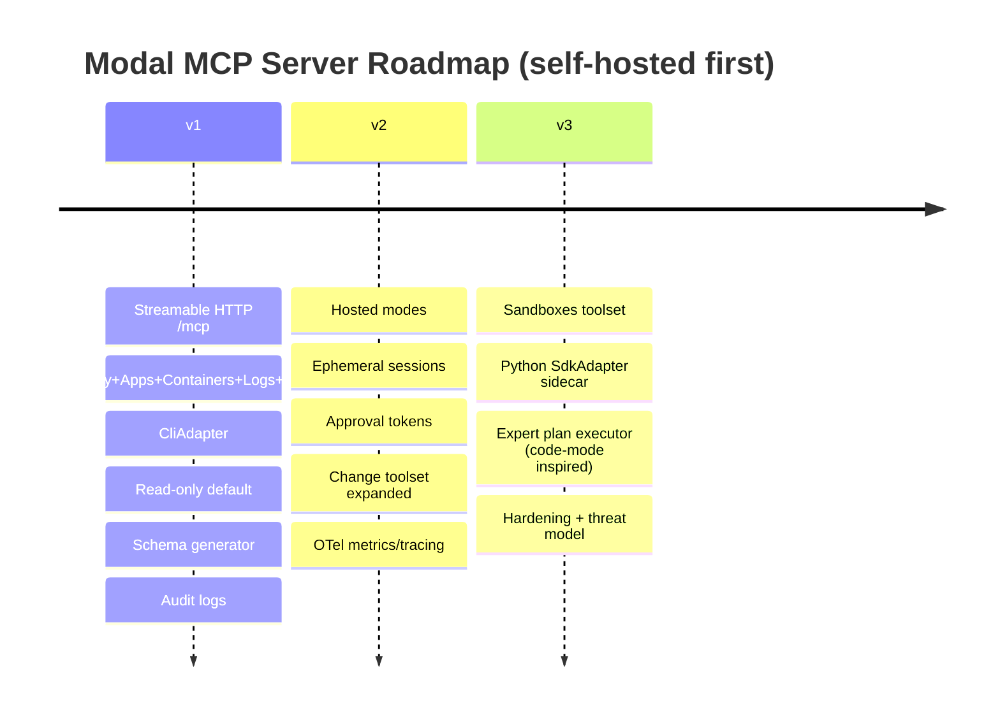

# Modal Remote MCP Server Implementation Specification for Self‑Hosting

## Executive summary

This report specifies a **Modal-focused remote Model Context Protocol (MCP) server** that is **self-hosted first**, with a clear path to optional hosted variants. It is designed to be **stable**, **token-efficient**, **secure by default**, and **trustable** even when run by a solo developer (through strong controls, explicit modes, auditability, and a conservative security posture). It explicitly incorporates design lessons from major public MCP servers and the MCP specification.

Key conclusions:

The ecosystem signal across major MCP servers suggests **TypeScript (Node.js) is the most common language among high-usage public servers**, while **Go is a close runner-up with strong deployability advantages**. Specifically: Cloudflare’s MCP server is a TypeScript project with TypeScript tooling and Workers/OAuth dependencies. citeturn16view0turn45view0 Exa’s MCP server is TypeScript/Node-based (its `module` points to `src/index.ts`) and uses the official MCP TypeScript SDK. citeturn22view0turn22view1 Playwright’s MCP server is installed via `npx`, requires Node.js, and is implemented around TypeScript/Node workflows. citeturn40view0turn17view0turn21view0 The MCP “reference servers” repo is a Node monorepo organised as workspaces under `src/*`, and is explicitly described as educational reference implementations rather than production-ready software. citeturn15view0turn14view2 GitHub’s official MCP server is implemented in Go (e.g., `main.go`) and uses toolsets and read-only mode patterns worth copying. citeturn15view3turn38view1

For a solo developer prioritising self-hosting, the practical recommendation is:

- **Primary choice: TypeScript (Node.js 20 LTS)**, using the **official MCP TypeScript SDK** and Streamable HTTP transport wrappers. The TypeScript SDK explicitly supports **Node.js/Bun/Deno**, ships server libraries (Streamable HTTP + auth helpers), and includes runtime middleware packages for wiring into Node HTTP / Express / Hono. citeturn32view0turn32view3  
- **Secondary option: Go**, if you strongly value a single compiled artefact and minimal runtime footprint. The official Go SDK exists and is documented on pkg.go.dev. citeturn33search3  
- Modal integration should be designed as an **Adapter layer**. In v1, the most reliable, supportable approach is to call the **Modal CLI** with JSON output enabled where available (e.g., `modal app list --json`, `modal container list --json`, `modal volume list --json`). citeturn24view0turn26view0turn25search1 This decouples the MCP server language choice from Modal’s Python SDK while keeping outputs structured.

The v1 tool surface is organised into eight toolsets: **discovery**, **apps**, **containers**, **logs/diagnostics**, **volumes**, **sandboxes**, **change** (disabled by default), and **expert** (disabled by default). Tool schemas include MCP tool annotations (`readOnlyHint`, `destructiveHint`, `idempotentHint`, `openWorldHint`) exactly as defined in the MCP schema reference, and all tools return both human-friendly `content[]` and strict `structuredContent`, following MCP guidance. citeturn23view0turn35view0

Finally, to maximise trust, the recommendation is to publish the project under **Apache-2.0** (patent grant + familiar enterprise posture), aligned with leading MCP projects (Cloudflare uses Apache-2.0). citeturn45view0turn45view2 A “single-maintainer with strong automation” model (security policy, signed releases, deterministic builds, and transparent audit logs) is recommended as the best trust-by-design approach for a solo developer.

## Baseline requirements and assumptions

This specification targets **MCP protocol version 2025-06-18** as the baseline (tool annotations, output schemas, Streamable HTTP transport details, tool list change notifications). citeturn35view0turn23view0turn43view0

Assumptions (explicit):

- The server is **self-hosted** (Docker-first) and exposed over HTTPS (recommended).  
- **Modal authentication** for self-hosting is BYO token via Modal’s supported mechanisms: environment variables `MODAL_TOKEN_ID` and `MODAL_TOKEN_SECRET` or `modal token set` writing to `.modal.toml` (env vars take precedence). citeturn28search2  
- The server can bundle the Modal CLI (Python-based) in the container image, and will prefer `--json` output where offered by the CLI. citeturn24view0turn26view0turn25search1  
- Where Modal CLI does not provide JSON output (notably streaming logs), the MCP server defines its own structured envelope and optionally stores raw text as an attachment-like field with truncation defaults.

## Language choice and ecosystem evaluation

### What major public MCP servers indicate

A direct scan of major public MCP servers named in the prompt yields this high-level distribution:

- Cloudflare MCP: TypeScript toolchain (`tsc`), uses `@modelcontextprotocol/sdk`, and runs with Workers/Hono toolchain. citeturn16view0turn16view1  
- Playwright MCP: distributed via Node tooling (`npx`), explicitly requires Node.js ≥ 18, and is described/used as a Node-based MCP server. citeturn40view0turn40view1  
- Exa MCP server: Node engine, TypeScript dependency and entrypoint points to `src/index.ts`; uses the MCP SDK. citeturn22view0turn22view1turn22view4  
- MCP reference servers repo: a Node workspace monorepo targeting server implementations under `src/*`, explicitly educational examples. citeturn15view0turn14view2  
- GitHub MCP server: implemented in Go and has a mature “toolset allowlist + read-only priority” configuration model. citeturn15view3turn38view1

The strongest **“popular server” signal** therefore points to **TypeScript** as the dominant implementation language among these public, high-usage servers, with Go as an important outlier used by GitHub.

### TypeScript vs Go vs Python for a solo, self-hosted Modal server

TypeScript / Node.js advantages

- **Ecosystem alignment**: The official MCP TypeScript SDK is explicitly positioned as a full implementation and ships server libraries (Streamable HTTP + stdio + auth helpers), client libraries, and middleware packages (Node/Express/Hono). citeturn32view0turn32view3  
- **Runtime portability**: The SDK states it runs on Node.js, Bun, and Deno. citeturn32view0  
- **Design pattern reuse**: Cloudflare and Exa show real-world patterns for schema validation (e.g., Zod usage in Cloudflare MCP) and remote operation, providing directly reusable structure and testing habits. citeturn16view0turn22view0  
- **Token-efficiency innovation**: Cloudflare’s “Code Mode” work demonstrates a practical, high-leverage approach: ask models to write TypeScript that calls a generated API rather than emitting tool calls directly, improving large-tool and multi-step workflows. citeturn39view0turn39view2  

TypeScript / Node.js disadvantages

- Requires a Node runtime and dependency management; supply chain auditing becomes more important vs a single Go binary.
- If you also bundle Modal CLI (Python) you effectively ship a “polyglot” container anyway, but the MCP server core can remain TypeScript.

Go advantages

- **Deployability**: a self-contained compiled service simplifies minimal images and operational management.
- The official Go SDK is available and documented, with the basic pattern of `mcp.NewServer(...)` and transports on pkg.go.dev. citeturn33search3  
- GitHub’s Go implementation is a strong reference for configuration models (toolsets, read-only). citeturn38view1  

Go disadvantages (for this specific project)

- The Modal ecosystem is heavily Python-first; if you rely on a CLI or Python SDK anyway, Go’s single-binary advantage is partially offset.
- Type-heavy JSON schema authoring and ergonomic validation tends to take more work than TypeScript + schema libraries.

Python advantages

- Modal’s API surface is Python-first (by product design), and Modal’s own examples and docs are Python-centric.
- If you were building a purely local MCP server (stdio) or a Modal-deployed server written in Modal’s idiomatic style, Python would be attractive.

Python disadvantages (relative to the prompt constraints)

- Among the specific “major public MCP servers” named, Python is not the dominant language signal; TypeScript is.
- For a solo dev prioritising remote/self-hosted reliability, TypeScript’s official SDK maturity and examples are currently stronger signals in this particular set. citeturn32view0turn16view0turn22view4  

### Recommendation

Choose **TypeScript (Node.js 20 LTS)** for the MCP server core, and implement Modal integration behind a **ModalAdapter interface** with two backends:

- **CliAdapter (v1 default)**: shells out to the Modal CLI with `--json` flags where supported; parses JSON; provides stable outputs even if the internal API changes. citeturn24view0turn26view0turn25search1  
- **SdkAdapter (v2+)**: optional Python sidecar process that uses the Modal Python SDK for operations not well-covered by CLI JSON. This aligns with Modal’s own guidance for auth and secrets handling. citeturn28search2turn28search0  

This approach maximises: (a) alignment with dominant public MCP server language patterns, (b) self-hosting pragmatism, and (c) Modal compatibility without forcing the core server language to be Python.

## Architecture, transport, hosting, and adapter design

### Protocol transport: Streamable HTTP as the primary remote mode

This server is remote-first and uses **Streamable HTTP transport** with a **single endpoint** (e.g., `/mcp`) supporting both POST and GET, as required by the MCP transport specification. citeturn43view0turn43view1

Key required behaviours to implement exactly:

- The server MUST provide a single endpoint path supporting both POST and GET. citeturn43view0  
- Clients send every JSON-RPC message as a new HTTP POST; the client must include an Accept header for both `application/json` and `text/event-stream`. citeturn43view1  
- The server may answer POST requests either with JSON or by initiating an SSE stream and should close the stream after responding. citeturn43view1  
- The client may open an SSE stream by GET; the server should return `text/event-stream` or 405 if it doesn’t support SSE at the endpoint. citeturn43view1  
- **Origin validation is mandatory** for Streamable HTTP to prevent DNS rebinding; when running locally, bind to localhost; implement authentication. citeturn43view0turn43view1  
- If the server assigns a session ID at initialisation, it returns `Mcp-Session-Id` and the client must include it in subsequent requests. citeturn43view1turn42search0  

### Tool list changes and dynamic toolsets

The server declares the `tools` capability with `listChanged: true` and emits `notifications/tools/list_changed` when toolsets are enabled/disabled during a connection. citeturn35view0

GitHub’s MCP server provides a useful precedent: a configurable allowlist for toolsets and tools, with a rule that **read-only mode takes priority** and “write tools are skipped if read-only is set.” citeturn38view1

This specification mirrors that model:

- **Server-level config** defines toolsets enabled at startup.
- A **dynamic toolset enablement tool** is provided (but disabled by default) for clients that support tool list refresh.

### Hosting model: self-hosted first

Primary self-host options:

- **Docker container** with:
  - Node.js 20 LTS runtime
  - The MCP server
  - Modal CLI installed
  - Minimal OS packages (CA certificates, Python runtime only insofar as Modal CLI requires it)

- Optional: reverse proxy (Nginx/Caddy/Traefik) providing TLS termination, rate limiting, and IP allowlisting.

Hosted deployment (optional future) must be clearly separated by mode (see “Auth flows”), because trust expectations differ.

### Adapter architecture: SDKAdapter and CliAdapter

The MCP server core should never import Modal logic directly; it calls a thin interface:

```ts
export interface ModalAdapter {
  validateAuth(): Promise<{ ok: true, context: WorkspaceContext } | { ok: false, reason: string }>;

  listEnvironments(args: { cursor?: string; limit: number }): Promise<EnvListResult>;
  listApps(args: ListAppsArgs): Promise<ListAppsResult>;
  getApp(args: GetAppArgs): Promise<GetAppResult>;
  stopApp(args: StopAppArgs): Promise<StopAppResult>;
  listContainers(args: ListContainersArgs): Promise<ListContainersResult>;
  getLogs(args: GetLogsArgs): Promise<GetLogsResult>;
  listVolumes(args: ListVolumesArgs): Promise<ListVolumesResult>;
  // ... sandboxes, mutations, etc.
}
```

Implementation plan:

- **CliAdapter (v1)** maps calls to `modal ... --json` commands:
  - `modal environment list --json` citeturn25search3  
  - `modal app list --json` citeturn24view0  
  - `modal container list --json` citeturn26view0  
  - `modal volume list --json` and `modal volume ls --json` citeturn25search1  

- **SdkAdapter (v2+)** uses a Python sidecar:
  - The TypeScript server communicates over a local loopback Unix socket (or stdio) to a Python worker.
  - The Python worker uses Modal’s Python APIs for sandbox spawning and operations not fully covered by CLI JSON.

### FastMCP vs “official SDK” approach

FastMCP is a Python-first framework ecosystem; this project is TypeScript-first by language choice. However, you should adopt analogous quality-of-life features that FastMCP advertises (notably, tool enable/disable notifications) by implementing MCP’s `notifications/tools/list_changed`. MCP explicitly defines this capability and notification. citeturn35view0turn43view1

### Expert-mode adapter and sandboxing constraints

This specification includes an **Expert toolset** inspired by Cloudflare “Code Mode”. Cloudflare’s core idea: convert tools to a TypeScript API and let an LLM write code to call it, improving tool-chain calls and reducing wasted token “copying” between tool steps. citeturn39view0turn39view2

For a self-hosted server, arbitrary code execution is dangerous. Therefore:

- Expert mode is **disabled by default**.
- When enabled, it runs code in a **hard sandbox**:
  - Separate OS process (not JS `vm`), launched with:
    - no filesystem write access beyond a temp directory
    - no outgoing network except to the MCP server’s own internal “tool RPC bridge”
    - strict CPU and memory limits
  - The only capability is calling the server’s internal tool RPC bridge, which itself applies policy checks.

This preserves the main advantage of Code Mode while maintaining a sharply constrained blast radius.

## Repository layout, modules, and CI

### Monorepo structure (recommended)

Use a workspace monorepo mirroring patterns in the MCP TypeScript SDK and MCP servers repo: workspace packages, shared tooling, deterministic builds. citeturn32view0turn15view0

Proposed layout:

```text
modal-mcp-server/
  README.md
  LICENSE
  SECURITY.md
  CONTRIBUTING.md
  CODE_OF_CONDUCT.md

  package.json
  pnpm-lock.yaml
  pnpm-workspace.yaml
  tsconfig.base.json

  docker/
    Dockerfile
    docker-compose.yml
    entrypoint.sh

  packages/
    server/
      src/
        index.ts                      # main entry: starts Streamable HTTP server
        mcp/
          transport.ts                # Streamable HTTP + optional SSE wiring
          server.ts                   # MCP server instance, capabilities, tool registry
          toolsets.ts                 # enable/disable toolsets, listChanged notifications
        config/
          schema.ts                   # zod schema for config
          load.ts                     # load env/file config, redaction rules
        auth/
          modes.ts                    # credential modes + policy engine entry
          session.ts                  # session tokens, storage interface
          crypto.ts                   # sealing, key rotation
        policy/
          engine.ts                   # allow/deny rules, mutation gate, approvals
          rules.ts                    # built-in default rules
        adapters/
          modalAdapter.ts             # interface (the contract)
          cliAdapter.ts               # Modal CLI integration
          sdkAdapter.ts               # Python sidecar integration (v2+)
          pythonSidecar/              # Python code (optional, v2+)
        tools/
          v1/
            registry.ts               # tool definitions assembled here
            schemas/                  # JSON schemas generated/maintained
            discovery.ts
            apps.ts
            containers.ts
            logs.ts
            volumes.ts
            sandboxes.ts
            change.ts
            expert.ts
        observability/
          otel.ts                     # OpenTelemetry tracer/meter
          audit.ts                    # audit log writer
          metrics.ts                  # counters/histograms
        util/
          errors.ts
          pagination.ts
          refs.ts                     # opaque refs encoding/decoding
          redaction.ts
      test/
        unit/
        integration/
        fixtures/
      scripts/
        generate-schemas.ts           # ensure schemas are exact + versioned
        smoke-test.sh
      package.json

    web-admin/                        # optional, v2+ for approvals UI
      ...

  .github/
    workflows/
      ci.yml
      release.yml
      dependency-review.yml
```

### CI pipeline

Quality gates should be non-negotiable for trust:

- Typecheck + lint + formatting
- Unit tests
- Integration tests that:
  - run the server in Docker
  - run a minimal MCP client against `/mcp`
  - stub Modal CLI output (fixture-driven) for deterministic tests

The MCP TypeScript SDK demonstrates a strong monorepo hygiene pattern and provides examples and middleware packages. citeturn32view0turn32view3

For releases:

- Signed tags
- SBOM generation
- Reproducible Docker builds (pin base image digests)
- Security policy and vulnerability reporting channel (SECURITY.md)

## MCP toolsets and exact v1 tool schemas

### Schema design principles

This server’s tool contracts are designed around MCP’s explicit guidance:

- Tools are discovered via `tools/list` and invoked via `tools/call`. citeturn35view0  
- Tools may provide `outputSchema`; if provided, the server must return `structuredContent` conforming to it. citeturn35view0  
- For backwards compatibility, if structured content is returned, the server should also return the serialised JSON in a TextContent block. citeturn35view0  
- Tool annotations are hints (`readOnlyHint`, `destructiveHint`, `idempotentHint`, `openWorldHint`) and clients must treat them as untrusted unless the server is trusted. citeturn23view1turn35view0  

### Tool naming and toolset naming convention

Tool names use a stable prefix to avoid collisions:

- `modal_discovery_*`
- `modal_apps_*`
- `modal_containers_*`
- `modal_logs_*`
- `modal_volumes_*`
- `modal_sandboxes_*`
- `modal_change_*` (disabled by default)
- `modal_expert_*` (disabled by default)

### Common types used in schemas

All tool outputs share a strict envelope for consistent parsing and token control:

- `ok: boolean`
- `request_id: string` (server-generated, stable for audit)
- `warnings: string[]` (optional)
- `data: object | null`
- `next_cursor?: string` (where applicable, opaque cursor)

Cursors are opaque strings; do not embed meaning for clients.

Opaque refs (`*_ref`) are also treated as opaque and tamper-resistant. Internally, they encode type + identifiers and are MAC-signed.

### Tool schema bundle

Below is the canonical JSON bundle you should generate into `packages/server/src/tools/v1/schemas/tools.v1.json`. It is designed to be “exact” for v1: tool names, input schema, output schema, and tool annotations are fully specified.

```json
{
  "version": "v1",
  "$defs": {
    "Cursor": {
      "type": "string",
      "description": "Opaque cursor token; treat as an unstructured string."
    },
    "Limit": {
      "type": "integer",
      "minimum": 1,
      "maximum": 200,
      "default": 50
    },
    "Ref": {
      "type": "string",
      "description": "Opaque, tamper-resistant reference token issued by this server."
    },
    "IsoDateTime": {
      "type": "string",
      "description": "ISO 8601 datetime string.",
      "pattern": "^[0-9]{4}-[0-9]{2}-[0-9]{2}T[0-9]{2}:[0-9]{2}(:[0-9]{2})?(\\.[0-9]+)?Z$"
    },
    "ToolEnvelope": {
      "type": "object",
      "required": ["ok", "request_id", "data"],
      "properties": {
        "ok": { "type": "boolean" },
        "request_id": { "type": "string" },
        "warnings": { "type": "array", "items": { "type": "string" } },
        "data": { "type": ["object", "null"] },
        "next_cursor": { "$ref": "#/$defs/Cursor" }
      }
    },
    "EnvSelector": {
      "type": "object",
      "properties": {
        "env": {
          "type": "string",
          "description": "Modal Environment name. If omitted, uses server default."
        }
      },
      "additionalProperties": false
    },
    "OutputFormat": {
      "type": "string",
      "enum": ["summary", "raw", "both"],
      "default": "summary",
      "description": "Controls token output volume."
    }
  },
  "tools": [
    {
      "name": "modal_discovery_server_info",
      "description": "Return server build info, enabled toolsets, auth mode, and Modal connectivity status.",
      "inputSchema": { "type": "object", "additionalProperties": false },
      "outputSchema": {
        "type": "object",
        "required": ["ok", "request_id", "data"],
        "properties": {
          "ok": { "type": "boolean" },
          "request_id": { "type": "string" },
          "warnings": { "type": "array", "items": { "type": "string" } },
          "data": {
            "type": "object",
            "required": ["server", "mcp", "toolsets", "auth", "modal"],
            "properties": {
              "server": {
                "type": "object",
                "required": ["name", "version", "build_sha"],
                "properties": {
                  "name": { "type": "string" },
                  "version": { "type": "string" },
                  "build_sha": { "type": "string" },
                  "build_time": { "type": "string" }
                }
              },
              "mcp": {
                "type": "object",
                "required": ["protocol_version", "transport"],
                "properties": {
                  "protocol_version": { "type": "string", "enum": ["2025-06-18"] },
                  "transport": { "type": "string", "enum": ["streamable_http"] }
                }
              },
              "toolsets": {
                "type": "object",
                "required": ["enabled", "available", "expert_enabled", "change_enabled"],
                "properties": {
                  "enabled": { "type": "array", "items": { "type": "string" } },
                  "available": { "type": "array", "items": { "type": "string" } },
                  "expert_enabled": { "type": "boolean" },
                  "change_enabled": { "type": "boolean" }
                }
              },
              "auth": {
                "type": "object",
                "required": ["mode", "read_only"],
                "properties": {
                  "mode": {
                    "type": "string",
                    "enum": ["self_hosted_byo_token", "hosted_read_only_ephemeral", "hosted_mutating_approval"]
                  },
                  "read_only": { "type": "boolean" }
                }
              },
              "modal": {
                "type": "object",
                "required": ["connected"],
                "properties": {
                  "connected": { "type": "boolean" },
                  "default_env": { "type": "string" },
                  "adapter": { "type": "string", "enum": ["cli", "sdk"] }
                }
              }
            }
          }
        }
      },
      "annotations": { "readOnlyHint": true, "openWorldHint": false, "idempotentHint": true, "destructiveHint": false }
    },

    {
      "name": "modal_discovery_list_environments",
      "description": "List Modal Environments visible to the configured credentials.",
      "inputSchema": {
        "type": "object",
        "properties": {
          "cursor": { "$ref": "#/$defs/Cursor" },
          "limit": { "$ref": "#/$defs/Limit" }
        },
        "additionalProperties": false
      },
      "outputSchema": {
        "type": "object",
        "required": ["ok", "request_id", "data"],
        "properties": {
          "ok": { "type": "boolean" },
          "request_id": { "type": "string" },
          "warnings": { "type": "array", "items": { "type": "string" } },
          "data": {
            "type": "object",
            "required": ["items"],
            "properties": {
              "items": {
                "type": "array",
                "items": {
                  "type": "object",
                  "required": ["env", "env_ref"],
                  "properties": {
                    "env": { "type": "string" },
                    "env_ref": { "$ref": "#/$defs/Ref" }
                  }
                }
              },
              "next_cursor": { "$ref": "#/$defs/Cursor" }
            }
          }
        }
      },
      "annotations": { "readOnlyHint": true, "openWorldHint": false, "idempotentHint": true, "destructiveHint": false }
    },

    {
      "name": "modal_apps_list",
      "description": "List deployed/running or recently stopped Modal apps in an Environment.",
      "inputSchema": {
        "type": "object",
        "properties": {
          "env": { "type": "string" },
          "cursor": { "$ref": "#/$defs/Cursor" },
          "limit": { "$ref": "#/$defs/Limit" },
          "filters": {
            "type": "object",
            "properties": {
              "name_prefix": { "type": "string" },
              "state": { "type": "string", "enum": ["running", "deployed", "stopped", "any"], "default": "any" }
            },
            "additionalProperties": false
          },
          "format": { "$ref": "#/$defs/OutputFormat" }
        },
        "additionalProperties": false
      },
      "outputSchema": {
        "type": "object",
        "required": ["ok", "request_id", "data"],
        "properties": {
          "ok": { "type": "boolean" },
          "request_id": { "type": "string" },
          "warnings": { "type": "array", "items": { "type": "string" } },
          "data": {
            "type": "object",
            "required": ["items"],
            "properties": {
              "items": {
                "type": "array",
                "items": {
                  "type": "object",
                  "required": ["app_ref", "app_id", "name", "env"],
                  "properties": {
                    "app_ref": { "$ref": "#/$defs/Ref" },
                    "app_id": { "type": "string", "description": "Modal app identifier (may be ap-* depending on Modal)."},
                    "name": { "type": "string" },
                    "env": { "type": "string" },
                    "state": { "type": "string" },
                    "created_at": { "$ref": "#/$defs/IsoDateTime" },
                    "updated_at": { "$ref": "#/$defs/IsoDateTime" }
                  }
                }
              },
              "next_cursor": { "$ref": "#/$defs/Cursor" }
            }
          }
        }
      },
      "annotations": { "readOnlyHint": true, "openWorldHint": false, "idempotentHint": true, "destructiveHint": false }
    },

    {
      "name": "modal_apps_get",
      "description": "Get detailed information about one Modal app.",
      "inputSchema": {
        "type": "object",
        "properties": {
          "app_ref": { "$ref": "#/$defs/Ref" },
          "format": { "$ref": "#/$defs/OutputFormat" }
        },
        "required": ["app_ref"],
        "additionalProperties": false
      },
      "outputSchema": { "$ref": "#/$defs/ToolEnvelope" },
      "annotations": { "readOnlyHint": true, "openWorldHint": false, "idempotentHint": true, "destructiveHint": false }
    },

    {
      "name": "modal_containers_list",
      "description": "List running containers (optionally filtered by app).",
      "inputSchema": {
        "type": "object",
        "properties": {
          "env": { "type": "string" },
          "app_ref": { "$ref": "#/$defs/Ref" },
          "cursor": { "$ref": "#/$defs/Cursor" },
          "limit": { "$ref": "#/$defs/Limit" },
          "format": { "$ref": "#/$defs/OutputFormat" }
        },
        "additionalProperties": false
      },
      "outputSchema": { "$ref": "#/$defs/ToolEnvelope" },
      "annotations": { "readOnlyHint": true, "openWorldHint": false, "idempotentHint": true, "destructiveHint": false }
    },

    {
      "name": "modal_logs_get",
      "description": "Fetch logs for an app or container with filtering and truncation controls.",
      "inputSchema": {
        "type": "object",
        "properties": {
          "env": { "type": "string" },
          "target": {
            "type": "object",
            "required": ["kind", "ref"],
            "properties": {
              "kind": { "type": "string", "enum": ["app", "container"] },
              "ref": { "$ref": "#/$defs/Ref" }
            },
            "additionalProperties": false
          },
          "since": { "type": "string", "description": "ISO 8601 or relative (e.g. 2h). Passed through to Modal CLI when possible." },
          "until": { "type": "string" },
          "tail": { "type": "integer", "minimum": 1, "maximum": 5000, "default": 200 },
          "search": { "type": "string" },
          "include_timestamps": { "type": "boolean", "default": true },
          "format": { "$ref": "#/$defs/OutputFormat" },
          "cursor": { "$ref": "#/$defs/Cursor" }
        },
        "required": ["target"],
        "additionalProperties": false
      },
      "outputSchema": { "$ref": "#/$defs/ToolEnvelope" },
      "annotations": { "readOnlyHint": true, "openWorldHint": false, "idempotentHint": true, "destructiveHint": false }
    },

    {
      "name": "modal_volumes_list",
      "description": "List volumes in an Environment.",
      "inputSchema": {
        "type": "object",
        "properties": {
          "env": { "type": "string" },
          "cursor": { "$ref": "#/$defs/Cursor" },
          "limit": { "$ref": "#/$defs/Limit" }
        },
        "additionalProperties": false
      },
      "outputSchema": { "$ref": "#/$defs/ToolEnvelope" },
      "annotations": { "readOnlyHint": true, "openWorldHint": false, "idempotentHint": true, "destructiveHint": false }
    },

    {
      "name": "modal_volumes_ls",
      "description": "List files in a volume path.",
      "inputSchema": {
        "type": "object",
        "properties": {
          "env": { "type": "string" },
          "volume_ref": { "$ref": "#/$defs/Ref" },
          "path": { "type": "string", "default": "/" },
          "cursor": { "$ref": "#/$defs/Cursor" },
          "limit": { "$ref": "#/$defs/Limit" }
        },
        "required": ["volume_ref"],
        "additionalProperties": false
      },
      "outputSchema": { "$ref": "#/$defs/ToolEnvelope" },
      "annotations": { "readOnlyHint": true, "openWorldHint": false, "idempotentHint": true, "destructiveHint": false }
    },

    {
      "name": "modal_sandboxes_spawn",
      "description": "Spawn a Modal Sandbox for controlled code execution tasks (disabled unless sandboxes toolset enabled).",
      "inputSchema": {
        "type": "object",
        "properties": {
          "env": { "type": "string" },
          "image": { "type": "string", "description": "Named image preset identifier configured in server." },
          "command": { "type": "array", "items": { "type": "string" }, "description": "Entrypoint command." },
          "timeout_seconds": { "type": "integer", "minimum": 10, "maximum": 3600, "default": 600 }
        },
        "required": ["image", "command"],
        "additionalProperties": false
      },
      "outputSchema": { "$ref": "#/$defs/ToolEnvelope" },
      "annotations": { "readOnlyHint": false, "destructiveHint": false, "idempotentHint": false, "openWorldHint": false }
    },

    {
      "name": "modal_change_stop_app",
      "description": "Stop an app (change toolset; disabled by default).",
      "inputSchema": {
        "type": "object",
        "properties": {
          "app_ref": { "$ref": "#/$defs/Ref" },
          "dry_run": { "type": "boolean", "default": true, "description": "If true, returns the planned stop without executing." },
          "approval_token": { "type": "string", "description": "Required in hosted_mutating_approval mode to execute when dry_run=false." }
        },
        "required": ["app_ref"],
        "additionalProperties": false
      },
      "outputSchema": { "$ref": "#/$defs/ToolEnvelope" },
      "annotations": { "readOnlyHint": false, "destructiveHint": true, "idempotentHint": true, "openWorldHint": false }
    },

    {
      "name": "modal_expert_run_plan",
      "description": "Expert mode: execute a multi-step Modal plan in a constrained sandbox (disabled by default).",
      "inputSchema": {
        "type": "object",
        "properties": {
          "plan": {
            "type": "object",
            "required": ["steps"],
            "properties": {
              "steps": {
                "type": "array",
                "minItems": 1,
                "maxItems": 50,
                "items": {
                  "type": "object",
                  "required": ["tool", "args"],
                  "properties": {
                    "tool": { "type": "string" },
                    "args": { "type": "object" }
                  },
                  "additionalProperties": false
                }
              }
            },
            "additionalProperties": false
          },
          "max_tokens_out": { "type": "integer", "minimum": 1000, "maximum": 100000, "default": 8000 }
        },
        "required": ["plan"],
        "additionalProperties": false
      },
      "outputSchema": { "$ref": "#/$defs/ToolEnvelope" },
      "annotations": { "readOnlyHint": true, "destructiveHint": false, "idempotentHint": true, "openWorldHint": false }
    }
  ]
}
```

This schema bundle is consistent with MCP’s `Tool` and `ToolAnnotations` definitions. citeturn23view0turn23view1 The server must ensure all structured results conform to their declared output schema, and should include serialised JSON in a text block for compatibility. citeturn35view0

### Toolset enablement rules

Default enabled toolsets (self-hosted):

- `discovery`, `apps`, `containers`, `logs`, `volumes`  
Default disabled toolsets:

- `sandboxes`, `change`, `expert`

Read-only mode takes priority over configured toolsets (mirroring GitHub’s approach). citeturn38view1

### Request/response examples

Example: `tools/list` and dynamic tool list change

MCP defines tool listing with pagination and a list-changed notification. citeturn35view0

Example: A tool call returning structured content

MCP defines that structured content should be returned in `structuredContent`, with a serialised JSON text block for compatibility. citeturn35view0

Example response shape (server convention):

```json
{
  "content": [
    {
      "type": "text",
      "text": "{\"ok\":true,\"request_id\":\"req_01J...\",\"data\":{\"items\":[{\"env\":\"dev\",\"env_ref\":\"mref.v1...\"}]}}"
    }
  ],
  "structuredContent": {
    "ok": true,
    "request_id": "req_01J...",
    "data": {
      "items": [
        { "env": "dev", "env_ref": "mref.v1..." }
      ]
    }
  },
  "isError": false
}
```

## Authentication flows, credential modes, policy engine, and approvals

### Modal credentials: supported inputs for self-hosting

Modal documents two primary token configuration methods:

- `modal token set` writes tokens to `.modal.toml`
- Environment variables `MODAL_TOKEN_ID` and `MODAL_TOKEN_SECRET` (takes precedence) citeturn28search2

Your MCP server supports both:

- By default (self-hosted), it reads env vars; if absent, it may optionally read a mounted `.modal.toml` file.
- It never prints token secrets; logs are redacted.

### Three credential modes

Mode: self_hosted_byo_token (v1 default)

- Operator configures Modal credentials locally (env vars or `.modal.toml`).
- No multi-user support is required.
- Policy defaults:
  - read-only toolsets enabled
  - change tools disabled unless explicitly enabled

Mode: hosted_read_only_ephemeral (v2)

Problem: if you host the server for others, asking them to permanently give you their Modal token is high-trust and often unacceptable. The best you can do without Modal-provided delegation is **minimise exposure**.

Flow:

- User submits Modal token once over TLS to `/session/create`
- Server validates token (via a safe read-only command)
- Server returns an **ephemeral session token** (server-signed JWT-like) with:
  - scopes: read-only tools only
  - TTL: e.g., 30 minutes
- Server stores the Modal token encrypted-at-rest with TTL, or (preferably) stores it sealed using envelope encryption and evicts on expiry.

Mode: hosted_mutating_approval (v2/v3)

Adds a second factor for mutations: approval token or UI approval.

Flow:

- Session exists as above.
- Mutating calls require:
  - `dry_run=true` first; server returns a **proposed change plan**.
  - User approves via:
    - `approval_token` minted for that plan (one-time, short TTL), or
    - web-admin UI “Approve” button (records approver identity)

This implements MCP’s “human in the loop” guidance: clients should provide confirmation for sensitive operations; servers should validate inputs, enforce access controls, and rate limit. citeturn35view0turn43view0

### OAuth feasibility

MCP’s architecture overview notes Streamable HTTP supports standard HTTP auth methods and recommends OAuth as a way to obtain tokens. citeturn30view1

For Modal specifically, there is no evidence in Modal’s published docs of “OAuth delegation for third-party apps to obtain Modal API tokens” in the way GitHub’s remote server supports host-configured OAuth apps. Therefore:

- OAuth is feasible for authenticating users **to your MCP server** (using an external IdP), but not for “getting a Modal token” unless Modal adds that capability.
- If you deploy behind an auth gateway (Cloudflare Access, a reverse proxy with OIDC, etc.), the MCP server can treat the upstream identity as the authenticated principal and map policies per user.

### Service-user and least privilege guidance (Modal-native)

Modal’s docs provide strong guidance for automated access:

- Service users exist (beta); creating them requires shared workspace owner/manager privileges. citeturn29search3  
- Restrict scope using restricted Environments; service users default to **Viewer** unless explicitly assigned Contributor. citeturn28search1turn28search5  
- Apps cannot look up objects across restricted Environments. citeturn28search1  

Implication for this MCP server:

- Default to operating in a single Environment (explicit `--env` or `MODAL_ENVIRONMENT`), and treat cross-environment operations as a privileged, opt-in capability. citeturn24view0turn27search5  
- Document a “safe self-hosting posture”: use a service user token with Viewer role in a restricted Environment for read-only use cases.

### Policy engine core rules

The policy engine runs on every tool invocation:

- Evaluates server mode + user identity + tool annotations + toolset membership.
- Enforces:
  - tool allowlists
  - data egress restrictions (redaction)
  - rate limits
  - maximum output sizes
- Mutation gating rules:
  - if `auth.read_only=true`, deny all tools with `readOnlyHint=false` (and any tools in `change` toolset). This mirrors GitHub’s “read-only mode takes priority” behaviour. citeturn38view1turn23view1  
  - for dangerous tools, require `dry_run=true` first and then a plan-bound approval token.

### Session handling and storage

Streamable HTTP servers may assign a session ID via `Mcp-Session-Id` in the initialise response; clients must include it later. citeturn43view1turn42search0

Design:

- Maintain two separate concepts:
  - MCP transport session (`Mcp-Session-Id`, primarily for HTTP connection/session semantics)
  - Auth session (ephemeral session token, optional; a bearer token for your server)

Token storage:

- In self-hosted mode, do not store tokens beyond process memory.
- In hosted modes, store tokens only sealed:
  - Use a master key provided by the operator (KMS or env var).
  - Token values never appear in logs; apply redaction.

## Token efficiency strategies and output design

### Why this matters

Cloudflare’s MCP README highlights the “tool explosion” problem: a large number of tools can cause significant token waste (their example discusses >2 million tokens for discovery, and a reduction to ~244k tokens using their approach). citeturn7search4

Cloudflare’s “Code Mode” post explains *why*: traditional tool calling requires feeding each tool’s output back into the model for subsequent calls, often wasting tokens just to copy data forward; letting the model write code that calls a TypeScript API can avoid that and only surface final results. citeturn39view0turn39view2

### Practical strategies in this server

Default “summary” outputs

- Every tool supports a `format` field (`summary` | `raw` | `both`).
- Summary mode returns:
  - counts, top-N, hashes, and stable refs
  - a “how to fetch more” hint (e.g., use cursor, or request raw)

Truncation plus cursoring

- For logs, default `tail=200`, and provide `cursor` to continue.
- Ensure cursor is opaque and server-controlled.

Stable refs and deferred “details” calls

- List tools return opaque refs; detail tools accept refs.
- This ensures the model doesn’t need to carry long identifiers or whole objects in memory.

Expert mode as an optional token amplifier

- `modal_expert_run_plan` runs multi-step plans and returns only final summaries unless raw is requested.

Playwright as an inspiration for “structured snapshots”

Playwright MCP demonstrates a highly token-efficient pattern: return structured accessibility snapshots with element refs rather than pixel screenshots, enabling repeated operations with compact identifiers. citeturn40view1  
For Modal, an analogous pattern is: list resources (apps/containers/volumes) returning compact refs, and require refs for follow-up actions.

## Observability, audit logging, metrics, and security controls

### Security controls derived from MCP transport spec

For Streamable HTTP, the server must:

- Validate Origin headers (DNS rebinding mitigation)
- Bind to localhost for local use where appropriate
- Require authentication for all connections citeturn43view0turn43view1

For tool calls, MCP explicitly recommends robust validation, access controls, and rate limiting. citeturn35view0

### Audit logging schema

Write one JSON log line per tool invocation (and per denial):

```json
{
  "ts": "2026-04-15T10:12:33Z",
  "request_id": "req_01J...",
  "mcp_session_id": "mcp_sess_...",
  "actor": { "kind": "self_hosted", "principal": "local" },
  "tool": { "name": "modal_apps_list", "toolset": "apps", "read_only_hint": true },
  "decision": { "allowed": true, "policy_version": "v1", "mode": "self_hosted_byo_token" },
  "input": { "hash": "sha256:...", "redacted_preview": { "env": "dev", "limit": 50 } },
  "output": { "ok": true, "bytes": 4123, "truncated": false },
  "latency_ms": 187,
  "backend": { "adapter": "cli", "command": "modal app list --json ..." }
}
```

### Metrics and tracing (OpenTelemetry)

OpenTelemetry now includes semantic conventions for MCP, including attributes like:

- `mcp.method.name`
- `mcp.session.id`
- `mcp.protocol.version`
- span patterns for `tools/call` and `initialize` citeturn37view2turn37view4

Implementation:

- Create spans per MCP method:
  - `initialize`, `tools/list`, `tools/call`
- Create child spans per backend adapter execution:
  - `modal.cli.exec`
  - `modal.python.sidecar.request`
- Emit counters/histograms:
  - tool invocations by name
  - tool denials by policy rule
  - backend latency
  - bytes out + truncation rate (token control SLO)

### Security posture checklist

- Strict input validation against schema for every tool (server-side).
- Output redaction for secrets:
  - never return `MODAL_TOKEN_SECRET`
  - detect common secret patterns (e.g., “as-” token secret seen in Modal docs) and redact. citeturn28search21  
- Rate limiting: global + per-session.
- Dependency review and lockfile enforcement.
- Explicit mode banners in `modal_discovery_server_info` to avoid accidental unsafe hosting.

## Staged build plan and milestones

Assumptions for timeline estimates:

- Solo developer, part-time to full-time depending on availability.
- Focus on correctness, testability, and safe-by-default behaviour over breadth.

### v1: self-hosted remote server with read-only core

Scope:

- Streamable HTTP server with `/mcp` endpoint
- Toolsets: discovery, apps, containers, logs/diagnostics, volumes
- CliAdapter only
- Read-only mode (default), with change/expert toolsets present but disabled
- Full schema bundle generation and unit tests

Deliverables:

- Docker image + docker-compose example
- Tool schema file `tools.v1.json` and generator script
- Integration smoke test suite with stubbed Modal CLI JSON fixtures
- Audit log JSON line output

Tests:

- Protocol conformance: initialize, tools/list, tools/call
- `notifications/tools/list_changed` (even if toolset toggling disabled, implement and test the code path)
- Origin validation, auth required in remote mode citeturn43view0

Timeline (indicative): 2–4 weeks.

### v2: secure hosted support and mutations with approvals

Scope:

- Auth sessions (ephemeral tokens)
- Hosted modes:
  - hosted_read_only_ephemeral
  - hosted_mutating_approval
- Policy engine enforcement and plan-bound approvals
- Expanded change toolset:
  - stop app
  - rollback app
  - volume write ops (put/rm/delete) behind approvals

Deliverables:

- `/session/create` and `/approval/*` internal endpoints (not MCP tools)
- Web-admin minimal UI (optional) for approvals and audit log browsing
- OpenTelemetry tracing and metrics dashboards

Timeline: 4–8 weeks after v1.

### v3: sandboxes + expert mode (code-mode-inspired)

Scope:

- Sandboxes toolset enabled with strong constraints
- SdkAdapter sidecar for operations not cleanly supported by CLI JSON
- Expert toolset:
  - constrained multi-step plan execution
  - optional “TypeScript plan compiler” (not arbitrary code) inspired by Cloudflare’s “Code Mode” principles citeturn39view0turn39view2

Deliverables:

- Hardened sandbox runner
- Extensive security review checklist and threat model doc
- Performance improvements and caching

Timeline: open-ended; start once v2 is stable.

Mermaid timeline overview:



## Licence, governance, and reference server comparison

### Recommended licence and maintenance model

Licence recommendation: **Apache-2.0**

Rationale:

- Cloudflare’s MCP repo is Apache-2.0. citeturn45view0  
- MCP reference code is undergoing an explicit transition towards Apache-2.0 for new contributions. citeturn45view2  
- Apache-2.0 offers a patent grant and is often preferred for infrastructure integrations where enterprise adoption matters.

Maintenance model to maximise trust (solo dev)

- Clear security policy (SECURITY.md) and vulnerability disclosure process.
- Signed releases + reproducible Docker builds.
- Strict CI gates; no “untested main”.
- Public roadmap and changelog.
- Audit logs and policy defaults documented prominently so users can evaluate trust.

### Comparison table: major reference MCP servers

| Reference MCP server | Language signal | Licence | Maturity signals (from public repo/docs) | Notable design lessons to copy |
|---|---:|---:|---|---|
| GitHub MCP server | Go (`main.go`) citeturn15view3 | MIT citeturn44view1 | Configurable toolsets/tools; read-only priority; supports Docker env flags citeturn38view1 | Toolset allowlists; “read-only overrides everything”; dynamic tool discovery as an optional feature (with cautions) citeturn38view2 |
| Cloudflare MCP | TypeScript (`tsc`, `@modelcontextprotocol/sdk`) citeturn16view0 | Apache-2.0 citeturn45view0 | Strong emphasis on scaling large tool surfaces; uses Workers OAuth provider dependency citeturn16view0 | Token efficiency and code-mode approach; treat “tool explosion” as first-class design constraint citeturn7search4turn39view0 |
| Playwright MCP | Node.js distribution and workflow citeturn40view0turn40view2 | Apache-2.0 (package.json) citeturn17view0 | Documented operational model; supports running as standalone HTTP server with `/mcp` endpoint citeturn40view2 | Structured, compact “snapshots + refs” approach; an example of token-efficient structured outputs (avoid screenshots-first) citeturn40view1 |
| Exa MCP server | TypeScript/Node (`src/index.ts`, `typescript`, MCP SDK) citeturn22view1turn22view4 | MIT citeturn10view0 | Ships build scripts for stdio and streamable HTTP; uses MCP inspector tooling citeturn22view1turn22view0 | Multi-transport builds; explicit output/control surfaces; production packaging patterns |
| MCP reference servers repo | TypeScript monorepo with workspaces citeturn15view0turn14view1 | Mixed: transition MIT → Apache-2.0 citeturn45view2turn45view3 | Very high activity; explicitly **not production-ready** (educational examples) citeturn14view2 | Copy patterns, not code: minimal safe examples; clarity of primitives; avoid assuming production hardening |

These references collectively support the architectural decisions above: strict schema+structured outputs, toolset gating, read-only-first safety, and token-efficiency as a first-order feature.
