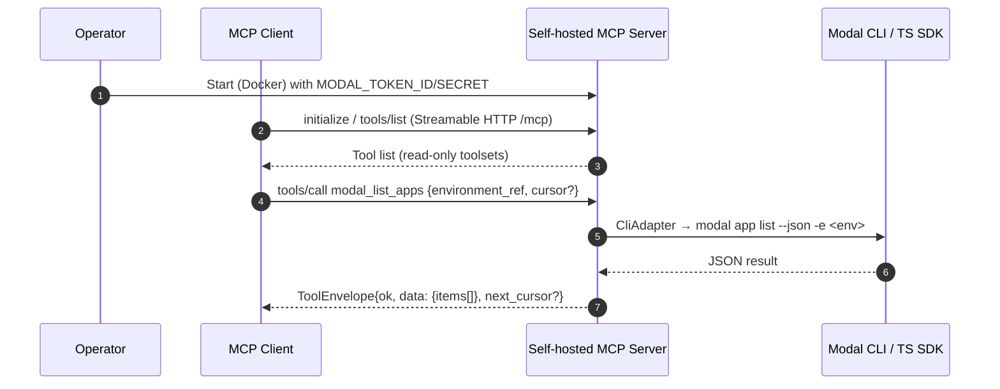
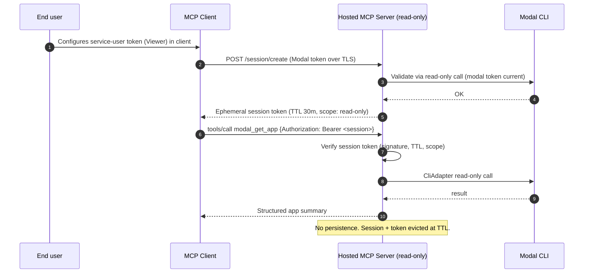
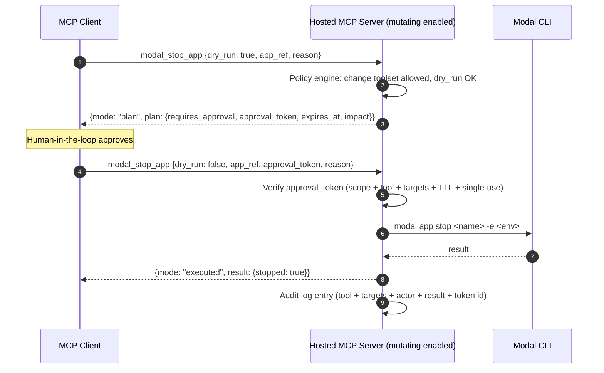

# Modal MCP Server — v1 Implementation Plan

> Combined implementation plan synthesizing `mcp-concept-en.md` and
> `mcp-concept-de.md`. Target audience: solo maintainer building a
> Modal-focused Remote MCP server that is self-hosting-first, token-efficient,
> secure-by-default, and trustable.

---

## 1. Executive summary

This plan specifies **`modal-mcp`**, a Modal-focused Remote Model Context
Protocol (MCP) server:

- **Transport:** Streamable HTTP (single `/mcp` endpoint, POST + optional GET/SSE).
- **MCP protocol baseline:** `2025-06-18` (tool annotations, output schemas,
  `notifications/tools/list_changed`, Streamable HTTP session semantics).
- **Language:** **TypeScript / Node.js 20 LTS**, using the official MCP
  TypeScript SDK. Modal integration via an adapter layer with two backends:
  **CliAdapter** (`modal ... --json`, primary for 6 of 7 toolsets) and
  **SdkAdapter (TS)** (the `modal` npm package, used only for the
  `sandboxes` toolset where it exposes `sandboxes.list()` plus a rich
  `Sandbox` instance API). Verification against `modal-labs/modal-client`
  confirmed that the TS SDK has no list/logs/stop/rollback/history verbs
  for apps, containers, volumes, or environments — those operations live
  only in the Modal CLI (which is the Python package `modal`). A Python
  sidecar is deferred to v2 and only for log **streaming** via
  `modal._logs.tail_logs`.
- **Hosting model:** **self-hosted-first** (Docker Compose default), with
  Kubernetes/Helm and optional "deploy to own Modal workspace" paths. Hosted
  multi-tenant operation is explicitly a later milestone with stricter trust
  gates.
- **Security default:** **read-only**, BYO Modal token
  (`MODAL_TOKEN_ID` / `MODAL_TOKEN_SECRET` or a mounted `~/.modal.toml`).
  Mutating tools exist in code but are **compiled-in-disabled** until the
  operator opts into the `change` toolset, and every mutation requires
  `dry_run` → server-minted `approval_token` (short TTL, single-use) → exec.
- **Tool surface:** eight toolsets — `discovery`, `apps`, `containers`,
  `logs`, `volumes`, `sandboxes`, `change` (off), `expert` (off).
  Sandboxes is enabled by default for **read-only inspection only**
  (listing, summary, stdio tail) — sandbox `spawn`/`exec` live in the
  `change`/`expert` toolsets which are off. Read-only mode is enforced
  **server-side** (not by trusting tool annotation hints), mirroring
  GitHub's "read-only takes priority" model.
- **Token efficiency:** opaque `Ref` tokens instead of native IDs, cursor
  pagination, default "summary" outputs, high-signal structured content
  (Playwright-style diagnostics rather than raw log dumps), and a
  deactivated Expert toolset inspired by Cloudflare Code Mode that covers
  the long tail without bloating the default schema. Cloudflare's public
  numbers anchor this discipline: a naive "every endpoint is a tool"
  server can consume ~2M tokens just for tool discovery; their curated
  Code Mode variant cuts this to ~244k — a ~90% reduction that comes
  directly from refusing tool explosion.
- **Licence:** Apache-2.0.

Design lessons inherited from the public MCP server ecosystem:

| Reference | Lesson copied |
|---|---|
| GitHub MCP (Go) | Toolset allowlists + "read-only mode takes priority" policy |
| Cloudflare MCP (TS) | Token-efficient "code mode" patterns + treat tool explosion as a first-class constraint |
| Playwright MCP (TS) | Structured high-signal snapshots + stable refs over raw output |
| Exa MCP (TS) | Multi-transport build, production packaging via npx + container |
| MCP reference servers (TS monorepo) | Workspace layout & schema hygiene — not production hardening |

---

## 2. Goals, non-goals, assumptions

### 2.1 Goals (v1)

1. A self-hosted Remote MCP server for Modal usable by a single operator
   against a single Modal workspace.
2. Complete **read-only** coverage for the most frequent Modal operator
   tasks: discovery, apps, containers, logs/diagnostics, volumes, sandboxes.
3. Safety-first defaults that make it reasonable to install without reading
   the full codebase: read-only, explicit env, no token persistence,
   structured audit logs.
4. Token-efficient outputs: opaque refs, cursor pagination, `format`
   selector (`summary` | `raw` | `both`), default truncation.
5. Deterministic schema surface (`schema/mcp-tools.v1.json`) with contract
   tests gating breaking changes.
6. First-class diagnostics tools that are distinctive vs. "CLI over MCP":
   failure summarization, deployment diffing, startup diagnosis.

### 2.2 Non-goals (v1)

- Multi-tenant hosted operation (v2).
- Mutating operations enabled by default (v3).
- Sandboxes `exec` / code execution via MCP (v3, expert mode).
- OAuth delegation for obtaining Modal tokens on behalf of third-party users
  (Modal does not currently expose a public OAuth delegation flow; we rely on
  BYO tokens).
- Replacing the Modal CLI / Modal dashboard.

### 2.3 Assumptions

- Operator controls their own Modal workspace and has either a personal or
  service-user token with scoped RBAC (Viewer default in restricted
  environments is the recommended posture).
- Deployment target is Docker or Kubernetes; a host supervisor provides TLS
  and (optionally) an OIDC reverse proxy for identity at the edge.
- **The Modal CLI (Python package `modal`) is a hard dependency** of the
  v1 container image. This is not an optional tool: the CLI *is* the only
  stable interface to Modal's operational verbs. Node runs the MCP server;
  the CLI runs the operations. The TypeScript core only crosses the
  language boundary via `execFile` into the CLI (v1) or a long-lived
  Python sidecar (v2, log streaming only).

---

## 3. Language and architecture decisions

### 3.1 Language: TypeScript / Node.js 20 LTS

Rationale:

- Ecosystem signal among major public MCP servers is dominated by
  TypeScript (Cloudflare, Playwright, Exa, reference servers). GitHub's Go
  implementation is the notable outlier.
- The official **MCP TypeScript SDK** ships Streamable HTTP transport, auth
  helpers, and Node/Express/Hono middleware.
- A Modal TypeScript SDK exists (npm `modal`, from `modal-labs/modal-client`),
  but its public surface is narrow — see §3.2 — so it is **not** the
  primary reason for picking TypeScript. The main driver is MCP
  ecosystem alignment, not Modal SDK alignment.
- Type-heavy JSON-schema authoring plus Zod/TypeBox validation is
  ergonomically cheap in TS.
- Go was considered (single-binary wins) and rejected because the MCP SDK
  richness tilts the balance toward TS for a solo maintainer.

Compact language comparison (drawn from the DE concept's 4-language table,
re-evaluated against verified Modal SDK coverage):

| Criterion | Go | Python | **TS/Node** | Rust |
|---|---|---|---|---|
| MCP SDK maturity | good (GitHub ref) | good (FastMCP) | **excellent** (Streamable HTTP + Auth helpers + Express/Hono middleware) | emerging |
| Modal SDK support | Go SDK exists, narrow (same gaps as TS) | public SDK has broader internals (`_logs`, `list_environments`, `_VolumeManager.list`) | **narrow** (sandboxes only) | none |
| Binary distribution | excellent (single binary) | weaker (interpreter + venv) | medium (Node runtime) | excellent |
| JSON-schema ergonomics | verbose | good | **excellent** (Zod/TypeBox) | good |
| Solo-dev learning curve | low-medium | low | **low-medium** | high |
| Public MCP server signal | GitHub | reference servers (~19%) | **dominant** (Cloudflare, Exa, Playwright, ~69% of refs) | minor |

None of these criteria strongly favour Python over TS — and specifically,
the Python SDK's marginal operational surface (`environments.list_environments`,
`_VolumeManager.list`, `_logs.fetch_logs/tail_logs`) does not span the full
tool set either. The CLI would still be mandatory in a Python-first
architecture, so picking Python would give us a polyglot container *and*
drop MCP SDK maturity.

### 3.2 Adapter strategy: CLI primary, TS SDK for sandboxes, Python sidecar deferred

```
┌───────────────────────────┐
│   MCP server core (TS)    │
│   transport · schemas ·   │
│   policy · audit · refs   │
└──────────┬────────────────┘
           │  ModalAdapter interface
           ▼
   ┌───────┴──────────┐      ┌──────────────────┐
   │  CliAdapter      │      │  SdkAdapter (TS) │
   │  modal --json    │      │  npm `modal`     │
   │  (primary)       │      │  sandboxes only  │
   └──────────────────┘      └──────────────────┘
           │                         │
           └────────── v2 ───────────┘
                       ▼
           ┌─────────────────────────┐
           │  PythonSidecarAdapter   │
           │  modal._logs.tail_logs  │
           │  (log streaming only)   │
           └─────────────────────────┘
```

Architectural intent — **the CLI is not a stopgap.** Modal's operational
verbs (app list/stop/rollback/history, container list/logs/stop, volume
`ls`/`get`/`put`/`rm`/`cp`, environment list) exist **only** as Typer CLI
command handlers inside the `modal` Python package, calling an internal
unstable `_grpc_client`. There is no stable public REST API surface to
migrate toward. The CLI adapter is therefore likely **permanent** for
these verbs. The `ModalAdapter` abstraction exists not to enable a
hypothetical future SDK migration, but to:

1. isolate drift in the Modal CLI's `--json` contract;
2. apply policy, audit, redaction, and normalisation at a single seam;
3. allow individual operations to be swapped to the TS SDK or a Python
   sidecar where those prove materially better.

Per-backend roles:

- **CliAdapter (v1 primary, permanent).** Shells out to `modal <cmd>
  --json` for discovery, apps, containers, logs, volumes, and change
  toolsets. Every subcommand is on an explicit allowlist; arguments are
  always passed as arrays (never shell strings); outputs are parsed from
  JSON; results are normalised into the adapter's domain types; signed
  `Ref` tokens are minted on the way out. See §6.2 for the verb map.

- **SdkAdapter (TS, v1 opportunistic).** Uses the `modal` npm package for
  the `sandboxes` toolset only: `sandboxes.list()` (async generator),
  `sandboxes.fromId()`, `sandboxes.fromName()`, plus the `Sandbox`
  instance methods (`exec`, `terminate`, `open`/filesystem, `tunnels`,
  `snapshotFilesystem`, `setTags`/`getTags`) for the change/expert
  toolsets when enabled. Verified file layout: `js/src/{app,cls,function,
  image,queue,sandbox,sandbox_filesystem,secret,volume}.ts` —
  `sandbox.ts` is the only file with a rich enough surface to beat the
  CLI. Everything else in the TS SDK is `fromName`-only lookup and does
  not help us.

- **PythonSidecarAdapter (v2, single purpose).** Long-lived Python
  worker speaking a local RPC (Unix socket) to the TS core, used
  **only** for streaming log tail via `modal._logs.tail_logs`. Earned
  its complexity only because per-call CLI spawn is too expensive for
  long-running streams. Not used for anything else.

Routing is governed by a capability map, not per-process. The adapter
boundary is enforced: the MCP server core never imports any Modal symbol
directly, it only touches the `ModalAdapter` interface. See §6.1 for the
per-tool capability map.

### 3.3 Transport: Streamable HTTP at `/mcp`

Required behaviours (per MCP `2025-06-18`):

- Single endpoint supporting both `POST` and `GET`.
- Clients include `Accept: application/json, text/event-stream` on POST.
- Server may answer POST with JSON or an SSE stream; closes the stream
  after the response.
- On `initialize`, the server assigns `Mcp-Session-Id` and the client
  echoes it on subsequent requests.
- **Origin validation is mandatory** (DNS rebinding protection). Local
  development defaults bind to `127.0.0.1`.
- Authentication required for all connections in remote mode (bearer token
  or reverse-proxy-asserted identity).
- `tools` capability is advertised with `listChanged: true`;
  `notifications/tools/list_changed` is emitted when toolset enablement
  changes during a session.

### 3.4 Hosting model: self-hosted-first

| Target | Status | Notes |
|---|---|---|
| **Docker Compose** | v1 default | Node 20 base + Modal CLI + server; reverse proxy (Caddy/Traefik) for TLS. |
| **Kubernetes (Helm chart)** | v1 stretch, v2 supported | Ingress, Secrets, HPA; ships with a minimal Helm chart in `deploy/kubernetes/helm`. |
| **Modal deploy (own workspace)** | v2 | Useful "dogfooding" path for users who already run Modal; requires careful scoping. |
| **Cloudflare Workers (read-only subset)** | v3 optional | No shell/CLI available — SDK-only; restricted to read-only tools. |

---

## 4. Repository layout

Monorepo using pnpm workspaces. Layout merges the two source docs; opinions
resolved toward the richer DE structure for toolsets and adapters, plus the
EN `observability/` and `policy/` splits.

```text
modal-mcp/
  README.md
  LICENSE                  # Apache-2.0
  SECURITY.md
  CONTRIBUTING.md
  CODE_OF_CONDUCT.md
  CHANGELOG.md

  package.json
  pnpm-workspace.yaml
  pnpm-lock.yaml
  tsconfig.base.json

  docs/
    specs/
      modal-mcp_v1.md       # this file
      mcp-concept-en.md
      mcp-concept-de.md
    architecture.md
    threat-model.md
    self-hosting.md
    hosted-service.md       # v2+
    toolsets.md
    policy.md
    troubleshooting.md

  schema/
    mcp-tools.v1.json       # generated canonical tool descriptors
    mcp-tools.v1.md         # human-readable snapshot

  packages/
    server/
      src/
        index.ts                      # bootstrap
        http/
          mcpHandler.ts               # Streamable HTTP + /mcp wiring
          authMiddleware.ts
          originGuard.ts
          rateLimit.ts
          requestContext.ts
        mcp/
          server.ts                   # MCP server instance & capabilities
          toolsets.ts                 # enable/disable + listChanged
          registry.ts                 # assembles tool definitions
        config/
          env.ts                      # env parsing (Zod)
          toolsetConfig.ts
          policyConfig.ts
        auth/
          modes.ts                    # credential mode state machine
          session.ts                  # Mcp-Session-Id + auth session
          crypto.ts                   # HMAC signing, envelope encryption
        policy/
          engine.ts                   # allow/deny, mutation gate
          rules.ts
          approvals.ts                # dry_run → approval_token contract
        domain/
          refs.ts                     # mref1.<payload>.<sig> codec
          cursor.ts                   # mc1.<payload>.<sig> codec
          types.ts                    # Workspace, Environment, App, ...
          normalize.ts
          errors.ts                   # ModalAdapterError
        adapters/
          modalAdapter.ts             # interface (contract)
          cli/
            modalCliAdapter.ts        # v1 primary for 6/7 toolsets
            cliParsers.ts
            verbMap.ts                # allowlisted subcommand map
          sdk/
            modalSdkAdapter.ts        # v1 opportunistic: sandboxes only
          python/                     # v2: log streaming only
        toolsets/
          discovery.ts
          apps.ts
          containers.ts
          logs.ts
          volumes.ts
          sandboxes.ts
          change.ts                   # compiled, disabled by default
          expert.ts                   # compiled, disabled by default
        observability/
          logger.ts                   # pino/structured JSON
          audit.ts                    # audit JSONL writer
          metrics.ts                  # OTel counters/histograms
          tracing.ts                  # OTel spans (mcp.* conventions)
        util/
          redact.ts
          validation.ts
          pagination.ts
          time.ts
      test/
        unit/
        contract/
        integration/
        fixtures/
      scripts/
        generate-schemas.ts
        smoke-test.sh
      package.json
      tsconfig.json

    cli/
      src/
        main.ts             # local launcher / config helper
      package.json

  deploy/
    docker/
      Dockerfile
      docker-compose.yml
      entrypoint.sh
    kubernetes/
      helm/
        Chart.yaml
        values.yaml
        templates/
          deployment.yaml
          service.yaml
          ingress.yaml
          configmap.yaml
          secret.yaml
    modal/
      app.py                # v2: deploy into user's own Modal workspace
    cloudflare/
      worker.ts             # v3: read-only subset

  .github/
    workflows/
      ci.yml
      release.yml
      container.yml
      security.yml
      dependency-review.yml
```

---

## 5. Tool surface (v1)

### 5.1 Naming & toolset convention

Tools are prefixed `modal_` and use the **verb-noun** form
(`modal_list_apps`, `modal_get_app_logs`) throughout, with two meta
exceptions in the `discovery` toolset (`modal_discovery_server_info`,
`modal_whoami`) where the meta nature reads better without a verb. This
matches the richer DE form.

Toolset defaults and per-tool annotations:

| Toolset | Default | Tool | readOnlyHint | destructiveHint | idempotentHint |
|---|---|---|:-:|:-:|:-:|
| `discovery` | enabled | `modal_discovery_server_info` | ✓ | | ✓ |
| `discovery` | enabled | `modal_whoami` | ✓ | | ✓ |
| `discovery` | enabled | `modal_list_workspaces` | ✓ | | ✓ |
| `discovery` | enabled | `modal_list_environments` | ✓ | | ✓ |
| `discovery` | enabled | `modal_get_environment` | ✓ | | ✓ |
| `apps` | enabled | `modal_list_apps` | ✓ | | ✓ |
| `apps` | enabled | `modal_get_app` | ✓ | | ✓ |
| `apps` | enabled | `modal_list_app_deployments` | ✓ | | ✓ |
| `apps` | enabled | `modal_get_app_logs` | ✓ | | ✓ |
| `containers` | enabled | `modal_list_containers` | ✓ | | ✓ |
| `containers` | enabled | `modal_get_container` | ✓ | | ✓ |
| `containers` | enabled | `modal_get_container_logs` | ✓ | | ✓ |
| `logs` | enabled | `modal_search_logs` | ✓ | | ✓ |
| `logs` | enabled | `modal_summarize_failures` | ✓ | | ✓ |
| `logs` | enabled | `modal_compare_deployments` | ✓ | | ✓ |
| `logs` | enabled | `modal_diagnose_app_startup` | ✓ | | ✓ |
| `volumes` | enabled | `modal_list_volumes` | ✓ | | ✓ |
| `volumes` | enabled | `modal_ls_volume` | ✓ | | ✓ |
| `volumes` | enabled | `modal_read_volume_text` | ✓ | | ✓ |
| `volumes` | enabled | `modal_stat_volume_path` | ✓ | | ✓ |
| `sandboxes` | **enabled** | `modal_list_sandboxes` | ✓ | | ✓ |
| `sandboxes` | **enabled** | `modal_get_sandbox` | ✓ | | ✓ |
| `sandboxes` | **enabled** | `modal_get_sandbox_stdio` | ✓ | | ✓ |
| `change` | **disabled** | `modal_stop_app` | | **✓** | ✓ |
| `change` | **disabled** | `modal_rollback_app` | | | |
| `change` | **disabled** | `modal_stop_container` | | **✓** | ✓ |
| `change` | **disabled** | `modal_terminate_sandbox` | | **✓** | ✓ |
| `expert` | **disabled** | `modal_expert_search` | ✓ | | ✓ |
| `expert` | **disabled** | `modal_expert_execute` | mixed | mixed | |

Note on `modal_rollback_app`: both `destructiveHint` and `idempotentHint`
are **false** — rollback creates a *new* deployment (monotonically
increasing version number), so it is neither destructive nor idempotent.
It is still gated behind the `change` toolset and the dry-run + approval
contract.

Note on `modal_discovery_server_info`: this tool is the user-visible
**safety banner**. It returns server mode, enabled toolsets, read-only
state, and Modal connectivity. Operators and clients are expected to call
it first to make the server's trust posture explicit, preventing
accidentally running a read-only-default server in unsafe configuration.

Sandboxes toolset is enabled by default for **read-only inspection only**
(listing, summary, stdio tail). Sandbox creation, `exec`, filesystem
writes, and termination are all gated behind `change`/`expert`. Listing
an existing sandbox is no more dangerous than listing a container.

Server-side enforcement rules:

1. **Read-only mode takes priority.** If `MODAL_MCP_READ_ONLY=true` (v1
   default), any tool whose annotation has `readOnlyHint=false` **or**
   that belongs to the `change` / `expert` toolsets is **removed from
   `tools/list`** — not merely rejected at call time. This mirrors
   GitHub's "write tools are skipped if read-only is set" behaviour and
   is enforced by the policy engine, not by trusting annotations.
2. **Toolset gate.** Tools whose toolset is not in
   `MODAL_MCP_ENABLED_TOOLSETS` are likewise hidden. Toolset enablement
   changes emit `notifications/tools/list_changed`.
3. **Annotations are hints, not enforcement.** The server advertises
   `readOnlyHint`, `destructiveHint`, `idempotentHint`, `openWorldHint`
   correctly per the MCP schema, but the policy engine treats them as
   advisory. Enforcement is by explicit allowlists in `policy/engine.ts`
   keyed on `(tool_name, toolset)` — never on the hint alone.

### 5.2 Common schema primitives

All tools share:

- `Ref` — opaque, server-signed reference token,
  `^mref1\.[A-Za-z0-9_-]+\.[A-Za-z0-9_-]+$`. Payload is HMAC-SHA256 signed
  with `MODAL_MCP_SIGNING_KEY`; carries `{kind, id, env, ws}`.
- `Cursor` — opaque pagination token,
  `^mc1\.[A-Za-z0-9_-]+\.[A-Za-z0-9_-]+$`. Same signing scheme, different
  prefix.
- `IsoOrRelativeTime` — RFC3339 timestamp or relative duration (`2h`,
  `30m`, `1d`).
- `Limit` — integer ∈ [1, 200], default 50.
- `OutputFormat` — `"summary" | "raw" | "both"`, default `"summary"`.
- `ToolEnvelope` — every tool returns `structuredContent` conforming to:

  ```json
  {
    "ok": true,
    "request_id": "req_01J...",
    "warnings": [],
    "data": { "...": "..." },
    "next_cursor": "mc1....."
  }
  ```

  Plus a `TextContent` block containing the same JSON serialised (for
  backwards compatibility per MCP guidance).

### 5.3 Tool descriptor bundle

The canonical bundle lives at `schema/mcp-tools.v1.json`. It is generated
from TypeScript definitions in `packages/server/src/toolsets/*.ts` via
`scripts/generate-schemas.ts` and checked in. Contract tests compare the
generated file against the committed snapshot; any schema diff must be
accompanied by a version bump.

Each descriptor carries `name`, `description`, `inputSchema` (with
`additionalProperties: false`), `outputSchema` (wrapping `ToolEnvelope` +
tool-specific `data`), and `annotations`. Below are three canonical
descriptors chosen to cover the three output patterns (status object,
paginated list, log-with-diagnostics). The remaining 27 descriptors
follow the same patterns and are specified in `schema/mcp-tools.v1.json`.
The high-signal diagnostic tools (`modal_summarize_failures`,
`modal_compare_deployments`, `modal_diagnose_app_startup`) are
first-class in v1 because they are what differentiates this server from
a thin CLI wrapper.

#### Common `$defs` block

```json
{
  "$defs": {
    "Ref": {
      "type": "string",
      "description": "Opaque, server-signed reference token. Do not parse.",
      "pattern": "^mref1\\.[A-Za-z0-9_-]+\\.[A-Za-z0-9_-]+$"
    },
    "Cursor": {
      "type": "string",
      "description": "Opaque pagination cursor. Do not parse.",
      "pattern": "^mc1\\.[A-Za-z0-9_-]+\\.[A-Za-z0-9_-]+$"
    },
    "IsoOrRelativeTime": {
      "description": "RFC3339 timestamp or relative duration (e.g. 2h, 30m, 1d, 1w).",
      "anyOf": [
        { "type": "string", "format": "date-time" },
        { "type": "string", "pattern": "^[0-9]+(s|m|h|d|w)$" }
      ]
    },
    "Limit": { "type": "integer", "minimum": 1, "maximum": 200, "default": 50 },
    "OutputFormat": {
      "type": "string",
      "enum": ["summary", "raw", "both"],
      "default": "summary"
    },
    "ToolEnvelope": {
      "type": "object",
      "required": ["ok", "request_id", "data"],
      "properties": {
        "ok": { "type": "boolean" },
        "request_id": { "type": "string" },
        "warnings": { "type": "array", "items": { "type": "string" } },
        "data": { "type": ["object", "null"] },
        "next_cursor": { "$ref": "#/$defs/Cursor" }
      }
    }
  }
}
```

#### `modal_discovery_server_info`

```json
{
  "name": "modal_discovery_server_info",
  "description": "Return server build info, enabled toolsets, auth mode, read-only state, and Modal connectivity status. Call this first to make the server's trust posture explicit.",
  "inputSchema": { "type": "object", "additionalProperties": false },
  "outputSchema": {
    "allOf": [
      { "$ref": "#/$defs/ToolEnvelope" },
      {
        "properties": {
          "data": {
            "type": "object",
            "required": ["server", "mcp", "toolsets", "auth", "modal"],
            "properties": {
              "server": {
                "type": "object",
                "required": ["name", "version", "build_sha"],
                "properties": {
                  "name":       { "type": "string" },
                  "version":    { "type": "string" },
                  "build_sha":  { "type": "string" },
                  "build_time": { "type": "string", "format": "date-time" }
                }
              },
              "mcp": {
                "type": "object",
                "required": ["protocol_version", "transport"],
                "properties": {
                  "protocol_version": { "type": "string", "enum": ["2025-06-18"] },
                  "transport":        { "type": "string", "enum": ["streamable_http"] }
                }
              },
              "toolsets": {
                "type": "object",
                "required": ["enabled", "available", "change_enabled", "expert_enabled"],
                "properties": {
                  "enabled":        { "type": "array", "items": { "type": "string" } },
                  "available":      { "type": "array", "items": { "type": "string" } },
                  "change_enabled": { "type": "boolean" },
                  "expert_enabled": { "type": "boolean" }
                }
              },
              "auth": {
                "type": "object",
                "required": ["mode", "read_only"],
                "properties": {
                  "mode": {
                    "type": "string",
                    "enum": ["self_hosted_byo_token", "hosted_read_only_ephemeral", "hosted_mutating_approval"]
                  },
                  "read_only": { "type": "boolean" }
                }
              },
              "modal": {
                "type": "object",
                "required": ["connected", "adapter"],
                "properties": {
                  "connected":   { "type": "boolean" },
                  "default_env": { "type": "string" },
                  "adapter":     { "type": "string", "enum": ["cli", "sdk_ts", "python_sidecar"] }
                }
              }
            }
          }
        }
      }
    ]
  },
  "annotations": {
    "title": "Modal: Server info (safety banner)",
    "readOnlyHint": true,
    "idempotentHint": true,
    "openWorldHint": false
  }
}
```

#### `modal_list_apps`

```json
{
  "name": "modal_list_apps",
  "description": "List deployed, running, or recently stopped apps in an environment (paginated). Mirrors `modal app list --json` semantics.",
  "inputSchema": {
    "type": "object",
    "required": ["environment_ref"],
    "additionalProperties": false,
    "properties": {
      "environment_ref": { "$ref": "#/$defs/Ref" },
      "status": { "type": "string", "enum": ["deployed", "running", "stopped", "any"], "default": "any" },
      "search": { "type": "string" },
      "cursor": { "$ref": "#/$defs/Cursor" },
      "limit":  { "$ref": "#/$defs/Limit" },
      "format": { "$ref": "#/$defs/OutputFormat" }
    }
  },
  "outputSchema": {
    "allOf": [
      { "$ref": "#/$defs/ToolEnvelope" },
      {
        "properties": {
          "data": {
            "type": "object",
            "required": ["items"],
            "properties": {
              "items": {
                "type": "array",
                "items": {
                  "type": "object",
                  "required": ["app_ref", "name", "state"],
                  "properties": {
                    "app_ref":          { "$ref": "#/$defs/Ref" },
                    "name":             { "type": "string" },
                    "state":            { "type": "string" },
                    "last_deploy_time": { "type": "string", "format": "date-time" }
                  }
                }
              }
            }
          }
        }
      }
    ]
  },
  "annotations": {
    "title": "Modal: List apps",
    "readOnlyHint": true,
    "idempotentHint": true,
    "openWorldHint": true
  }
}
```

#### `modal_get_app_logs`

```json
{
  "name": "modal_get_app_logs",
  "description": "Fetch app logs with tail + time range + search, returning structured entries and summarized error signatures. Default is non-streaming.",
  "inputSchema": {
    "type": "object",
    "required": ["app_ref"],
    "additionalProperties": false,
    "properties": {
      "app_ref": { "$ref": "#/$defs/Ref" },
      "tail":    { "type": "integer", "minimum": 1, "maximum": 5000, "default": 200 },
      "since":   { "$ref": "#/$defs/IsoOrRelativeTime" },
      "until":   { "$ref": "#/$defs/IsoOrRelativeTime" },
      "search":  { "type": "string" },
      "include_timestamps": { "type": "boolean", "default": true },
      "format":  { "$ref": "#/$defs/OutputFormat" },
      "cursor":  { "$ref": "#/$defs/Cursor" }
    }
  },
  "outputSchema": {
    "allOf": [
      { "$ref": "#/$defs/ToolEnvelope" },
      {
        "properties": {
          "data": {
            "type": "object",
            "required": ["entries", "summary"],
            "properties": {
              "entries": {
                "type": "array",
                "items": {
                  "type": "object",
                  "required": ["ts", "message"],
                  "properties": {
                    "ts":            { "type": "string", "format": "date-time" },
                    "source":        { "type": "string", "enum": ["stdout", "stderr", "system", "unknown"] },
                    "message":       { "type": "string" },
                    "container_ref": { "$ref": "#/$defs/Ref" }
                  }
                }
              },
              "summary": {
                "type": "object",
                "required": ["error_signatures"],
                "properties": {
                  "error_signatures": { "type": "array", "items": { "type": "string" } },
                  "top_sources":      { "type": "array", "items": { "type": "string" } }
                }
              }
            }
          }
        }
      }
    ]
  },
  "annotations": {
    "title": "Modal: Get app logs",
    "readOnlyHint": true,
    "idempotentHint": true,
    "openWorldHint": true
  }
}
```

The remaining descriptors follow the same patterns:
`modal_list_*` → `{items[], next_cursor}`;
`modal_get_*` → single-object `data`;
`modal_get_*_logs` / `modal_search_logs` / `modal_summarize_failures`
→ `{entries|matches|signatures, summary, next_cursor}`;
`modal_diagnose_app_startup` → `{diagnosis, evidence[]}`;
`modal_compare_deployments` → `{diff}`;
`modal_stop_*` / `modal_rollback_app` / `modal_terminate_sandbox` →
`{mode, plan?, result?}` (see §7.4).

A `ToolEnvelope`-first output design is a deliberate synthesis call
(taken from the EN concept). DE's original schemas omit the envelope and
put tool-specific fields at the top level, which is thinner but offers
no room for `request_id`, `warnings`, and `next_cursor` without
per-tool churn. The envelope is worth the extra wrapper layer because it
lets the policy engine, audit log, and client share a single parser.

### 5.4 Output design rules (token efficiency)

Motivation: Cloudflare publicly reports that a naive "every endpoint is a
tool" server consumes ~2M tokens just for tool discovery, vs. ~244k for a
curated Code Mode variant — a ~90% saving that comes from refusing tool
explosion, not from compression. This server treats tool explosion and
output bloat as first-class design constraints.

- **Default summary mode.** `format=summary` returns counts, top-N error
  signatures, hashes, and stable refs plus a "how to fetch more" hint.
  `format=raw` returns full adapter output (capped). `format=both`
  returns both.
- **Cursor + tail.** Logs default to `tail=200` with an opaque `cursor`.
  `tail ∈ [1, 5000]`.
- **Refs over IDs.** List tools emit `*_ref` opaque tokens; detail tools
  only accept `*_ref`. Native Modal IDs (`ap-*`, `ta-*`, etc.) never leave
  the server unless `MODAL_MCP_DEBUG_EXPOSE_IDS=true`, and that flag is
  honoured **only in self-hosted mode** — it is ignored in any hosted
  credential mode.
- **Hard caps:**
  - `modal_read_volume_text.max_bytes`: ∈ [1, 1048576], default 262144
    (256KiB). Always sets `truncated`.
  - `modal_get_sandbox_stdio.tail_bytes`: ∈ [1, 65536], default 8192.
  - `modal_summarize_failures.signatures[].sample_messages`: max 3.
- **Structured diagnostics.** `modal_summarize_failures` returns grouped
  signatures (`{signature, count, sample_messages[≤3]}`) + ranked causes,
  not raw log lines, following the Playwright "accessibility snapshot"
  design principle — high-signal, compact, reference-carrying.

---

## 6. Adapter contract

```ts
// packages/server/src/adapters/modalAdapter.ts
export type Ref = string;     // mref1....
export type Cursor = string;  // mc1....

export interface ModalAdapter {
  validateAuth(): Promise<
    | { ok: true; context: { workspaceRef: Ref; defaultEnvRef?: Ref } }
    | { ok: false; reason: string }
  >;

  // Discovery
  whoami(): Promise<{ actorKind: string; workspaces: Workspace[] }>;
  listWorkspaces(cursor?: Cursor): Promise<Page<Workspace>>;
  listEnvironments(workspaceRef: Ref, cursor?: Cursor): Promise<Page<Environment>>;
  getEnvironment(environmentRef: Ref): Promise<Environment>;

  // Apps
  listApps(environmentRef: Ref, opts: AppListOpts): Promise<Page<App>>;
  getApp(appRef: Ref): Promise<App>;
  listAppDeployments(appRef: Ref, cursor?: Cursor): Promise<Page<Deployment>>;
  getAppLogs(appRef: Ref, opts: LogOpts): Promise<LogsPage>;

  // Containers
  listContainers(environmentRef: Ref, opts: ContainerListOpts): Promise<Page<Container>>;
  getContainer(containerRef: Ref): Promise<Container>;
  getContainerLogs(containerRef: Ref, opts: LogOpts): Promise<LogsPage>;

  // Volumes
  listVolumes(environmentRef: Ref, cursor?: Cursor): Promise<Page<VolumeSummary>>;
  lsVolume(volumeRef: Ref, path: string, cursor?: Cursor): Promise<Page<VolumeEntry>>;
  readVolumeText(volumeRef: Ref, path: string, maxBytes: number):
    Promise<{ content: string; truncated: boolean }>;
  statVolumePath(volumeRef: Ref, path: string):
    Promise<{ exists: boolean; type: "file"|"dir"|"unknown"; sizeBytes?: number }>;

  // Sandboxes
  listSandboxes(environmentRef: Ref, opts: SandboxListOpts): Promise<Page<SandboxSummary>>;
  getSandbox(sandboxRef: Ref): Promise<SandboxSummary>;
  getSandboxStdio(sandboxRef: Ref, tailBytes: number):
    Promise<{ stdout: string; stderr: string; truncated: boolean }>;

  // Mutating (v3)
  stopApp(appRef: Ref): Promise<{ stopped: boolean }>;
  rollbackApp(appRef: Ref, targetVersion?: number):
    Promise<{ rolledBack: boolean; newDeploymentRef?: Ref }>;
  stopContainer(containerRef: Ref): Promise<{ stopped: boolean }>;
  terminateSandbox(sandboxRef: Ref): Promise<{ terminated: boolean }>;
}
```

### 6.1 Capability routing

The adapter layer holds a **capability map** deciding per-call which
backend to use. There is **no implicit fallback** — if the chosen backend
fails, the error is surfaced to the caller with the adapter name recorded
in the audit log. Capability decisions were made from verified TS SDK
coverage (§3.1, §3.2).

```ts
const capabilities: Record<keyof ModalAdapter, Backend> = {
  // Discovery — CLI only (no TS SDK surface)
  validateAuth:         "cli",
  whoami:               "cli",
  listWorkspaces:       "cli",
  listEnvironments:     "cli",    // modal environment list --json
  getEnvironment:       "cli",

  // Apps — CLI only
  listApps:             "cli",    // modal app list --json
  getApp:               "cli",
  listAppDeployments:   "cli",    // modal app history --json
  getAppLogs:           "cli",    // v2: python_sidecar for streaming tail

  // Containers — CLI only
  listContainers:       "cli",    // modal container list --json
  getContainer:         "cli",
  getContainerLogs:     "cli",    // modal container logs

  // Volumes — CLI only
  listVolumes:          "cli",    // modal volume list --json
  lsVolume:             "cli",    // modal volume ls --json
  readVolumeText:       "cli",    // modal volume get <path>
  statVolumePath:       "cli",    // derived from ls output

  // Sandboxes — TS SDK primary, CLI fallback
  listSandboxes:        "sdk_ts", // modal.sandboxes.list(...) (async gen)
  getSandbox:           "sdk_ts", // modal.sandboxes.fromId(...)
  getSandboxStdio:      "sdk_ts", // Sandbox stdio tail via SDK streams

  // Mutating (change toolset, v3) — CLI, except sandbox terminate
  stopApp:              "cli",    // modal app stop
  rollbackApp:          "cli",    // modal app rollback
  stopContainer:        "cli",    // modal container stop (SIGINT)
  terminateSandbox:     "sdk_ts", // Sandbox.terminate()
};
```

### 6.2 CLI safety rules and verb map

Safety rules:

- `execFile` with an argument array — never a shell string, never
  `bash -c`.
- Hard allowlist of subcommands (see verb map below). Any argument not
  in the whitelist for a given verb is rejected before spawn.
- Per-call timeout: default 30s; log tail up to 120s.
- Path sanitisation for volume operations: reject inputs containing
  `..`, NUL bytes, or ASCII control characters; normalise to absolute
  POSIX paths; reject after normalisation if the path escapes the
  volume root.
- Stdout capped at 4 MiB per call; on exceed, the adapter returns a
  `PARSE_ERROR` and logs the truncation.
- Environment variables for spawned CLI processes: only
  `MODAL_TOKEN_ID`, `MODAL_TOKEN_SECRET`, `MODAL_ENVIRONMENT`, `PATH`,
  `HOME`, `LANG`. Everything else is stripped.
- Credentials are passed via env, never via argv.

Verb map (exact CLI commands the CliAdapter shells out to, mirroring
the DE concept's CLI mapping section):

| Adapter method | CLI command (args as array) | Notes |
|---|---|---|
| `listEnvironments` | `modal environment list --json` | |
| `whoami` / `validateAuth` | `modal token current` (read-only check) | No JSON flag; parse key=value |
| `listApps` | `modal app list -e <env> --json` | |
| `getApp` | `modal app list -e <env> --json` + filter client-side | No `get` subcommand |
| `listAppDeployments` | `modal app history <name-or-id> -e <env> --json` | |
| `getAppLogs` | `modal app logs <name-or-id> -e <env> [--since <t>] [--until <t>]` | No `--json`; parser emits structured entries |
| `listContainers` | `modal container list [-e <env>] [--app-id <id>] --json` | |
| `getContainer` | `modal container list -e <env> --json` + filter | |
| `getContainerLogs` | `modal container logs <task-id> -e <env>` | |
| `listVolumes` | `modal volume list -e <env> --json` | |
| `lsVolume` | `modal volume ls <vol-name> <path> -e <env> --json` | |
| `readVolumeText` | `modal volume get <vol-name> <path> - -e <env>` | `-` writes to stdout |
| `statVolumePath` | `modal volume ls <vol-name> <parent> -e <env> --json` + match | |
| `stopApp` | `modal app stop <name-or-id> -e <env>` | **Destructive: stopped apps cannot be restarted; a new deployment is required.** |
| `rollbackApp` | `modal app rollback <name-or-id> -e <env> [--version <n>]` | Creates a new deployment (`destructiveHint=false`, `idempotentHint=false`). |
| `stopContainer` | `modal container stop <task-id> -e <env>` | Sends SIGINT and reassigns in-progress inputs; operationally risky but not irreversible. |

The verb map lives in code at `packages/server/src/adapters/cli/verbMap.ts`
and is the single source of truth for the subcommand allowlist. Any
subcommand not in this file cannot be invoked by the server.

For operations where the Modal CLI does not provide `--json`
(`modal app logs`, `modal container logs`, `modal token current`), the
adapter's parser lives in `cliParsers.ts` and is exercised exhaustively
by fixture replay tests (§9.1) to catch upstream format drift early.

### 6.3 Unified error contract

`ModalAdapterError` carries:

- `code`: `UNAUTHORIZED` | `NOT_FOUND` | `RATE_LIMITED` | `SCOPE_VIOLATION`
  | `UPSTREAM_ERROR` | `PARSE_ERROR` | `POLICY_BLOCKED` | `TIMEOUT`
- `retryable`: boolean
- `safe_message`: user-/LLM-safe text
- `debug`: only included when `MODAL_MCP_DEBUG=true`

Errors are translated into MCP tool results with `isError=true` and a
structured `data.error` object following the tool's `outputSchema`.

---

## 7. Authentication, policy, and approvals

### 7.1 Credential modes

| Mode | Milestone | Description |
|---|---|---|
| `self_hosted_byo_token` | **v1 default** | Operator supplies `MODAL_TOKEN_ID`/`MODAL_TOKEN_SECRET` (preferred) or a mounted `~/.modal.toml`. Token stays in process memory; never persisted; redacted from logs. |
| `hosted_read_only_ephemeral` | v2 | Operator submits Modal token to `/session/create` over TLS; server validates via a read-only CLI call; returns an ephemeral server-signed session token (default TTL 30 min, configurable 15–60 min). Token stored either in-memory with TTL (default) or sealed via envelope encryption with operator-provided master key + per-session data keys (opt-in). |
| `hosted_mutating_approval` | v4 | Above + per-mutation approval flow. |

### 7.2 Modal-native least privilege

- Recommend **service users** (beta in Modal) with Viewer role in a
  **restricted environment** for any unattended setup. Viewer is the default
  role for service users in restricted environments and limits blast
  radius.
- The server defaults to operating in a single environment
  (`MODAL_ENVIRONMENT`). Cross-environment calls are a privileged opt-in
  (`MODAL_MCP_ALLOW_CROSS_ENV=true`).

### 7.3 Policy engine

The policy engine runs on **every** tool invocation. Inputs: server mode,
caller identity, tool metadata, toolset membership, request arguments.

Enforcement order:

1. **Rate limiting** (global + per-session + per-tool bucket).
2. **Toolset gate** (is the toolset enabled at all?).
3. **Read-only gate** — blocks any tool whose name is on the
   allowlisted **mutating tool list** (`policy/rules.ts`:
   `{modal_stop_app, modal_rollback_app, modal_stop_container,
   modal_terminate_sandbox, modal_expert_execute}`) or whose toolset is
   in `{change, expert}`. Enforcement is by name/toolset, not by
   trusting `destructiveHint` — annotations are hints. Note that
   `modal_rollback_app` has `destructiveHint=false` but is still
   blocked because it is in the `change` toolset.
4. **Approval gate** for mutations (see 7.4).
5. **Input validation** against JSON Schema (server-side, even though the
   MCP SDK also validates).
6. **Output redaction**: strip `MODAL_TOKEN_*`, `as-*` service-user
   secrets, and common token patterns from any field.

### 7.4 Dry-run + approval token contract

Every tool in the `change` toolset (and the future mutating subset of
`expert`) implements:

- `dry_run` input, **default `true`**.
- On `dry_run=true`, the server returns
  `{mode: "plan", plan: {requires_approval: true, approval_token,
  expires_at, impact}}`. The `approval_token` is:
  - server-signed, single-use, TTL 60–180 seconds;
  - scope-bound to `(tool_name, target_refs, actor, workspace)`;
  - recorded in the audit log as "issued".
- On `dry_run=false`, the caller must present a matching `approval_token`.
  The server verifies scope, TTL, and single-use, then executes and logs
  the token as "consumed". Missing or mismatched tokens produce
  `isError=true` with `code=POLICY_BLOCKED`.

Human-in-the-loop is expected at the MCP client: the client surfaces the
plan, the human approves, the client resubmits.

### 7.5 Sessions and storage

Two independent session concepts:

- **MCP transport session** — `Mcp-Session-Id` set on `initialize`,
  client-echoed. Controls MCP connection lifecycle only.
- **Auth session** — optional bearer token issued in hosted modes.
  Independent TTL and scope.

Storage rules:

- **Self-hosted:** nothing persisted. Tokens live in process memory; the
  process only reads env/`~/.modal.toml` at startup.
- **Hosted (default):** tokens in-memory only, with TTL. Session records
  are evicted from memory on expiry; nothing touches disk.
- **Hosted (opt-in persistence):** envelope encryption. Operator
  provides a **master key** via KMS / Secret Store (never via plain env
  var). The server generates a **per-session data key**, encrypts the
  session data with it, encrypts the data key with the master key, and
  stores only the sealed tuple `(encrypted_data_key, ciphertext)`.
  Master key never leaves the KMS boundary; data keys exist only in
  memory during active use. On rotation, only data keys need
  re-encryption; ciphertexts do not.
- **All modes:** token values never appear in logs. Redaction runs
  before any logger formatter — the logger wraps the redactor, not the
  other way around.

---

## 8. Observability

### 8.1 Structured logs (stdout JSONL)

Fields per request line:

```json
{
  "ts": "2026-04-15T10:12:33Z",
  "level": "info",
  "request_id": "req_01J...",
  "mcp_session_id": "mcp_sess_...",
  "tool": "modal_list_apps",
  "toolset": "apps",
  "read_only_policy": true,
  "actor": { "kind": "self_hosted", "principal": "local" },
  "decision": { "allowed": true, "policy_version": "v1",
                "mode": "self_hosted_byo_token" },
  "input": { "hash": "sha256:...",
             "redacted_preview": { "environment_ref": "mref1....", "limit": 50 } },
  "output": { "ok": true, "bytes": 4123, "truncated": false,
              "adapter": "cli" },
  "latency_ms": 187
}
```

### 8.2 Audit log (separate JSONL sink)

Same events, written to a separate append-only file or stdout stream under
`MODAL_MCP_AUDIT_LOG`. Destructive/mutating events are required; read
events are included by default but can be sampled via
`MODAL_MCP_AUDIT_READ_SAMPLE`. Approval tokens are logged at issuance and
consumption.

### 8.3 Metrics & tracing (OpenTelemetry)

Following the OTel MCP semantic conventions:

- Spans: `mcp.initialize`, `mcp.tools/list`, `mcp.tools/call`, child spans
  `modal.cli.exec`, `modal.sdk_ts.<op>`, and `modal.python_sidecar.request`
  (v2+), each with command / op name redacted as needed.
- Attributes: `mcp.method.name`, `mcp.session.id`,
  `mcp.protocol.version`, `modal.adapter` ∈ `{cli, sdk_ts,
  python_sidecar}`, `modal.environment`.
- Metrics:
  - `modal_mcp_tool_invocations_total{tool, result}`
  - `modal_mcp_tool_denials_total{rule}`
  - `modal_mcp_adapter_latency_ms` histogram
  - `modal_mcp_output_bytes` histogram
  - `modal_mcp_output_truncation_ratio` gauge (token-control SLO)

---

## 9. Quality assurance

### 9.1 Test pyramid

- **Unit tests.** Ref/Cursor codec & signature verification, policy engine
  (read-only enforcement, approval token lifecycle), input validation edge
  cases, redaction, CLI argument sanitisation, cursor round-trip.
- **Contract tests.** Snapshot `schema/mcp-tools.v1.json`. Any diff to
  `name`/`inputSchema`/`outputSchema` is a breaking change and must bump
  the schema version.
- **Fixture replay tests.** Record/replay normalised adapter responses so
  the server is resilient to Modal CLI/SDK output drift; fixtures live in
  `test/fixtures/modal/*.json`.
- **Integration tests (stubbed Modal CLI).** Spin up the server in
  Docker, run an MCP client against `/mcp`, use a fake Modal CLI binary on
  `PATH` that echoes fixture JSON. Covers `initialize`, `tools/list`,
  `tools/call`, `notifications/tools/list_changed`, origin validation.
- **Integration tests (live Modal).** Optional, gated on `MODAL_MCP_LIVE=1`,
  runs against a dedicated restricted environment with a Viewer
  service-user token. Covers list-apps, log filter, volume ls + small
  read, sandbox list/get.
- **Security tests.**
  - CLI injection — assert no argument ever becomes a shell string.
  - Path traversal in volume paths.
  - Origin header spoofing / DNS rebinding.
  - Rate limiting.
  - Secret redaction in logs and tool outputs.

### 9.2 CI gates (GitHub Actions)

- `ci.yml` — lint (ESLint), format (Prettier), typecheck (`tsc --noEmit`),
  unit + contract + fixture tests (Vitest), coverage floor.
- `container.yml` — build Docker image with pinned base digest, run
  Trivy scan, push to GHCR on tag.
- `security.yml` — dependency review, CodeQL, secret scanner.
- `release.yml` — Changesets-driven, signed tags, SBOM (Syft), reproducible
  build check, GHCR publish, NPM publish.
- Releases must be green on all gates; no "untested main".

### 9.3 Schema versioning rules

- The canonical bundle is versioned (`"version": "v1"`).
- Additive changes (new optional fields, new tools) within v1 are allowed
  between minor versions.
- Any rename, type change, removal, or change to `required` fields forces
  a new version bundle (`v2`) and the previous one stays compiled-in for
  one release cycle behind a config flag.

---

## 10. Security posture

Prioritised, numbered list (ported from the DE concept's trust-building
section so it can be audited as a checklist):

1. **Self-hosted first.** v1 only ships self-hosted read-only. Hosted
   and mutating modes are later, gated milestones.
2. **Service-user by default.** Documented setup uses a Modal service
   user with Viewer role in a restricted environment so the blast
   radius is bounded by Modal's own RBAC.
3. **Hard read-only policy enforcement.** Read-only is enforced by a
   server-side allowlist keyed on tool name and toolset, not by
   trusting tool annotations. Tool annotations are advisory hints per
   the MCP schema.
4. **Dry-run + approval token** for every mutation — single-use,
   TTL-bound, scope-bound to `(tool, targets, actor, workspace)`.
5. **Signed, reproducible releases** — Apache-2.0, pinned base image
   digests, SBOM, signed tags, CI gating.
6. **Minimal schema surface by default.** Expert and Change toolsets
   are off; the default `tools/list` is small enough to avoid Cloudflare-
   style tool explosion (§5.4).
7. **CliAdapter with `--json`** where the CLI offers it; fixture replay
   tests catch drift where it does not.
8. **Safe outputs by default** — `format=summary`, structured
   diagnostics, truncation with `truncated` flag, opaque refs over
   native IDs.
9. **Secrets/key handling** — tokens pass via env only, never argv;
   redaction runs before any logger formatter; envelope encryption for
   hosted persistence uses KMS-held master keys and per-session data
   keys.

Transport-layer controls:

- **Streamable HTTP**: mandatory Origin validation; bind to `127.0.0.1`
  in local mode; TLS terminated by reverse proxy in remote mode; bearer
  auth or upstream OIDC identity required for all connections.
- **CLI execution**: `execFile` only, argument array, subcommand
  allowlist (§6.2), per-call timeout, stdout capped at 4 MiB,
  environment variables whitelisted.
- **Input validation** against JSON Schema on every tool call, before
  the adapter layer.
- **Output redaction** for secrets — `MODAL_TOKEN_*`, Modal `as-*`
  service-user fingerprints, AWS-style keys, JWT shapes.
- **Rate limits** global + per-session (token-bucket), conservative
  defaults.
- **Dependency hygiene**: pnpm lockfile enforced; dependency review on
  PRs; pinned Docker base image digests; SBOM on release.
- **Threat model** in `docs/threat-model.md` covers: credential
  exfiltration, scope confusion (wrong env/app), supply chain drift,
  upstream Modal CLI format drift, and irreversible operations —
  specifically, `modal app stop` cannot be restarted; recovery is a
  fresh deployment, not a restart. This constraint is surfaced in the
  `impact` text of `modal_stop_app`'s dry-run plan.

### 10.1 Expert toolset sandbox constraints (v3)

The Expert toolset is deactivated in v1 and v2. When it lands in v3 as
a Cloudflare-Code-Mode-inspired constrained executor, it runs code
under a **hard OS-level sandbox**, never inside a Node `vm`. The
constraints, ported verbatim from the EN concept:

- **Separate OS process**, not an in-process JS `vm`.
- **No filesystem write access** beyond an ephemeral tmp directory
  created per execution and deleted on exit.
- **No outgoing network** except the server's own internal tool RPC
  bridge — no DNS, no arbitrary HTTP.
- **Strict CPU and memory limits** enforced by the OS (cgroups on
  Linux, rlimits elsewhere).
- **Only capability is the internal tool RPC bridge**, which itself
  applies the full policy engine (rate limits, read-only gate, toolset
  gate, approval gate). The Expert executor can therefore never
  escalate beyond what a normal MCP client could invoke.
- **Input DSL is a constrained plan** (`{steps: [{op, args}, ...]}`),
  not arbitrary TypeScript. Cloudflare's Code Mode idea minus the
  arbitrary-code risk.

### 10.2 Sequence diagrams

Three canonical flows. The self-hosted read-only path is the default
v1 flow; the hosted read-only path illustrates ephemeral session token
handling; the mutating approval path illustrates dry-run + approval.







---

## 11. Configuration (environment variables)

| Variable | Default | Description |
|---|---|---|
| `MODAL_TOKEN_ID`, `MODAL_TOKEN_SECRET` | — | Modal credentials (preferred). |
| `MODAL_CONFIG_PATH` | `~/.modal.toml` | Fallback credentials file. |
| `MODAL_ENVIRONMENT` | workspace default | Default Modal environment. |
| `MODAL_MCP_HTTP_BIND` | `127.0.0.1:8765` | Bind address. Remote mode must override. |
| `MODAL_MCP_PUBLIC_ORIGIN` | — | Origin the server expects to be reached under; used for Origin validation. |
| `MODAL_MCP_AUTH_MODE` | `self_hosted_byo_token` | Credential mode. |
| `MODAL_MCP_READ_ONLY` | `true` | Hard read-only enforcement. |
| `MODAL_MCP_ENABLED_TOOLSETS` | `discovery,apps,containers,logs,volumes,sandboxes` | Comma-separated toolset allowlist. |
| `MODAL_MCP_SIGNING_KEY` | required | HMAC key for Ref/Cursor/approval tokens. |
| `MODAL_MCP_AUDIT_LOG` | stdout | Audit log sink (file path or `stdout`). |
| `MODAL_MCP_RATE_LIMIT_RPS` | `5` | Per-session tool-call budget. |
| `MODAL_MCP_LOG_LEVEL` | `info` | `trace|debug|info|warn|error`. |
| `MODAL_MCP_OTEL_EXPORTER` | unset | OTLP endpoint for traces/metrics. |
| `MODAL_MCP_DEBUG_EXPOSE_IDS` | `false` | Expose native Modal IDs (`ap-*`, `ta-*`) in outputs. **Self-hosted mode only** — ignored in any hosted credential mode. |
| `MODAL_MCP_ALLOW_CROSS_ENV` | `false` | Allow tools across environments. |

---

## 12. Staged build plan

Merges EN's three-version plan with DE's five-stage milestone list. The v1
scope is explicitly the DE "self-hosted read-only" stage.

| Stage | Scope | Key deliverables | Indicative effort |
|---|---|---|---|
| **v0 — Prototype** | End-to-end `/mcp` + 3 read-only tools (`modal_whoami`, `modal_list_apps`, `modal_get_app_logs`) via CliAdapter | Dockerfile, minimal CI, smoke test | ~1 week |
| **v1 — Self-hosted read-only** *(this plan)* | All read-only toolsets (discovery/apps/containers/logs/volumes/sandboxes), CliAdapter primary + TS SdkAdapter for sandboxes, policy engine, refs/cursors, audit log, schema bundle, Docker Compose deploy, Helm chart skeleton | `tools.v1.json`, contract tests, `docs/self-hosting.md`, GHCR image | 2–4 weeks |
| **v2 — Hosted read-only + log streaming** | Hosted mode with ephemeral session tokens, rate limiting, OTel tracing/metrics, `docs/hosted-service.md`, "no persistence by default" posture. Introduce Python sidecar **only** for streaming log tail via `modal._logs.tail_logs`. | `/session/create`, metrics dashboards, public docs, Python sidecar for log streaming | 4–8 weeks after v1 |
| **v3 — Self-hosted mutating + Expert preview** | Enable `change` toolset with dry-run + approval flow, expanded audit, Expert toolset preview in the §10.1 hard sandbox | Approval token subsystem, Expert sandbox runner, threat model revision, integration tests against non-prod Modal | 3–6 weeks after v2 |
| **v4 — Hosted mutating** | Mutating operations in hosted mode with strict AuthN/AuthZ, abuse prevention, incident playbook, optional external security review | Web-admin approvals UI (optional), formal threat model doc | open-ended |

### 12.1 v1 definition of done

- `pnpm test` and `pnpm contract-test` green.
- Docker image builds reproducibly and runs under Compose on a clean host
  using nothing but `MODAL_TOKEN_ID/SECRET` + `MODAL_MCP_SIGNING_KEY`.
- `initialize` + `tools/list` + every read-only `tools/call` exercised by
  integration tests with fixture CLI.
- Origin validation, bearer auth, and rate limiting exercised by
  security tests.
- Audit JSONL produced for every invocation, with redacted inputs.
- `docs/self-hosting.md` walks a new operator from zero to a working
  `/mcp` endpoint in under 15 minutes.
- `schema/mcp-tools.v1.json` is the single source of truth for descriptors
  and matches generated output.

---

## 13. Open questions and risks

1. **Modal SDK coverage (verified, not an open question).** The TS SDK
   (npm `modal`, source `modal-labs/modal-client/js/src`) exposes
   `apps.fromName`, `volumes.{fromName,ephemeral,delete}`,
   `sandboxes.{list,create,fromId,fromName}` + rich `Sandbox` instance
   methods, `secrets`, `functions`, `cls`, `queues`, `images`. It does
   **not** expose list/history/logs/stop/rollback for apps, containers,
   volumes, or environments — no `container.ts`, no `environment.ts`,
   no log API. The Python SDK is marginally richer
   (`environments.list_environments`, `_VolumeManager.list`,
   `modal._logs.{tail_logs,fetch_logs}`) but still lacks app
   list/stop/rollback/history, container list/logs/stop, and volume
   path operations — those only exist as Typer CLI handlers in
   `modal.cli.*` calling the internal unstable `_grpc_client`. The CLI
   adapter is therefore architecturally load-bearing and likely
   permanent.
2. **Modal CLI `--json` drift.** Not every subcommand has `--json`
   (`app logs`, `container logs`, `token current` notably don't).
   Parsers for those live in `cliParsers.ts` and are exercised by
   fixture replay tests. Upstream drift in either the `--json` shapes
   or the text formats is an ongoing maintenance cost; the mitigation
   is pinning a minimum CLI version in the container image and
   opening upstream issues requesting stable JSON contracts.
3. **OAuth delegation.** Modal does not currently publish an OAuth flow
   for third parties to obtain user tokens on their behalf; hosted
   modes therefore rely on BYO tokens or service-user tokens. Re-evaluate
   when Modal ships delegation.
4. **Expert toolset sandboxing.** Cloudflare-style Code Mode is
   attractive but arbitrary code execution is a hard security problem.
   v1 ships the stub descriptors disabled; v3 revisits with the
   constraints in §10.1 (separate OS process, no FS writes outside
   tmp, no network except internal RPC bridge, CPU/memory limits,
   only capability is the policy-gated internal tool bridge,
   constrained DSL input — never arbitrary TypeScript).
5. **Destructive op irreversibility.** `modal app stop` cannot be
   restarted; the only recovery is a new deployment. This is a policy
   constraint baked into the `modal_stop_app` tool description and its
   dry-run plan's `impact` text, and is audited at approval issuance.
6. **Solo-maintainer trust.** Mitigated by: Apache-2.0 licence, signed
   releases + SBOM, pinned base images, small surface by default, the
   `modal_discovery_server_info` safety banner, public roadmap and
   changelog, documented audit log format.

---

## 14. Licence and governance

- **Licence:** Apache-2.0 (patent grant, familiar enterprise posture,
  alignment with Cloudflare MCP and the reference-servers transition).
- **Governance:** single-maintainer with strong automation.
  `SECURITY.md` documents the vulnerability disclosure process; all
  releases are tagged and signed; the CI pipeline is the authoritative
  gate. Contributions welcome via PR with DCO.

---

## 15. Reference comparison

| Server | Lang | Licence | Lesson copied in v1 |
|---|---|---|---|
| GitHub MCP | Go | MIT | Toolset allowlist + read-only priority; dynamic toolsets behind a flag |
| Cloudflare MCP | TS | Apache-2.0 | Token efficiency first-class; Expert toolset inspiration; published ~2M→244k token figure |
| Playwright MCP | TS | Apache-2.0 | Structured snapshot + refs over raw output |
| Exa MCP | TS | MIT | Multi-transport build, production packaging via `npx` + container |
| MCP reference servers | TS monorepo | MIT → Apache-2.0 | Workspace layout & schema hygiene — not production hardening |

---

## 16. Synthesis decisions (deliberate departures from the sources)

Where the two source concepts disagreed or where evidence outside both
sources changed the answer, this plan makes deliberate calls. They are
listed here so reviewers can trace them rather than rediscover them.

1. **Adapter primary: CLI, not TS SDK.** The EN concept recommended
   CLI-primary; the DE concept recommended TS-SDK-primary. Evidence
   from `modal-labs/modal-client/js/src` confirmed the TS SDK's
   operational surface is narrow (sandboxes only). EN was right. The
   only v1 SDK usage is the `sandboxes` toolset.

2. **CLI is not a stopgap.** Both sources implied the CLI would be
   replaced by a "better" backend over time. Verification found no
   stable public Modal REST API for operational verbs and the CLI
   commands only live as Typer handlers over internal gRPC. The CLI
   adapter is therefore likely permanent; the abstraction boundary
   exists for drift isolation and policy/audit, not for eventual
   replacement.

3. **Sandboxes enabled by default, read-only subset only.** DE enabled
   sandboxes by default; EN did not include sandbox listing at all.
   v1 enables `{modal_list_sandboxes, modal_get_sandbox,
   modal_get_sandbox_stdio}` by default because they are read-only and
   the TS SDK surface is rich enough to back them cleanly. Sandbox
   `spawn`/`exec`/terminate live in `change`/`expert` (disabled).

4. **Tool naming: verb-noun form throughout.** DE used `modal_list_apps`
   / `modal_get_app_logs`; EN used `modal_apps_list` /
   `modal_logs_get`. Picked the DE form for consistency, with the two
   meta tools `modal_discovery_server_info` and `modal_whoami` as
   documented exceptions.

5. **Read-only enforcement hides tools from `tools/list`.** EN's
   enforcement text rejects mutating tools at call time; GitHub's
   implementation hides them from the tool listing. This plan follows
   the stricter GitHub pattern: removed from `tools/list` entirely, so
   a compromised client cannot even enumerate them.

6. **ToolEnvelope wrapper on every output.** DE returned tool-specific
   `{items[], next_cursor}` shapes at the top level. EN wrapped
   everything in `{ok, request_id, warnings, data, next_cursor}`. Went
   with the envelope because it lets the policy engine, audit log, and
   client share a single parser. Trade-off: every `outputSchema` has
   one more layer of wrapping.

7. **Diagnostic tools as v1 surface.** `modal_summarize_failures`,
   `modal_compare_deployments`, `modal_diagnose_app_startup` come
   from DE; EN had only `modal_logs_get` in its `logs` toolset. Kept
   DE's richer surface — this is what makes the server more than a
   CLI wrapper.

8. **Hosted mutating deferred to v4, not v2/v3.** EN sequenced hosted
   mutations earlier; DE later. v4 was chosen because the combination
   of hosted identity + mutating verbs + Modal's irreversible "stop
   app" warrants the extra gap. Reassess when v3 lands.

9. **Approval token TTL: 60–180 seconds, single-use.** EN said only
   "short TTL"; DE specified the range. Adopted DE's number.

10. **Ephemeral session TTL: 30 min default.** EN said "e.g. 30 min";
    DE allowed 15–60 min. Picked 30 as the default with 15–60 as the
    configurable window — one default, one range.

11. **Python sidecar is v2, single-purpose (log streaming).** EN
    positioned it as v2+ for operations not in the CLI; DE implied
    it as a fallback. Evidence shows the CLI *is* the Python package,
    so a sidecar has no operational advantage over CLI shell-out for
    most verbs. The exception is long-running log tail, where per-call
    CLI spawn is too expensive. That's the only reason it exists.

12. **Mode banner** via `modal_discovery_server_info`. EN called this
    out as a safety signal; DE did not. Kept EN's framing — it's the
    first call a client should make and it makes the trust posture
    explicit.

---

*Combined from `docs/specs/mcp-concept-en.md` and
`docs/specs/mcp-concept-de.md`, with Modal SDK/CLI coverage verified
directly against `modal-labs/modal-client`. Where the two sources
disagreed, deliberate calls are documented in §16.*
