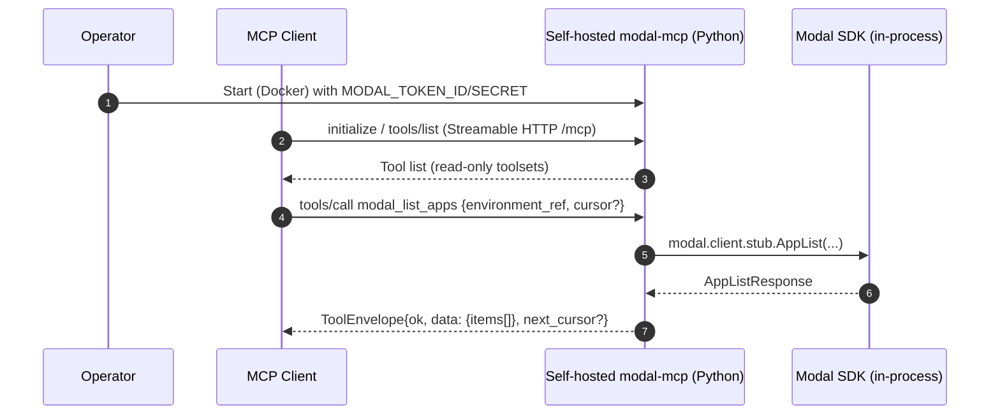
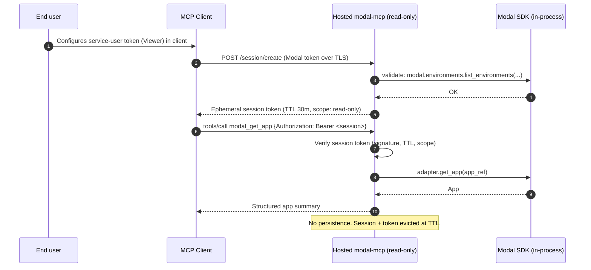
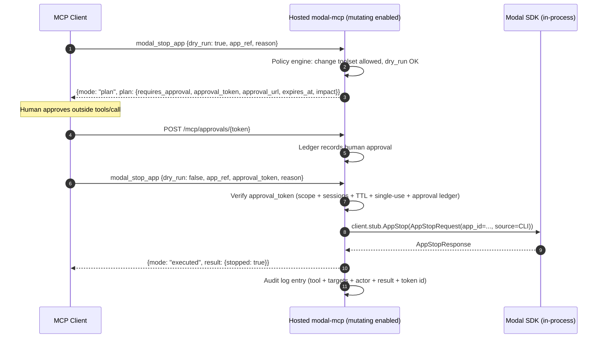

# Modal MCP Server — v2 Implementation Plan (Python + FastMCP)

> This plan supersedes `modal-mcp_v1.md` on the language and architecture
> questions. It specifies a Python-first implementation using **FastMCP
> + Pydantic v2 + Modal Python SDK**, in a single process, no sidecar,
> no CLI shell-out. It also incorporates the review hardening from the
> FastMCP, Modal-integration, and security findings. See §16 for the
> v1→v2 diff.

---

## 1. Executive summary

`modal-mcp` is a Modal-focused Remote Model Context Protocol (MCP) server:

- **Transport:** Streamable HTTP (single `/mcp` endpoint), provided
  natively by FastMCP.
- **MCP protocol baseline:** `2025-06-18` (tool annotations, output
  schemas, `notifications/tools/list_changed`, Streamable HTTP session
  semantics). FastMCP implements all of these out of the box.
- **Language:** **Python 3.12**, using **FastMCP 3.x** (the canonical
  Python MCP framework, now merged into the official Anthropic MCP
  Python SDK), Pydantic v2 for schemas, Starlette for ASGI middleware,
  uvicorn as the runtime.
- **Modal integration:** direct in-process imports from the `modal`
  package — `modal.environments.list_environments`,
  `modal.Volume.objects.list`, `modal.Volume.from_name(...).listdir`,
  `modal.Volume.from_name(...).read_file`,
  `modal._logs.{fetch_logs, tail_logs}`, `modal.Sandbox.list`, and
  verified `client.stub.<RPC>` calls for operations with no high-level
  API. **No CLI subprocess, no
  sidecar, no cross-language boundary.**
- **Hosting model:** **self-hosted-first** (Docker Compose default),
  with Kubernetes/Helm deferred to v2/v3 and optional "deploy to own
  Modal workspace" paths in v2.
- **Security default:** **read-only**, BYO Modal token
  (`MODAL_TOKEN_ID` / `MODAL_TOKEN_SECRET` or a mounted
  `~/.modal.toml`). Mutating tools are disabled by default, and every
  mutation requires `dry_run` → server-minted `approval_token` (short
  TTL, single-use) → out-of-band approval endpoint → exec.
- **Tool surface:** eight toolsets — `discovery`, `apps`, `containers`,
  `logs`, `volumes`, `sandboxes` (read-only enabled), `change` (off),
  `expert` (off). Implemented via FastMCP tags with
  `mcp.disable(tags={...})` for gating; runtime toggles inside an MCP
  request emit `notifications/tools/list_changed`, while startup
  gating just shapes the initial `tools/list`.
- **Token efficiency:** opaque `Ref` tokens instead of native IDs,
  cursor pagination, default `format=summary` outputs, structured
  diagnostic content (Playwright-style), and a deactivated Expert
  toolset inspired by Cloudflare Code Mode. Same Cloudflare numbers
  anchor the design: ~2M tokens for naive tool-list discovery vs.
  ~244k for a curated set — a ~90% saving from refusing tool explosion,
  not from compression.
- **Licence:** Apache-2.0.

### What this plan changes from v1

v1 specified TypeScript + MCP TS SDK + a CLI adapter (primary) + a TS
SDK adapter (sandboxes only) + a deferred Python sidecar (log
streaming). v2 collapses all of that into a single Python process:

| v1 | v2 |
|---|---|
| TypeScript core + Python CLI dep + optional Python sidecar | Single Python process |
| Per-call `execFile` into `modal <cmd> --json` | Direct in-process function calls |
| `cliParsers.ts` to parse text-format `modal app logs` / `modal container logs` | Direct access to `modal._logs.fetch_logs` + `modal._grpc_client` — typed data, no text parsing |
| `ToolEnvelope` as a hand-written Zod wrapper | Generic `ToolEnvelope[T]` Pydantic model — FastMCP/Pydantic generate the concrete schema, normalised before snapshot diffing |
| Custom toolset enable/disable + `list_changed` wiring | `mcp.disable(tags={...})` for startup gating and runtime request-scoped toggles |
| Polyglot container (Node + Python + Modal CLI) | Single Python container (Modal SDK included) |
| Python sidecar in v2 for log streaming | Bounded log tail fetch is v1 via `tail_logs(...)`; infinite follow waits for the §6.2a lifecycle contract |

Rationale is in §3; the diff is traced in §16.

---

## 2. Goals, non-goals, assumptions

### 2.1 Goals (v1 of the Python implementation)

1. A self-hosted Remote MCP server for Modal usable by a single
   operator against a single Modal workspace.
2. Complete read-only coverage for the most frequent Modal operator
   tasks: discovery, apps, containers, logs/diagnostics, volumes,
   sandboxes.
3. Safety-first defaults: read-only, explicit env, no token persistence,
   structured audit logs, mode banner via `modal_discovery_server_info`.
4. Token-efficient outputs: opaque refs, cursor pagination, `format`
   selector, default truncation, structured diagnostics.
5. Single deterministic schema surface (`schema/mcp-tools.v1.json`)
   with contract tests gating breaking changes.
6. First-class diagnostic tools (`modal_summarize_failures`,
   `modal_compare_deployments`, `modal_diagnose_app_startup`) —
   differentiators vs. a thin CLI wrapper.

### 2.2 Non-goals (v1)

- Multi-tenant hosted operation (v2).
- Mutating operations enabled by default (v3).
- Sandbox `exec` / code execution via MCP (v3, expert mode).
- OAuth delegation for obtaining Modal tokens on behalf of third-party
  users (Modal does not currently expose such a flow).
- Replacing the Modal CLI or Modal dashboard.

### 2.3 Assumptions

- Operator controls their own Modal workspace and has either a personal
  or service-user token with scoped RBAC. Viewer role in a restricted
  environment is the recommended posture.
- v1 deployment target is Docker/Compose; a host supervisor provides
  TLS and (optionally) an OIDC reverse proxy for identity at the edge.
  Kubernetes/Helm packaging is a later-release concern for v2/v3 once
  shared-service requirements are known.
- **The `modal` Python package is the single dependency for Modal
  integration.** It is pinned to a minimum version in
  `pyproject.toml`; that version pins both the high-level API surface
  (`modal.environments`, `modal.Volume`, `modal.Sandbox`, `modal._logs`)
  and the underlying `_grpc_client` / `modal_proto` stubs. They release
  together, so they drift together — the stability profile of
  `_grpc_client` is coupled to the CLI's stability because they are
  the same code.
- FastMCP 3.x is the Python MCP framework of choice, verified to cover
  every MCP feature we need (Streamable HTTP, tool annotations,
  structured output via `ToolResult`, `tools/list_changed`, session
  state, progress reporting, JWT/OAuth).

---

## 3. Language and architecture decisions

### 3.1 Language: Python 3.12

The v1 plan chose TypeScript on the basis of public MCP server
ecosystem signal (Cloudflare, Exa, Playwright). That signal is real
but biased: those servers wrap web services whose native APIs are
HTTP/TS. For a **Modal-focused** server, the natural centre of gravity
is Python, because:

1. **Modal's public API surface is Python.** Every verb we need has a
  Python implementation, either as a public API (`modal.environments`,
   `modal.Volume`, `modal.Sandbox`), a semi-public module
   (`modal._logs`), or an internal gRPC client
   (`modal._grpc_client` / `modal.client`). There is no TypeScript
   equivalent — we verified the `modal` npm package exposes only
   sandbox operations at the level we need (see v1 §13).
2. **FastMCP matches the TS SDK feature-for-feature** for our needs
   (see verification in §3.3 below). It handles Streamable HTTP, tool
   annotations, structured output, list-changed notifications, OAuth,
   JWT, async session-scoped state, and progress reporting — all
   native.
3. **Single-language, single-process architecture** eliminates an
   entire class of decisions: adapter primary/fallback, capability
   maps, CLI text-format parsing, subprocess supervision, sidecar RPC.
4. **Operator affinity.** Modal users are Python developers. A Python
   server is the natural thing for them to debug, fork, or extend.

Comparison (re-evaluated vs. v1's table):

| Criterion | Python | TS/Node | Go |
|---|---|---|---|
| MCP SDK maturity | **very high** (FastMCP 3.x, merged into official Anthropic MCP SDK) | very high | good |
| Modal SDK coverage | **complete** (public + semi-public + `_grpc_client`) | narrow (sandboxes only) | narrow (same gaps as TS) |
| Process architecture | **single process, in-process calls** | TS core + Python dep for CLI (polyglot container) | single binary + Python dep |
| JSON-schema ergonomics | **Pydantic v2** (automatic from type hints) | Zod | verbose |
| Streaming support | **native async generators + `ctx.report_progress`** | requires sidecar for Modal streams | same |
| Solo-dev learning curve | low | low-medium | low-medium |
| Operator affinity for Modal users | **high** | low | low |

The v1 rejection of Go still holds. The v1 rejection of Python was
based on MCP ecosystem signal alone, which we now recognise as the
wrong tie-breaker for a Modal-specific server.

### 3.2 Architecture: single process, in-process adapter

```
┌────────────────────────────────────────────────────────┐
│                 modal-mcp (Python 3.12)                │
│                                                        │
│  ┌──────────────────────────────────────────────────┐  │
│  │  Starlette ASGI app (uvicorn)                    │  │
│  │  ├─ OriginGuard middleware                       │  │
│  │  ├─ AuthMiddleware (JWT / bearer)                │  │
│  │  ├─ RateLimitMiddleware                          │  │
│  │  └─ FastMCP StreamableHTTP app at /mcp           │  │
│  └──────────────────────┬───────────────────────────┘  │
│                         │                              │
│  ┌──────────────────────┴───────────────────────────┐  │
│  │  FastMCP server                                  │  │
│  │  ├─ tool registry (tag-gated: discovery, apps…)  │  │
│  │  ├─ ToolEnvelope[T] Pydantic output schemas      │  │
│  │  ├─ policy engine hook (per-tool middleware)     │  │
│  │  └─ audit log hook                               │  │
│  └──────────────────────┬───────────────────────────┘  │
│                         │                              │
│  ┌──────────────────────┴───────────────────────────┐  │
│  │  ModalAdapter (single in-process class)          │  │
│  │  ├─ modal.environments.*      (public)           │  │
│  │  ├─ modal.Volume.*            (public + semi)    │  │
│  │  ├─ modal.Sandbox.*           (public)           │  │
│  │  ├─ modal._logs.{fetch,tail}  (semi-public)      │  │
│  │  ├─ modal.client.stub.*       (internal gRPC)    │  │
│  │  └─ normalizers → domain types + signed Refs     │  │
│  └──────────────────────┬───────────────────────────┘  │
│                         │ gRPC (inside modal package)  │
└─────────────────────────┼──────────────────────────────┘
                          ▼
                   Modal control plane
```

There is no primary/fallback split at the adapter level. Each method
picks its backend once, based on verified coverage (§6.2). The picks
are stable because the Modal Python package releases the public API,
the semi-public modules, and the internal gRPC stubs together.

**Why keep a `ModalAdapter` abstraction at all** when the data path is
in-process and single-backend? Three reasons:

1. **Drift isolation.** `_grpc_client` shapes can change between
   Modal releases. The adapter is the single seam where that drift
   lives — every call site above it sees stable domain types, not
   protobuf messages. A Modal upgrade that reshuffles an RPC touches
   exactly one file.
2. **Single policy, audit, redaction, and normalisation seam.** Every
   Modal call goes through the adapter, so rate limiting, redaction,
   Ref minting, error translation, and audit hooks can all attach at
   one place. Without the abstraction they'd scatter across tool
   functions.
3. **Swap seam for future backends.** If Modal publishes a stable
   public REST API tomorrow, or if we decide to move log streaming
   into a separate subprocess for isolation reasons, the adapter is
   the layer that changes — not the tool functions, not the policy
   engine, not the schema. The `_cli_fallback.py` dead code in §6.3
   exists precisely as a pre-built swap target for the drift scenario.

**`_grpc_client` stability argument.** The `_`-prefixed modules in
Python mean "no public API promise in the Python sense" — the maintainer
reserves the right to refactor without a deprecation cycle. That is
*different* from "expect frequent breakage". In practice these modules
are the implementation of the `modal` CLI itself (the CLI lives at
`modal.cli.*` and calls `modal._grpc_client` directly). If they broke,
`modal app list --json` would break the same day, Modal users would
notice within hours, and a patch release would follow. Pinning a
minimum Modal version in `pyproject.toml` pins the internal layer
just as tightly as it pins the public API. Our mitigation for drift
is the same as for any internal-API usage: contract tests, fixture
replay, and a pinned minimum version with a conservative upgrade
cadence.

### 3.3 FastMCP feature coverage (verified)

Confirmed against `prefecthq/fastmcp` v3.2.4 documentation and wheel:

| MCP feature | FastMCP support |
|---|---|
| Streamable HTTP at `/mcp` | ✅ `mcp.http_app(path="/mcp")` / `mcp.run(transport="http")` |
| `Mcp-Session-Id` handling | ✅ built in |
| Tool annotations (`readOnlyHint`, `destructiveHint`, `idempotentHint`, `openWorldHint`) | ✅ `@mcp.tool(annotations=ToolAnnotations(...))` |
| Input schema from type hints | ✅ Pydantic v2 auto-generation |
| Custom `output_schema` | ✅ `@mcp.tool(output_schema=...)` or auto from the concrete return annotation via Pydantic `TypeAdapter`; generics are emitted in Pydantic's concrete schema shape, not our own `allOf` wrapper |
| Structured output with text + structured content + meta | ✅ `ToolResult(content=..., structured_content=..., meta=...)` |
| `notifications/tools/list_changed` | ✅ emitted by enable/disable calls made inside an active MCP request context; startup gating changes the first `tools/list` result but emits no notification because no session exists yet |
| Tag-based toolset grouping | ✅ `@mcp.tool(tags={"apps"})` + `mcp.disable(tags={"change"})` |
| Bearer / JWT auth | ✅ `JWTVerifier` (JWKS, issuer, audience) |
| OAuth (v2) | ✅ `RemoteAuthProvider`, `OAuthProxy`, `MultiAuth`; `MultiAuth` wraps one optional auth server plus verifiers, not peer providers |
| Progress notifications / streaming | ✅ `ctx.report_progress(...)`; streaming/progress tests must negotiate `Accept: application/json, text/event-stream` |
| Session state across requests | ✅ async `await ctx.set_state(...)` / `await ctx.get_state(...)`; session-scoped only, not a process-wide dependency-injection channel |
| Request metadata | ✅ `ctx.request_id`, `ctx.client_id`, `ctx.transport` |
| Structured logging from tools | ✅ `ctx.info / debug / warning / error` |
| Per-tool timeout | ✅ `@mcp.tool(timeout=30.0)` |
| Server composition | ✅ `mcp.http_app(path="/mcp", middleware=[...])`; parent Starlette apps must pass `lifespan=mcp_app.lifespan` |
| Origin validation / DNS rebinding | ⚠️ ASGI-layer — not FastMCP's responsibility; implemented as a ~20-line Starlette middleware (`http/origin_guard.py`) |

The only capability not provided directly by FastMCP is origin
validation, which is correct design: origin is a transport-layer
concern and belongs in the ASGI middleware stack.

### 3.4 Transport: Streamable HTTP at `/mcp`

FastMCP provides the full Streamable HTTP implementation per MCP
`2025-06-18`. The FastMCP app owns the Streamable HTTP session
manager, and that manager starts inside the app lifespan. Therefore
any parent Starlette composition **must** propagate `mcp_app.lifespan`.
Middleware that protects the HTTP surface is passed to
`mcp.http_app(...)` so it wraps the FastMCP route that owns the
session manager.

```python
from contextlib import asynccontextmanager
from fastmcp import FastMCP
from starlette.applications import Starlette
from starlette.middleware import Middleware
from starlette.routing import Mount
from modal_mcp.http.origin_guard import OriginGuard
from modal_mcp.http.rate_limit import RateLimitMiddleware

mcp = FastMCP(name="modal-mcp", lifespan=fastmcp_lifespan, auth=build_auth(settings))

mcp_app = mcp.http_app(
    path="/mcp",
    middleware=[
        Middleware(
            OriginGuard,
            allowed_origins=settings.allowed_origins,
            allowed_hosts=settings.allowed_hosts,
        ),
        Middleware(RateLimitMiddleware, settings=settings.rate_limit),
    ],
)

app = Starlette(
    routes=[Mount("/", app=mcp_app)],
    lifespan=mcp_app.lifespan,
)
```

`OriginGuard` is the first ASGI middleware in the FastMCP HTTP app's
middleware list. Nothing may be installed before it. FastMCP's own
in-process MCP middleware (`mcp.add_middleware(...)`) runs later in
the MCP pipeline and is not a substitute for transport-layer origin
and host checks.

Required behaviours (MCP `2025-06-18`) that FastMCP handles for us:

- Single `/mcp` endpoint supporting both POST and GET.
- `Accept: application/json, text/event-stream` handling on POST.
- JSON response or SSE stream at server's discretion; stream closed
  after response.
- `Mcp-Session-Id` assigned on `initialize`, client-echoed thereafter.
- `tools` capability advertised with `listChanged: true`;
  `notifications/tools/list_changed` emitted on tool enablement
  changes.

Behaviours we add via middleware:

- **Origin validation** — mandatory (DNS rebinding mitigation). In
  local mode we bind to `127.0.0.1` and also require `Host` to be
  `127.0.0.1`, `localhost`, or another explicit allowlisted local
  host; loopback binding alone is not a DNS-rebinding defence. In
  remote mode the reverse proxy forwards the client `Origin`; it does
  not synthesize one. `OriginGuard` rejects missing, `null`, wrong
  scheme, and non-allowlisted origins. `MODAL_MCP_ALLOWED_ORIGINS`
  must be non-empty at startup.
- **Authentication** — bearer token (self-hosted) or JWT from an
  upstream IdP (hosted). In FastMCP this is passed as `auth=...` to
  the `FastMCP` constructor.
- **Rate limiting** — token-bucket keyed by authenticated identity
  where available, with remote-address and global fallbacks (§10.1).

### 3.5 Hosting model: self-hosted-first

| Target | Status | Notes |
|---|---|---|
| **Docker Compose** | v1 default | Python 3.12 slim base + `modal` package + `fastmcp` + `uvicorn`. One image, one process. |
| **Kubernetes (Helm chart)** | v2/v3 candidate | Defer until shared-service requirements, ingress/TLS posture, secrets, and scaling expectations are explicit. |
| **Modal deploy (own workspace)** | v2 | Dogfooding path; `deploy/modal/app.py` wraps the server as a Modal ASGI app. Natural fit because the Modal SDK is already the runtime. |
| **Cloudflare Workers** | not supported | Workers cannot run the Modal Python package; the TS path was the only way there, and we rejected it. |

Note: the "deploy on Modal itself" path, which was awkward in v1 (Node
runtime on Modal, which is Python-first), is natural in v2 — Modal
runs Python ASGI apps as a first-class primitive.

---

## 4. Repository layout

Single Python package, `uv`-managed. `src/` layout for import hygiene.

```text
modal-mcp/
  README.md
  LICENSE                        # Apache-2.0
  SECURITY.md
  CONTRIBUTING.md
  CODE_OF_CONDUCT.md
  CHANGELOG.md

  pyproject.toml
  uv.lock
  ruff.toml
  mypy.ini

  docs/
    specs/
      modal-mcp_v1.md
      modal-mcp_v2.md             # this file
      mcp-concept-en.md
      mcp-concept-de.md
    architecture.md
    threat-model.md
    self-hosting.md
    hosted-service.md             # v2+
    toolsets.md
    policy.md
    troubleshooting.md

  schema/
    mcp-tools.v1.json             # generated canonical tool descriptors
    mcp-tools.v1.md               # human-readable snapshot

  src/
    modal_mcp/
      __init__.py
      __main__.py                 # uvicorn entry: python -m modal_mcp
      server.py                   # FastMCP instance + Starlette wiring
      config.py                   # Pydantic BaseSettings

      http/
        __init__.py
        origin_guard.py           # Starlette middleware (~20 lines)
        auth_middleware.py
        rate_limit.py
        request_context.py

      auth/
        __init__.py
        modes.py                  # credential mode state machine
        session.py                # auth session (separate from MCP session)
        crypto.py                 # HMAC signing, envelope encryption

      policy/
        __init__.py
        engine.py                 # allow/deny, mutation gate
        rules.py                  # mutating tool allowlist
        approvals.py              # dry_run → approval_token contract

      domain/
        __init__.py
        refs.py                   # mref1.<payload>.<sig> codec
        cursor.py                 # mc1.<payload>.<sig> codec
        types.py                  # Pydantic domain models
        envelope.py               # ToolEnvelope[T] generic
        normalize.py              # CLI/SDK result → domain types
        errors.py                 # ModalAdapterError hierarchy

      adapters/
        __init__.py
        modal_adapter.py          # single in-process class
        capabilities.py           # per-method backend choice documentation

      toolsets/
        __init__.py
        discovery.py              # @mcp.tool(tags={"discovery"}) funcs
        apps.py                   # tags={"apps"}
        containers.py             # tags={"containers"}
        logs.py                   # tags={"logs"}
        volumes.py                # tags={"volumes"}
        sandboxes.py              # tags={"sandboxes"}
        change.py                 # tags={"change"} — disabled by default
        expert.py                 # tags={"expert"} — disabled by default

      observability/
        __init__.py
        logger.py                 # structlog config
        audit.py                  # audit JSONL writer
        metrics.py                # OTel counters/histograms
        tracing.py                # OTel spans (mcp.* conventions)

      util/
        __init__.py
        redact.py
        validation.py
        pagination.py
        time.py

  tests/
    unit/
      test_refs.py
      test_cursor.py
      test_policy_engine.py
      test_approvals.py
      test_redaction.py
      test_normalize.py
    contract/
      test_schema_snapshot.py     # compare generated vs schema/mcp-tools.v1.json
    fixtures/
      modal/                      # recorded Modal gRPC / module responses
    integration/
      test_mcp_handshake.py       # initialize, tools/list, tools/call
      test_read_only_tools.py
      test_mutating_approval.py
      test_origin_guard.py
      test_rate_limit.py

  scripts/
    generate_schemas.py
    smoke_test.sh

  deploy/
    modal/
      app.py                      # v2: deploy into user's Modal workspace

  .github/
    workflows/
      ci.yml
      release.yml
      container.yml
      security.yml
      dependency-review.yml
```

### 4.1 `pyproject.toml` (sketch)

```toml
[project]
name = "modal-mcp"
version = "0.1.0"
requires-python = ">=3.12"
dependencies = [
  "fastmcp>=3.2,<3.3",       # schema/middleware baseline
  "modal>=1.4.1,<1.5",       # verified against modal 1.4.1 wheel/proto
  "pydantic>=2.7,<2.10",     # schema snapshot normalisation baseline
  "pydantic-settings>=2.3",
  "starlette>=0.37",
  "uvicorn[standard]>=0.30",
  "structlog>=24.1",
  "opentelemetry-api>=1.25",
  "opentelemetry-sdk>=1.25",
  "opentelemetry-instrumentation-starlette>=0.46b0",
  "opentelemetry-exporter-otlp>=1.25",
  "httpx>=0.27",             # for auth introspection, etc.
  "cryptography>=42",        # envelope encryption, HMAC
  "cbor2>=5.6",              # RFC 8949 deterministic CBOR encoding
]

[project.optional-dependencies]
dev = [
  "pytest>=8",
  "pytest-asyncio>=0.23",
  "pytest-cov>=5",
  "mypy>=1.10",
  "ruff>=0.5",
  "httpx>=0.27",             # test client
  "respx>=0.21",
]

[project.scripts]
modal-mcp = "modal_mcp.__main__:main"

[tool.uv]
managed = true
```

---

## 5. Tool surface (v1)

### 5.1 Toolsets, tools, and per-tool annotations

Tools are prefixed `modal_` and use the **verb-noun** form
(`modal_list_apps`, `modal_get_app_logs`) throughout, with two meta
exceptions in the `discovery` toolset (`modal_discovery_server_info`,
`modal_whoami`) where the meta nature reads better without a verb.

Toolset defaults and per-tool annotations:

| Toolset | Default | Tool | readOnlyHint | destructiveHint | idempotentHint |
|---|---|---|:-:|:-:|:-:|
| `discovery` | enabled | `modal_discovery_server_info` | ✓ | | ✓ |
| `discovery` | enabled | `modal_whoami` | ✓ | | ✓ |
| `discovery` | enabled | `modal_list_workspaces` | ✓ | | ✓ |
| `discovery` | enabled | `modal_list_environments` | ✓ | | ✓ |
| `discovery` | enabled | `modal_get_environment` | ✓ | | ✓ |
| `apps` | enabled | `modal_list_apps` | ✓ | | ✓ |
| `apps` | enabled | `modal_get_app` | ✓ | | ✓ |
| `apps` | enabled | `modal_list_app_deployments` | ✓ | | ✓ |
| `apps` | enabled | `modal_get_app_logs` | ✓ | | ✓ |
| `containers` | enabled | `modal_list_containers` | ✓ | | ✓ |
| `containers` | enabled | `modal_get_container` | ✓ | | ✓ |
| `containers` | enabled | `modal_get_container_logs` | ✓ | | ✓ |
| `logs` | enabled | `modal_search_logs` | ✓ | | ✓ |
| `logs` | enabled | `modal_summarize_failures` | ✓ | | ✓ |
| `logs` | enabled | `modal_compare_deployments` | ✓ | | ✓ |
| `logs` | enabled | `modal_diagnose_app_startup` | ✓ | | ✓ |
| `volumes` | enabled | `modal_list_volumes` | ✓ | | ✓ |
| `volumes` | enabled | `modal_ls_volume` | ✓ | | ✓ |
| `volumes` | enabled | `modal_read_volume_text` | ✓ | | ✓ |
| `volumes` | enabled | `modal_stat_volume_path` | ✓ | | ✓ |
| `sandboxes` | **enabled** | `modal_list_sandboxes` | ✓ | | ✓ |
| `sandboxes` | **enabled** | `modal_get_sandbox` | ✓ | | ✓ |
| `sandboxes` | **enabled** | `modal_get_sandbox_stdio` | ✓ | | ✓ |
| `change` | **disabled** | `modal_stop_app` | | **✓** | ✓ |
| `change` | **disabled** | `modal_rollback_app` | | | |
| `change` | **disabled** | `modal_stop_container` | | **✓** | ✓ |
| `change` | **disabled** | `modal_terminate_sandbox` | | **✓** | ✓ |
| `expert` | **disabled** | `modal_expert_search` | ✓ | | ✓ |
| `expert` | **disabled** | `modal_expert_execute` | mixed | mixed | |

**`modal_rollback_app` annotations rationale.** Both `destructiveHint`
and `idempotentHint` are **false** — rollback creates a *new*
deployment (monotonically increasing version number), so it is
neither destructive nor idempotent. It is still gated behind the
`change` toolset and the dry-run + approval contract.

**`modal_discovery_server_info` is the safety banner.** Operators and
clients are expected to call it **first**. It returns server mode,
enabled toolsets, read-only state, and Modal connectivity — making
the trust posture explicit and preventing accidentally running a
read-only-default server in an unsafe configuration.
Because MCP clients may feed this response into model reasoning, the
response is fixed-schema only: closed enums for `mode` and toolset
names, booleans for safety flags, version strings, and no
operator-supplied free text.

**Sandboxes enabled by default, read-only subset only.** The
`sandboxes` toolset ships enabled with `modal_list_sandboxes`,
`modal_get_sandbox`, and `modal_get_sandbox_stdio`. Sandbox creation,
`exec`, filesystem writes, and termination live in `change`/`expert`
(disabled). Listing an existing sandbox is no more dangerous than
listing a container.

**Server-side enforcement rules.** Three rules, enforced by the
policy engine, not by trusting tool annotations:

1. **Read-only mode takes priority.** If `MODAL_MCP_READ_ONLY=true`
   (v1 default), any tool whose name is on the mutating allowlist
   **or** belongs to `change` / `expert` toolsets is **removed from
   `tools/list`** — not merely rejected at call time. This mirrors
   GitHub's "write tools are skipped if read-only is set" behaviour
   and is enforced by the policy engine at startup and on toolset
   toggle.
2. **Toolset gate.** Tools whose toolset is not in
   `MODAL_MCP_ENABLED_TOOLSETS` are likewise hidden from
   `tools/list`. Toolset enablement changes emit
   `notifications/tools/list_changed` automatically (FastMCP does
   this for us on `mcp.disable(tags={...})` / `mcp.enable(...)`).
3. **Annotations are hints, not enforcement.** The server advertises
   `readOnlyHint`, `destructiveHint`, `idempotentHint`,
   `openWorldHint` correctly per the MCP schema, but the policy
   engine treats them as advisory. Enforcement is by explicit
   allowlists in `policy/rules.py` keyed on `(tool_name, toolset)` —
   never on the hint alone. A malicious or misconfigured client
   cannot bypass the gate by asking for a tool with a misleading
   annotation; the server does not consult the annotation when
   deciding.

### 5.2 FastMCP toolset wiring

Tools are decorated functions with `tags={"<toolset>"}`. Gating is by
tag; runtime toggling from inside an active MCP request is
`mcp.enable(tags={"logs"})` or `mcp.disable(tags={"change"})`, which
emits `notifications/tools/list_changed`. Startup gating is different:
it happens before any client session exists, so it narrows the first
`tools/list` response but intentionally emits no notification.

```python
# src/modal_mcp/toolsets/apps.py
from typing import Annotated
from fastmcp import Context
from mcp.types import ToolAnnotations
from pydantic import Field

from modal_mcp.domain.envelope import ToolEnvelope
from modal_mcp.domain.refs import Ref
from modal_mcp.domain.cursor import Cursor
from modal_mcp.domain.types import App, AppListData
from modal_mcp.server import mcp
from modal_mcp.adapters.registry import get_modal_adapter
from fastmcp.dependencies import CurrentContext

@mcp.tool(
    name="modal_list_apps",
    description=(
        "List deployed, running, or recently stopped apps in an "
        "environment (paginated). Returns opaque `app_ref` tokens."
    ),
    tags={"apps"},
    annotations=ToolAnnotations(
        readOnlyHint=True,
        idempotentHint=True,
        openWorldHint=True,
    ),
    timeout=30.0,
)
async def modal_list_apps(
    environment_ref: Annotated[Ref, Field(description="Opaque environment ref")],
    status: Annotated[
        str,
        Field(pattern="^(deployed|running|stopped|any)$")
    ] = "any",
    search: str | None = None,
    cursor: Cursor | None = None,
    limit: Annotated[int, Field(ge=1, le=200)] = 50,
    format: Annotated[str, Field(pattern="^(summary|raw|both)$")] = "summary",
    ctx: Context = CurrentContext(),
) -> ToolEnvelope[AppListData]:
    adapter = get_modal_adapter()
    page = await adapter.list_apps(
        env_ref=environment_ref,
        status=status,
        search=search,
        cursor=cursor,
        limit=limit,
    )
    return ToolEnvelope(
        ok=True,
        request_id=ctx.request_id,
        data=AppListData(items=page.items),
        next_cursor=page.next_cursor,
    )
```

`timeout=30.0` is for bounded, non-streaming tools only. Any tool that
can stream (`tail_app_logs`, a future tailing mode of
`modal_get_app_logs`, or sandbox stdio streaming) either omits
`timeout` or sets it to the configured maximum stream duration. FastMCP
timeouts are hard coroutine cancellations and do not reset when
`ctx.report_progress(...)` is emitted.

### 5.3 `ToolEnvelope[T]` as a Pydantic generic

The v1 `ToolEnvelope` synthesis decision (wrap every tool output in
`{ok, request_id, warnings, data, next_cursor}`) is *simpler* in
Python than in TypeScript. It is a single generic Pydantic model:

```python
# src/modal_mcp/domain/envelope.py
from typing import Generic, TypeVar
from pydantic import BaseModel, Field

T = TypeVar("T", bound=BaseModel)

class ToolEnvelope(BaseModel, Generic[T]):
    """Canonical envelope for every modal_mcp tool output."""
    ok: bool
    request_id: str
    warnings: list[str] = Field(default_factory=list)
    data: T | None = None
    next_cursor: str | None = None  # matches Cursor regex at runtime
```

Every tool's return annotation is `ToolEnvelope[SomeDataModel]`.
FastMCP 3.2.4 derives `output_schema` by running Pydantic
`TypeAdapter(<return_annotation>).json_schema(mode="serialization")`
over that concrete annotation and then compressing the schema. That
means Pydantic controls the `$defs` names and generic specialisation
shape. The contract snapshot accepts the live FastMCP/Pydantic shape
after the normalisation step in `scripts/generate_schemas.py`; it does
not require a hand-written `allOf: [{ "$ref": "#/$defs/ToolEnvelope" },
...]` wrapper. If a future release needs a stable shared `$ref`
wrapper, every tool must pass `output_schema=` explicitly and give up
auto-generation for outputs.

### 5.4 Toolset gating via lifespan

At startup, `server.py` reads `MODAL_MCP_ENABLED_TOOLSETS` and disables
the complement:

```python
# src/modal_mcp/server.py
from contextlib import asynccontextmanager
from fastmcp import FastMCP
from modal_mcp.config import Settings
from modal_mcp.adapters.modal_adapter import ModalAdapter
from modal_mcp.adapters.registry import bind_modal_adapter

settings = Settings()

ALL_TOOLSETS = {"discovery", "apps", "containers", "logs",
                "volumes", "sandboxes", "change", "expert"}

@asynccontextmanager
async def fastmcp_lifespan(server: FastMCP):
    adapter = await ModalAdapter.create(settings)
    bind_modal_adapter(adapter)
    try:
        yield
    finally:
        bind_modal_adapter(None)
        await adapter.aclose()

mcp = FastMCP(
    name="modal-mcp",
    version="0.1.0",
    lifespan=fastmcp_lifespan,
    auth=build_auth(settings),
)

# Import tool modules for their side-effect registrations
from modal_mcp.toolsets import (  # noqa: E402,F401
    discovery, apps, containers, logs, volumes, sandboxes, change, expert,
)

# Apply toolset gating
disabled = ALL_TOOLSETS - set(settings.enabled_toolsets)
if disabled:
    mcp.disable(tags=disabled)

# Apply read-only gating (server-side enforcement, not annotation trust)
if settings.read_only:
    mcp.disable(tags={"change", "expert"})
```

The `ModalAdapter` is process-wide dependency state, so it lives in a
module-level holder (`modal_mcp.adapters.registry`) that is bound
inside the FastMCP lifespan. It is not stored in `ctx.get_state`.
FastMCP session state is async and per-client-session; it is reserved
for genuinely per-session data such as cached `whoami` results or
request counters. CI must reject unawaited `ctx.get_state(` /
`ctx.set_state(` in `src/modal_mcp/toolsets/`, and toolsets must not
use those APIs for adapter injection.

### 5.5 Canonical tool descriptor bundle

The canonical bundle lives at `schema/mcp-tools.v1.json`. It is
generated from the FastMCP-decorated Python functions in
`src/modal_mcp/toolsets/*.py` via `scripts/generate_schemas.py` and
checked in. Contract tests compare the generated file against the
committed snapshot; any schema diff must be accompanied by a version
bump. The generator normalises Pydantic/FastMCP churn before diffing:
sort object keys, strip Pydantic-injected `title` fields, flatten title
capitalisation, canonicalise `ToolEnvelope[...]` `$defs` keys, and
normalise equivalent `additionalProperties` defaults.

Common `$defs` block — referenced by every tool's `inputSchema` and
by output schemas when FastMCP/Pydantic emit references:

```json
{
  "$defs": {
    "Ref": {
      "type": "string",
      "description": "Opaque, server-signed reference token. Do not parse.",
      "pattern": "^mref1\\.[A-Za-z0-9_-]+\\.[A-Za-z0-9_-]+$"
    },
    "Cursor": {
      "type": "string",
      "description": "Opaque pagination cursor. Do not parse.",
      "pattern": "^mc1\\.[A-Za-z0-9_-]+\\.[A-Za-z0-9_-]+$"
    },
    "IsoOrRelativeTime": {
      "description": "RFC3339 timestamp or relative duration (e.g. 2h, 30m, 1d, 1w).",
      "anyOf": [
        { "type": "string", "format": "date-time" },
        { "type": "string", "pattern": "^[0-9]+(s|m|h|d|w)$" }
      ]
    },
    "Limit": { "type": "integer", "minimum": 1, "maximum": 200, "default": 50 },
    "OutputFormat": {
      "type": "string",
      "enum": ["summary", "raw", "both"],
      "default": "summary"
    },
    "ToolEnvelope_AppListData_": { "...": "normalised Pydantic schema for ToolEnvelope[AppListData]" }
  }
}
```

Canonical descriptor for `modal_get_app_logs` (richest of the three
canonical output patterns). The concrete `outputSchema` below is
illustrative of the normalised Pydantic shape; the snapshot is
generated, never hand-authored:

```json
{
  "name": "modal_get_app_logs",
  "description": "Fetch app logs with tail + time range + search, returning structured entries and summarized error signatures. Default is non-streaming.",
  "inputSchema": {
    "type": "object",
    "required": ["app_ref"],
    "additionalProperties": false,
    "properties": {
      "app_ref": { "$ref": "#/$defs/Ref" },
      "tail":    { "type": "integer", "minimum": 1, "maximum": 5000, "default": 200 },
      "since":   { "$ref": "#/$defs/IsoOrRelativeTime" },
      "until":   { "$ref": "#/$defs/IsoOrRelativeTime" },
      "search":  { "type": "string" },
      "include_timestamps": { "type": "boolean", "default": true },
      "format":  { "$ref": "#/$defs/OutputFormat" },
      "cursor":  { "$ref": "#/$defs/Cursor" }
    }
  },
  "outputSchema": { "$ref": "#/$defs/ToolEnvelope_AppLogsData_" },
  "annotations": {
    "title": "Modal: Get app logs",
    "readOnlyHint": true,
    "idempotentHint": true,
    "openWorldHint": true
  }
}
```

**Output-shape map for the remaining descriptors.** All follow one of
these patterns — the contract test in §9 verifies the FastMCP-generated
schema matches:

- `modal_list_*` → `data: { items: [ ... ], next_cursor? }`
- `modal_get_*` (non-logs) → `data: { <entity>: {...} }`
- `modal_get_*_logs` / `modal_search_logs` → `data: { entries|matches: [...], summary: { error_signatures: [...] }, next_cursor? }`
- `modal_summarize_failures` → `data: { signatures: [ { signature, count, sample_messages[≤3] } ], top_causes: [...] }`
- `modal_compare_deployments` → `data: { diff: { new_error_signatures, resolved_error_signatures, container_delta } }`
- `modal_diagnose_app_startup` → `data: { diagnosis: { summary, confidence, recommended_next_tools }, evidence: [ { kind ∈ {log,deployment,container}, ref, note } ] }`
- `modal_stop_*` / `modal_rollback_app` / `modal_terminate_sandbox` → `data: { mode ∈ {plan, executed}, plan?: { requires_approval, approval_token, approval_url, expires_at, impact }, result?: { stopped|rolled_back|terminated: bool } }` (see §7.4)
- `modal_ls_volume` → `data: { entries: [ { path, type ∈ {file,dir}, size_bytes } ], next_cursor? }`
- `modal_read_volume_text` → `data: { content: string, truncated: bool }`
- `modal_get_sandbox_stdio` → `data: { stdout: string, stderr: string, truncated: bool }`

### 5.6 Output design rules (token efficiency)

Motivation: Cloudflare publicly reports that a naive "every endpoint
is a tool" server consumes ~2M tokens just for tool discovery, vs.
~244k for a curated Code Mode variant — a ~90% saving that comes from
refusing tool explosion, not from compression. This server treats
tool explosion and output bloat as first-class design constraints.

- **Default summary mode.** `format=summary` returns counts, top-N
  error signatures, hashes, and stable refs plus a "how to fetch
  more" hint. `format=raw` returns full adapter output (capped).
  `format=both` returns both.
- **Cursor + tail.** Logs default to `tail=200` with an opaque
  `cursor`. `tail ∈ [1, 5000]`.
- **Refs over IDs.** List tools emit `*_ref` opaque tokens; detail
  tools only accept `*_ref`. Native Modal IDs (`ap-*`, `ta-*`, etc.)
  never leave the server unless `MODAL_MCP_DEBUG_EXPOSE_IDS=true`,
  and **that flag is allowed only in `self_hosted_byo_token` mode**.
  Combining it with any hosted credential mode is a fatal
  `CONFIG_CONFLICT` at `Settings` validation time; the server must not
  silently ignore it. The same fail-fast rule applies to
  `MODAL_MCP_DEBUG=true`.
- **Hard caps**, enforced in Pydantic `Field` constraints on the
  tool function parameters:
  - `modal_read_volume_text.max_bytes`: ∈ [1, 1048576], default
    262144 (256KiB). Always sets `truncated`.
  - `modal_get_sandbox_stdio.tail_bytes`: ∈ [1, 65536], default 8192.
  - `modal_summarize_failures.signatures[].sample_messages`: max 3.
- **Structured diagnostics.** `modal_summarize_failures` returns
  grouped signatures (`{signature, count, sample_messages[≤3]}`) +
  ranked causes, not raw log lines, following the Playwright
  "accessibility snapshot" design principle — high-signal, compact,
  reference-carrying.

---

## 6. Adapter contract

### 6.1 `ModalAdapter` interface

Single in-process class implementing the ModalAdapter protocol. No
subprocess, no sidecar, no capability map with "primary/fallback" —
just per-method backend choice that is stable for the pinned Modal
version.

```python
# src/modal_mcp/adapters/modal_adapter.py
from typing import Protocol, AsyncIterator
from modal_mcp.domain.types import (
    Workspace, Environment, App, Deployment, Container, VolumeSummary,
    VolumeEntry, SandboxSummary, LogEntry, LogSummary, Page, LogsPage,
)
from modal_mcp.domain.refs import Ref
from modal_mcp.domain.cursor import Cursor

class ModalAdapter(Protocol):
    async def validate_auth(self) -> tuple[bool, str | None]: ...

    # Discovery
    async def whoami(self) -> dict: ...
    async def list_workspaces(self) -> Page[Workspace]: ...
    async def list_environments(
        self, workspace_ref: Ref, cursor: Cursor | None
    ) -> Page[Environment]: ...
    async def get_environment(self, environment_ref: Ref) -> Environment: ...

    # Apps
    async def list_apps(
        self, env_ref: Ref, *, status: str, search: str | None,
        cursor: Cursor | None, limit: int,
    ) -> Page[App]: ...
    async def get_app(self, app_ref: Ref) -> App: ...
    async def list_app_deployments(
        self, app_ref: Ref, cursor: Cursor | None
    ) -> Page[Deployment]: ...
    async def get_app_logs(
        self, app_ref: Ref, *, tail: int, since: str | None,
        until: str | None, search: str | None, cursor: Cursor | None,
    ) -> LogsPage: ...
    async def tail_app_logs(
        self, app_ref: Ref, *, since: str | None,
    ) -> AsyncIterator[LogEntry]: ...

    # Containers
    async def list_containers(
        self, env_ref: Ref, *, app_ref: Ref | None, cursor: Cursor | None,
    ) -> Page[Container]: ...
    async def get_container(self, container_ref: Ref) -> Container: ...
    async def get_container_logs(
        self, container_ref: Ref, *, tail: int, since: str | None,
        until: str | None, search: str | None, cursor: Cursor | None,
    ) -> LogsPage: ...

    # Volumes
    async def list_volumes(
        self, env_ref: Ref, cursor: Cursor | None
    ) -> Page[VolumeSummary]: ...
    async def ls_volume(
        self, volume_ref: Ref, path: str, cursor: Cursor | None
    ) -> Page[VolumeEntry]: ...
    async def read_volume_text(
        self, volume_ref: Ref, path: str, max_bytes: int
    ) -> tuple[str, bool]: ...
    async def stat_volume_path(
        self, volume_ref: Ref, path: str
    ) -> dict: ...

    # Sandboxes (read-only)
    async def list_sandboxes(
        self, env_ref: Ref, *, search: str | None, cursor: Cursor | None
    ) -> Page[SandboxSummary]: ...
    async def get_sandbox(self, sandbox_ref: Ref) -> SandboxSummary: ...
    async def get_sandbox_stdio(
        self, sandbox_ref: Ref, tail_bytes: int
    ) -> tuple[str, str, bool]: ...

    # Mutating (change toolset, v3)
    async def stop_app(self, app_ref: Ref) -> dict: ...
    async def rollback_app(
        self, app_ref: Ref, target_version: int | None
    ) -> dict: ...
    async def stop_container(self, container_ref: Ref) -> dict: ...
    async def terminate_sandbox(self, sandbox_ref: Ref) -> dict: ...
```

### 6.1a Modal client lifecycle

`ModalAdapter.create(settings)` constructs one process-wide
`modal.client._Client` and owns its async lifecycle. The preferred
construction is `await modal.Client.from_credentials(token_id,
token_secret)` for explicit `MODAL_TOKEN_*` / `*_FILE` settings, or
`await modal.Client.from_env()` only when `MODAL_CONFIG_PATH` is the
selected credential source. The adapter closes the client in the
FastMCP lifespan's `finally` block.

The client is shared across concurrent asyncio tool calls in the same
event loop. Modal 1.4.1 wraps RPCs in the client's task context and
reuses its cached stub/channel; if channel use starts failing with
`ClientClosed`, `UNAVAILABLE`, or `DEADLINE_EXCEEDED`, the adapter
closes and reconstructs the client once before surfacing a retryable
`UPSTREAM_ERROR`. Test harnesses inject a fake adapter through
`bind_modal_adapter(...)` and do not patch `ctx.get_state`.

`validate_auth` uses `modal.Client.verify(server_url, (token_id,
token_secret))` where explicit credentials are available; otherwise it
performs a cheap `EnvironmentList` probe through the constructed
client. Startup also resolves `MODAL_ENVIRONMENT` to a real Modal
environment. If the configured environment cannot be found, the server
refuses to start.

Every adapter method must state whether the underlying RPC accepts an
explicit `environment_name`. If it does, the adapter passes the target
environment. If it does not, the adapter verifies the returned object's
signed ref or metadata matches the requested environment before
returning it. `MODAL_MCP_ALLOW_CROSS_ENV=true` allows the request
target environment to differ from the server default only; it never
allows a ref signed for one environment to be used against another.

### 6.1b Domain type schemas

These Pydantic domain types are part of the contract snapshot. Exact
field names can grow additively, but removing or changing a field is a
schema-versioned change.

| Type | Required fields |
|---|---|
| `Workspace` | `workspace_ref`, `name`, `source` (`local_profile` or `authenticated_token`), `current` |
| `Environment` | `environment_ref`, `name`, `is_default`, `created_at?`, `web_suffix?` |
| `App` | `app_ref`, `name`, `description`, `state`, `created_at`, `stopped_at?`, `n_running_tasks`, `environment_ref` |
| `Deployment` | `version`, `status`, `deployed_at`, `client_version`, `deployed_by`, `deployed_by_avatar_url?`, `tag?`, `rollback_version?`, `rollback_allowed`, `commit?`, `image_digest?` |
| `Container` | `container_ref`, `task_id`, `app_ref?`, `function_id?`, `function_call_id?`, `state`, `started_at?`, `finished_at?`, `region?` |
| `VolumeSummary` | `volume_ref`, `name`, `created_at`, `created_by?`, `environment_ref` |
| `VolumeEntry` | `path`, `type` (`file`, `dir`, `symlink`, `fifo`, `socket`, `unknown`), `mtime`, `size_bytes` |
| `SandboxSummary` | `sandbox_ref`, `sandbox_id`, `app_ref?`, `name?`, `created_at`, `status`, `returncode?`, `tags` |
| `LogEntry` | `ts?`, `source`, `message`, `app_ref?`, `container_ref?`, `function_id?`, `function_call_id?`, `sandbox_ref?`, `dedup_key?` |
| `LogSummary` | `error_signatures`, `top_sources`, `total_entries`, `truncated`, `deduped_count` |

`Page[T]` always has `items: list[T]`, `next_cursor: Cursor | None`,
and `truncated: bool`. `LogsPage` has `entries: list[LogEntry]`,
`summary: LogSummary`, `next_cursor: Cursor | None`, and
`stream_reset: bool = false`.

`Deployment.status` is server-normalised, not a Modal proto field. Valid
values are `active`, `superseded`, `rolled_back`, and `unknown`. The
adapter derives it from the ordered `AppDeploymentHistoryResponse` row,
the current app state, and rollback metadata; if that derivation is not
unambiguous it returns `unknown` and adds a warning. `Deployment.commit`
is either `null` or `{vcs, branch, commit_hash, commit_timestamp,
dirty, author_name?, author_email?, repo_url?}` copied from
`AppDeploymentHistory.commit_info`. `image_digest` is optional until a
verified Modal history field or image metadata call supplies it; no
implementation may invent it from free-form log text.

### 6.2 Backend choice per method

This table is verified against Modal 1.4.1 (`modal` wheel +
`modal_proto`). It is an implementation contract, not a wish list.
Each row names the exact public/semi-public API or gRPC method, its
request/response shape, and whether the environment is explicit.
Evidence comes from the 1.4.1 wheel generated stubs and CLI sources:
`modal_proto/api_pb2_grpc.py`, `modal/_logs.py`,
`modal/volume.py`, `modal/sandbox.py`, `modal/cli/app.py`,
`modal/cli/utils.py`, and `modal/cli/volume.py`. The contract tests
must reproduce this inventory by importing `modal_proto.api_pb2_grpc`
and asserting each `ModalClientStub` method's request serializer and
response deserializer match the table below.

| Adapter method | Verified implementation path | Request/response | Environment threading |
|---|---|---|---|
| `validate_auth` | `modal.Client.verify(server_url, credentials)` or `client.stub.EnvironmentList(Empty())` | `ClientHelloResponse` or `EnvironmentListResponse` | N/A |
| `whoami` | `client.stub.WorkspaceNameLookup(Empty())` plus token-source inference from config | `WorkspaceNameLookupResponse.workspace_name`; no role field | N/A |
| `list_workspaces` | Local Modal profile read via `modal.config.config_profiles()` plus current token workspace via `WorkspaceNameLookup` | Local profiles, not a server-side list | N/A; Modal tokens are workspace-scoped |
| `list_environments` | `modal.environments.list_environments(client=client)` | `EnvironmentList(Empty()) -> EnvironmentListResponse.items` | Lists environments for the authenticated workspace |
| `get_environment` | `modal.environments._Environment.from_name(name).hydrate(client=client)` or filter `EnvironmentList` | `EnvironmentGetOrCreateRequest(name=...)` if hydration is needed | Explicit name |
| `list_apps` | `client.stub.AppList(api_pb2.AppListRequest(environment_name=...))` | `AppListResponse.apps[]` | Explicit `environment_name` |
| `get_app` | Filter from `AppListResponse.apps[]`, or `AppGetByDeploymentName(name, environment_name)` when input is a name | `AppGetByDeploymentNameRequest` returns `app_id` only | Explicit `environment_name` for name lookup |
| `list_app_deployments` | `client.stub.AppDeploymentHistory(AppDeploymentHistoryRequest(app_id=...))` | `AppDeploymentHistoryResponse.app_deployment_histories[]` | App ref env verified before call |
| `get_app_logs` | `modal._logs.fetch_logs(client, app_id, since, until, filters=LogsFilters(...))` for ranges; `tail_logs(client, app_id, n, since=..., until=..., filters=...)` for tail mode | `AppFetchLogsRequest -> AppFetchLogsResponse.batches[]` containing `TaskLogsBatch` | App ref env verified before call |
| `tail_app_logs` | `modal._logs.tail_logs(client, app_id, n, since=..., until=..., filters=...)` | Async generator of fetched `TaskLogsBatch`; this is bounded tail fetch, not an infinite follow stream | App ref env verified before call |
| `list_containers` | `client.stub.TaskList(TaskListRequest(environment_name=..., app_id=...))`; `FlashContainerList` is not the default contract | `TaskListResponse.tasks[]` | Explicit `environment_name` and optional `app_id` |
| `get_container` | Filter from `TaskListResponse.tasks[]` by `task_id` or `client.stub.TaskGetInfo(TaskGetInfoRequest(task_id=...))` if richer fields are required | `TaskGetInfoResponse` | Container ref env verified before call |
| `get_container_logs` | `modal._logs.fetch_logs(..., filters=LogsFilters(task_id=container_id, ...))` or `tail_logs` for tail mode | `AppFetchLogsResponse.batches[]` filtered by `task_id` | Container ref env and parent app env verified |
| `list_volumes` | `modal.Volume.objects.list(environment_name=..., client=client)` (`_VolumeManager.list`) | Uses paged `VolumeListRequest` internally | Explicit `environment_name` |
| `ls_volume` | `modal.Volume.from_name(...).listdir(path)` or `.iterdir(path, recursive=...)` | v2 volumes use `VolumeListFiles2Request -> stream VolumeListFiles2Response` | Volume ref env verified before call |
| `read_volume_text` | `modal.Volume.from_name(...).read_file(path)` | v2 volumes use `VolumeGetFile2Request -> VolumeGetFile2Response` then blob block downloads | Volume ref env verified before call |
| `stat_volume_path` | Derived from non-recursive `listdir(parent)` + exact path match | `VolumeEntry` only | Volume ref env verified before call |
| `list_sandboxes` | `async for sb in modal.Sandbox.list(app_id=..., tags=..., client=client)` | Internally `SandboxListRequest -> SandboxListResponse.sandboxes[]` | Modal 1.4.1 uses active environment via `_get_environment_name()`; adapter must set/verify active env before list |
| `get_sandbox` | `modal.Sandbox.from_id(sandbox_id, client=client)` | `SandboxWaitRequest(timeout=0) -> SandboxWaitResponse` | Sandbox ref env verified before call |
| `get_sandbox_stdio` | Do **not** implement "last N bytes" with `Sandbox.stdout.read(n)`; it is forward-read from current stream position. v1 requires either finished-sandbox full read with `max_bytes` cap, or a buffered tail maintained by the adapter. | `_StreamReader.read(n)` / filesystem APIs are forward reads | Sandbox ref env verified before call |
| `stop_app` | `client.stub.AppStop(AppStopRequest(app_id=..., source=APP_STOP_SOURCE_CLI))` | `Empty` | App ref env verified before call |
| `rollback_app` | `client.stub.AppRollback(AppRollbackRequest(app_id=..., version=...))`; CLI uses `version=-1` for "previous" | `Empty`; history comes from `AppDeploymentHistory` | App ref env verified before call |
| `stop_container` | `client.stub.ContainerStop(ContainerStopRequest(task_id=...))` | `ContainerStopResponse` | Container ref env verified before call |
| `terminate_sandbox` | `Sandbox.terminate()` / `SandboxTerminateRequest` | `SandboxTerminateResponse` | Sandbox ref env verified before call |

Verified Modal 1.4.1 inventory:

| Surface | Evidence source | Request | Response/stream | CLI/high-level call site |
|---|---|---|---|---|
| `WorkspaceNameLookup` | `modal_proto/api_pb2_grpc.py:963` | `google.protobuf.Empty` | `WorkspaceNameLookupResponse(workspace_name, username)` | `modal/config.py:179`-`184` |
| `AppList` | `modal_proto/api_pb2_grpc.py:83` | `AppListRequest(environment_name)` | `AppListResponse(apps)` | Adapter-only; CLI resolves named apps through helper lookups |
| `AppDeploymentHistory` | `modal_proto/api_pb2_grpc.py:38` | `AppDeploymentHistoryRequest(app_id)` | `AppDeploymentHistoryResponse(app_deployment_histories)` | `modal/cli/app.py:361`-`389` |
| `AppFetchLogs` | `modal_proto/api_pb2_grpc.py:43`; `modal/_logs.py:287`-`309` | `AppFetchLogsRequest(app_id, since, until, limit, source, function_id, function_call_id, task_id, sandbox_id, search_text)` | `AppFetchLogsResponse(batches)` | `modal/cli/utils.py:109`-`125` |
| `AppGetLogs` | `modal_proto/api_pb2_grpc.py:58` | `AppGetLogsRequest(app_id, timeout, last_entry_id, filters...)` | stream `TaskLogsBatch` | Not v1; future infinite follow only |
| `AppRollback` | `modal_proto/api_pb2_grpc.py:98` | `AppRollbackRequest(app_id, version)` | `Empty` | `modal/cli/app.py:297`-`343` |
| `AppStop` | `modal_proto/api_pb2_grpc.py:113` | `AppStopRequest(app_id, source)` | `Empty` | `modal/cli/app.py:347`-`358` |
| `TaskList` | `modal_proto/api_pb2_grpc.py:828` | `TaskListRequest(environment_name, app_id)` | `TaskListResponse(tasks)` | Adapter-only inventory backing containers |
| `TaskGetInfo` | `modal_proto/api_pb2_grpc.py:823` | `TaskGetInfoRequest(task_id)` | `TaskGetInfoResponse(app_id, info)` | Adapter-only richer container lookup |
| `ContainerStop` | `modal_proto/api_pb2_grpc.py:228` | `ContainerStopRequest(task_id)` | `ContainerStopResponse` | Modal CLI behaviour mirrored by impact text |
| `VolumeList` | `modal/volume.py:244`-`250` | `VolumeListRequest(environment_name, pagination)` | `VolumeListResponse(items, environment_name)` | `modal/cli/volume.py:113`-`116` |
| `VolumeListFiles2` | `modal_proto/api_pb2_grpc.py:918`; `modal/volume.py:700`-`702` | `VolumeListFiles2Request(volume_id, path, recursive, max_entries)` | stream `VolumeListFiles2Response(entries)` | `modal/cli/volume.py:130`-`139` |
| `VolumeGetFile2` | `modal_proto/api_pb2_grpc.py:893`; `modal/volume.py:734`-`737` | `VolumeGetFile2Request(volume_id, path, start, len)` | `VolumeGetFile2Response(get_urls, size, start, len)` | `modal/volume.py:716`-`737` |
| `SandboxList` | `modal_proto/api_pb2_grpc.py:663`; `modal/sandbox.py:1660`-`1670` | `SandboxListRequest(app_id, before_timestamp, environment_name, include_finished, tags)` | `SandboxListResponse(sandboxes)` | `modal.Sandbox.list` |
| `Sandbox.from_id` | `modal/sandbox.py:847`-`849` | `SandboxWaitRequest(timeout=0)` after id construction | hydrated `Sandbox` with stream readers | `modal/sandbox.py:800`-`801` |

The `modal_mcp.adapters.capabilities` module documents these choices
as a table-in-code so future maintainers don't have to rediscover
which internal module backs each verb. The mutating-row semantics
above are Modal operator behaviour, not implementation detail —
they're load-bearing for the dry-run plan `impact` text and for the
audit log's `reason` field at approval issuance.

#### 6.2a Log streaming lifecycle

Modal 1.4.1's `_logs.tail_logs(...)` is a bounded tail fetch that
progressively widens the lookback window and yields `TaskLogsBatch`
objects from `AppFetchLogs`. It is not an infinite reconnecting follow
stream. Therefore v1's "streaming" contract is: fetch in bounded
batches, convert each `TaskLogsBatch.items[]` to `LogEntry`, and emit
progress while draining those batches to the MCP client.

If a later `follow` implementation is added through `AppGetLogs`, the
adapter must define the lifecycle before enabling it: stream
termination detection, reconnect strategy, `last_entry_id` or
timestamp cursor threading, client-visible `stream_reset=true` events,
backpressure propagation from `ctx.report_progress`, maximum stream
duration, and deduplication by a stable key (`TaskLogsBatch` source
plus task/container id plus entry id/index when available). Timestamp
boundary duplicates are expected; the adapter either dedups them or
surfaces `deduped_count`.

All streaming/progress integration tests must negotiate
`Accept: application/json, text/event-stream`. A client that requests
only `application/json` should either receive the final structured
result without progress events or be covered by an explicit expected
skip.

#### 6.2b Pagination reality

| Method | Backing pagination | Adapter cursor strategy |
|---|---|---|
| `list_workspaces` | Local profile list, small and unpaged | No cursor |
| `list_environments` | `EnvironmentList` returns all items | Slice locally; cursor is an HMAC-signed offset if ever needed |
| `list_apps` | `AppList` returns all apps for an environment | Fetch once, filter locally, slice locally; cursor carries offset + query hash |
| `list_app_deployments` | `AppDeploymentHistory` returns all histories for an app | Slice locally |
| `list_containers` | `TaskList` returns tasks for environment/app | Slice locally with memory cap |
| `list_volumes` | `_VolumeManager.list` pages internally with `ListPagination(max_objects<=100, created_before=...)`; after each full page Modal 1.4.1 uses the last item creation timestamp as the next `created_before` marker | Cursor carries `{created_before, query_hash, limit}` only. No offset fallback. The first page uses the request's optional `created_before` or `+inf`; later pages use the last returned `metadata.creation_info.created_at`. |
| `ls_volume` | `VolumeListFiles2` is a stream of batches | Slice while streaming; stop once page + one extra item is collected |
| `list_sandboxes` | `Sandbox.list` loops over `SandboxList` batches using `before_timestamp` | Cursor carries `before_timestamp` and query hash |

For unbounded responses the adapter enforces `MODAL_MCP_MAX_LIST_ITEMS`
(default 10,000). Exceeding it returns `UPSTREAM_ERROR` with a safe
message asking for a narrower filter. Cursor payloads are HMAC-signed
and include `{kind: "cursor", tool, env, query_hash, offset_or_marker,
limit, exp}`. If per-session caching is enabled, the cache key is
stored in FastMCP session state; otherwise each page may refetch and
must tolerate inserted/deleted upstream items.

#### 6.2c CLI business logic the adapter must replicate

Skipping CLI shell-out does not mean skipping CLI behaviour. The
adapter must reproduce the non-trivial logic the Modal CLI layers on
top of raw RPCs:

- `modal_read_volume_text`: use `Volume.read_file(path)` /
  `VolumeGetFile2`, reassemble blob blocks in order, decode as UTF-8
  with replacement on invalid bytes, stop at `max_bytes` even in the
  middle of a block, and set `truncated=true`.
- `modal_rollback_app`: if `target_version is None`, send
  `AppRollbackRequest(version=-1)` to match the CLI's "previous"
  behaviour. If a specific target is supplied, parse only integer
  versions or `v<N>`, verify it appears in `AppDeploymentHistory`, and
  include a concurrent-rollback warning in the dry-run impact.
- `modal_stop_app`: `AppStop` is operationally destructive. The impact
  text must say whether observed Modal behaviour kills, drains, or
  lets in-flight containers finish; how queued inputs behave; and that
  recovery is a new deployment of the same app name rather than a
  server-side restart of the stopped deployment. Until live behaviour
  is verified, the tool remains behind dry-run + approval and the
  impact text must state "in-flight work semantics not verified".
- `modal_stop_container`: the Modal CLI documents that this sends
  SIGINT and reassigns in-progress inputs. The adapter must state
  whether reassignment is guaranteed or best-effort, whether retry
  count increments, and whether logs/stdout remain available after
  stop. Until live behaviour is verified, impact text must say
  "reassignment semantics are Modal-controlled and may interrupt
  in-flight work".
- `modal_ls_volume`: preserve the CLI path rules: no glob suffixes,
  POSIX path normalisation, exact directory/file handling, and
  non-recursive default for `listdir`.
- All internal RPC calls retry only on explicitly retryable transport
  errors (`UNAVAILABLE`, `DEADLINE_EXCEEDED`) with bounded backoff; API
  errors are translated to `ModalAdapterError` without retry loops.

### 6.3 Backend stability policy

Per §3.2, `modal._grpc_client`, `modal._logs`, and `modal._Volume`
internals are "no API promise in the Python sense" but are coupled to
the CLI's stability because the CLI (`modal.cli.*`) calls them
directly. Our policy:

1. **Pin a minimum Modal version** in `pyproject.toml` (`modal>=X,<Y`).
   Upgrades are deliberate and gated on the full contract test suite.
2. **Fixture replay tests** against recorded responses for every
   internal API call. Running them against a new Modal version is the
   upgrade gate. The fixture layer drives the adapter against recorded
   protobuf request/response pairs and catches field renames, response
   type changes, iterator-shape changes, and newly required request
   fields that symbol probing cannot see.
3. **Per-method symbol detection**: a startup probe imports each
   internal symbol we rely on and fails fast if any has been renamed
   or removed, before any tool call can land. The probe is a
   one-screen test that also runs in CI. It catches missing symbols and
   signature drift only; it is not sufficient without fixture replay.
4. **A documented fallback to CLI shell-out** is kept in the back
   pocket (code in `adapters/_cli_fallback.py`, not wired into the
   default adapter) for the case where an internal API breaks between
   releases. It is activated only by `MODAL_MCP_CLI_FALLBACK=true`,
   refused in hosted modes, and logs a startup warning. CI greps the
   default adapter import tree and fails if `_cli_fallback` is
   reachable without that flag.

### 6.4 Error contract

`ModalAdapterError` is a structured exception hierarchy:

```python
# src/modal_mcp/domain/errors.py
from enum import Enum
from pydantic import BaseModel

class ErrorCode(str, Enum):
    UNAUTHORIZED     = "UNAUTHORIZED"
    NOT_FOUND        = "NOT_FOUND"
    RATE_LIMITED     = "RATE_LIMITED"
    SCOPE_VIOLATION  = "SCOPE_VIOLATION"
    UPSTREAM_ERROR   = "UPSTREAM_ERROR"
    PARSE_ERROR      = "PARSE_ERROR"
    POLICY_BLOCKED   = "POLICY_BLOCKED"
    TIMEOUT          = "TIMEOUT"
    INTERNAL_DRIFT   = "INTERNAL_DRIFT"   # internal API shape changed

class ModalAdapterError(Exception):
    def __init__(
        self, code: ErrorCode, safe_message: str,
        *, retryable: bool = False, debug: dict | None = None,
    ):
        self.code = code
        self.safe_message = safe_message
        self.retryable = retryable
        self.debug = debug or {}
        super().__init__(safe_message)
```

Errors are translated into MCP tool results with `isError=True` and a
structured `data.error` object following each tool's `outputSchema`.
`debug` is only included when `MODAL_MCP_DEBUG=true` and the
credential mode is `self_hosted_byo_token`.

---

## 7. Authentication, policy, and approvals

### 7.1 Credential modes

| Mode | Milestone | Description |
|---|---|---|
| `self_hosted_byo_token` | **v1 default** | Operator supplies `MODAL_TOKEN_ID`/`MODAL_TOKEN_SECRET` (preferred) or a mounted `~/.modal.toml`. Token stays in process memory; never persisted; redacted from logs. |
| `hosted_read_only_ephemeral` | v2 | Operator submits Modal token to `/session/create` over TLS; server validates via a read-only call; returns an ephemeral server-signed session token (default TTL 30 min, configurable 15–60 min). Token stored either in-memory with TTL (default) or sealed via envelope encryption with operator-provided master key + per-session data keys (opt-in). |
| `hosted_mutating_approval` | v4 | Above + per-mutation approval flow. |

FastMCP auth composition is explicit per mode:

```python
from fastmcp.server.auth import AccessToken, MultiAuth, RemoteAuthProvider, TokenVerifier
from fastmcp.server.auth.providers.jwt import JWTVerifier

class StaticTokenVerifier(TokenVerifier):
    async def verify_token(self, token: str) -> AccessToken | None:
        if hmac.compare_digest(token, settings.self_hosted_bearer_token):
            return AccessToken(token=token, client_id="self-hosted", scopes=["modal-mcp:all"])
        return None

def build_auth(settings):
    if settings.auth_mode == "self_hosted_byo_token":
        return StaticTokenVerifier(required_scopes=["modal-mcp:all"])

    hosted_jwt = JWTVerifier(
        jwks_uri=settings.auth_jwks_uri,
        issuer=settings.auth_issuer,
        audience=settings.auth_audience,
    )
    return MultiAuth(
        server=RemoteAuthProvider(
            token_verifier=hosted_jwt,
            authorization_servers=[settings.auth_issuer],
            base_url=settings.public_base_url,
            allowed_client_redirect_uris=settings.allowed_redirect_uris,
        ),
        verifiers=[hosted_jwt],
    )
```

`RemoteAuthProvider.allowed_client_redirect_uris` is mandatory in
hosted modes. FastMCP defaults to allowing all redirect URIs for DCR
compatibility; this server treats an unset allowlist as
`CONFIG_CONFLICT`.

### 7.2 Modal-native least privilege

- Recommend **service users** (beta in Modal) with **Viewer** role in a
  **restricted environment** for any unattended setup. Creating a
  service user requires shared workspace owner/manager privileges;
  service users default to Viewer in restricted environments, which
  limits blast radius by Modal's own RBAC. Contributor must be
  explicitly assigned — never by default.
- Apps cannot look up objects across restricted environments, which
  gives us a second containment layer on top of our own scope checks.
- The server defaults to operating in a **single environment**
  (`MODAL_ENVIRONMENT`). Cross-environment operations are a privileged,
  explicit opt-in via `MODAL_MCP_ALLOW_CROSS_ENV=true` — otherwise any
  tool call with an `environment_ref` that resolves to a different env
  than `MODAL_ENVIRONMENT` is rejected with `SCOPE_VIOLATION` at the
  adapter boundary.
- `MODAL_MCP_ALLOW_CROSS_ENV=true` does **not** disable the
  ref-payload-to-target-environment check. A ref signed for
  `env=prod` can never be used against `env=dev`, regardless of the
  flag. The flag only allows the request's target environment to
  differ from the server default `MODAL_ENVIRONMENT`. Every such call
  is audited with `cross_env=true`, `ref.env`, and `target_env`; flag
  enablement is itself an audit event and the setting is frozen at
  startup.
- Document a **"safe self-hosting posture"** in
  `docs/self-hosting.md`: service-user token with Viewer role, scoped
  to a restricted environment, for read-only use. This is the
  recommended default operator setup.

### 7.3 Policy engine

The policy engine runs on **every** tool invocation as a FastMCP
`Middleware` subclass registered with `mcp.add_middleware(...)`.
Inputs: server mode, caller identity, tool metadata, toolset
membership, request arguments.

Enforcement order:

1. **Rate limiting** (global + authenticated identity + per-tool
   bucket; §10.1).
2. **Toolset gate** — is the toolset enabled at all?
3. **Read-only gate** — blocks any tool whose name is on the
   mutating allowlist in `policy/rules.py`
   (`{modal_stop_app, modal_rollback_app, modal_stop_container,
   modal_terminate_sandbox, modal_expert_execute}`) or whose toolset
   is in `{change, expert}`. Enforcement is by name/toolset, not by
   trusting `destructiveHint` — annotations are hints.

   **Concrete example.** `modal_rollback_app` has
   `destructiveHint=false` (because rollback creates a new monotonic
   deployment rather than destroying state), but it is still blocked
   under read-only mode because it is in the `change` toolset. This
   is exactly why the policy engine does not consult annotations:
   a tool can be non-destructive in the MCP schema sense and still
   be a mutation we want gated.
4. **Approval gate** for mutations (see §7.4).
5. **Argument validation for policy-only checks.** FastMCP middleware
   runs before tool-signature validation. Any policy rule that needs
   typed arguments must run its own `pydantic.TypeAdapter` validation
   inside the middleware, or move that rule into the tool body after
   FastMCP validates the call.
6. **Output redaction** — strip `MODAL_TOKEN_*`, `as-*` service-user
   fingerprints, AWS-style keys, JWT shapes, and operator-configured
   regex patterns from any field before the result leaves the
   middleware.

### 7.4 Dry-run + approval token contract

Every tool in the `change` toolset (and the future mutating subset of
`expert`) implements:

- `dry_run` input, **default `true`**.
- On `dry_run=true`, the server returns
  `{mode: "plan", plan: {requires_approval: true, approval_token,
  expires_at, impact, approval_url}}`. The `approval_token` is:
  - HMAC-SHA256 signed using the §10.3 canonical MAC construction;
  - single-use, TTL 60–180 seconds, and not consumable until at least
    2 seconds after issuance;
  - scope-bound to `(tool_name, target_refs_sorted, actor, workspace,
    mcp_session_id, auth_session_id, nonce, exp)`;
  - recorded in the audit log as "issued".
- The token is not sufficient by itself. A human approval must be
  recorded out-of-band through `POST /mcp/approvals/{token}`. This
  endpoint is not exposed as an MCP tool, so the LLM cannot synthesize
  it as a normal `tools/call`. `dry_run=false` requires both the
  matching `approval_token` and a prior approval record.
- The approval endpoint is protected by the same transport controls as
  `/mcp`: bearer/JWT auth, Origin/Host validation, TLS in hosted mode,
  and per-actor mutation rate limits. The endpoint resolves the actor
  from the HTTP auth context, never from the token payload alone, and
  rejects if `actor`, `auth_session_id`, `mcp_session_id`, remote mode,
  target refs, or workspace differ from the token scope. It also
  rejects missing or cross-site `Origin`, `Sec-Fetch-Site` values other
  than `same-origin`/`same-site` where supplied, and any request without
  an operator-visible confirmation step. The confirmation can be a
  local CLI prompt or a hosted UI button; it cannot be a hidden image,
  auto-submitted form, or MCP tool call.
- Single-use is enforced by `ApprovalTokenLedger`. Self-hosted mode
  uses an append-only file ledger, fsynced before the Modal mutation is
  dispatched. Hosted/multi-worker mode uses Redis `SET NX PX`. A
  single-process fallback uses an `asyncio.Lock` around check-and-insert
  and refuses `--workers > 1` when `MODAL_MCP_APPROVAL_LEDGER` is unset.
  Missing, mismatched, too-early, cross-session, or replayed tokens
  produce `isError=true` with `code=POLICY_BLOCKED`.

The security model assumes the client cannot auto-approve because
approval is a separate server endpoint, not because the MCP client is
honest. Mutating calls are also rate-limited per actor at a default of
1 per 30 seconds.

Approval endpoint tests cover: unauthenticated POST, authenticated
wrong-actor POST, valid actor but wrong `Mcp-Session-Id`, cross-site
`Origin`, missing confirmation marker, replayed confirmation, and a
valid confirmation followed by a successful `dry_run=false` call.

### 7.5 Sessions and storage

Two independent session concepts:

- **MCP transport session** — `Mcp-Session-Id`, managed by FastMCP.
- **Auth session** — optional bearer token issued in hosted modes.

Storage rules:

- **Self-hosted:** nothing persisted. Tokens live in process memory;
  the process only reads env/`~/.modal.toml` at startup.
- **Hosted (default):** tokens in-memory only, with TTL. Session
  records evict on expiry; nothing touches disk.
- **Hosted (opt-in persistence):** envelope encryption with
  AES-256-GCM-SIV (RFC 8452). The KMS-held master key wraps a fresh
  per-session data key. Session ciphertext stores
  `nonce || ciphertext || tag`, and AAD is
  `"modal-mcp/session/v1" || session_id || actor_hash || master_key_id`.
  Data keys are generated per session via HKDF-SHA256 with
  `session_id` as `info`; they exist only in process memory during
  active use. Forward secrecy is **not** claimed unless a future
  ratcheting KDF is added: a master key that can unwrap a stored data
  key can decrypt that session's stored ciphertext.
- **All modes:** token values never appear in logs. Redaction runs
  after exception formatting and before JSON rendering (§8.1), and the
  audit sink uses the same redactor.

### 7.6 FastMCP-specific wiring

The policy engine runs as a FastMCP **middleware subclass**:

```python
# src/modal_mcp/policy/engine.py
import mcp.types as mt
from fastmcp.server.middleware import CallNext, Middleware, MiddlewareContext
from fastmcp.tools.tool import ToolResult

class PolicyMiddleware(Middleware):
    async def on_call_tool(
        self,
        context: MiddlewareContext[mt.CallToolRequestParams],
        call_next: CallNext[mt.CallToolRequestParams, ToolResult],
    ) -> ToolResult:
        params = context.message
        tool_name = params.name
        arguments = dict(params.arguments or {})
        actor = await resolve_actor(context.fastmcp_context, context)
        decision = evaluate(tool_name, arguments, actor, settings)
        audit.record_decision(context, decision)
        if not decision.allowed:
            raise ModalAdapterError(
                code=ErrorCode.POLICY_BLOCKED,
                safe_message=decision.reason,
            )

        # If approval remains in-band for a self-hosted tool, strip it
        # before FastMCP validates the tool signature. Hosted mode uses
        # the out-of-band /mcp/approvals endpoint.
        arguments.pop("approval_token", None)
        context = context.copy(message=params.model_copy(update={"arguments": arguments}))
        try:
            result = await call_next(context)
        except Exception as e:
            audit.record_error(context, tool_name, e)
            raise
        audit.record_result(context, tool_name, result)
        return redact(result)

mcp.add_middleware(PolicyMiddleware())
```

FastMCP's relevant pipeline is: `mcp.add_middleware` hooks
(outer-to-inner) -> tool dispatch -> Pydantic validation of arguments
against the tool signature -> tool body -> Pydantic validation of the
return value against `output_schema` -> middleware post-processing.
Approval data must either be carried out-of-band or be declared on the
tool input model and stripped before the tool body runs.

---

## 8. Observability

### 8.1 Structured logs (`structlog`)

```python
# src/modal_mcp/observability/logger.py
import structlog

structlog.configure(
    processors=[
        structlog.contextvars.merge_contextvars,
        structlog.processors.add_log_level,
        structlog.processors.TimeStamper(fmt="iso", utc=True),
        structlog.processors.format_exc_info,
        modal_mcp.redact.structlog_redact_processor,
        structlog.processors.JSONRenderer(),
    ],
)

logger = structlog.get_logger("modal_mcp")
```

The redactor runs **after** `format_exc_info` so traceback strings and
exception reprs are scrubbed, and **before** `JSONRenderer` so every
sink sees redacted structured data. `Settings` stores every secret as
`pydantic.SecretStr` and populates a known-secret `frozenset` during
initialisation from `MODAL_TOKEN_ID`, `MODAL_TOKEN_SECRET`,
`MODAL_MCP_SIGNING_KEYS`, KMS/materialised data-key values, and any
file-loaded secret. The redactor recursively scans strings nested in
dict/list/tuple structures, applies known-secret replacement first,
then defence-in-depth shape regexes (`as-*`, JWT-like strings,
AWS-like keys), and finally decodes/re-scans base64-looking payloads.
`audit.record_error` must pass exception data through the same
`format_exc_info -> redact` pipeline before writing JSONL.

Fields per request line (unchanged from v1 §8.1):

```json
{
  "ts": "2026-04-15T10:12:33Z",
  "level": "info",
  "request_id": "req_01J...",
  "mcp_session_id": "mcp_sess_...",
  "tool": "modal_list_apps",
  "toolset": "apps",
  "read_only_policy": true,
  "actor": { "kind": "self_hosted", "principal": "local" },
  "decision": { "allowed": true, "policy_version": "v1",
                "mode": "self_hosted_byo_token" },
  "input": { "hash": "sha256:...",
             "redacted_preview": { "environment_ref": "mref1....", "limit": 50 } },
  "output": { "ok": true, "bytes": 4123, "truncated": false,
              "adapter": "modal_sdk" },
  "latency_ms": 187
}
```

### 8.2 Audit log

Same JSONL schema as the structured log, written to a separate sink
(file or stdout channel) configured by `MODAL_MCP_AUDIT_LOG`.
Destructive/mutating events are required; read events are included by
default with sampling controlled by `MODAL_MCP_AUDIT_READ_SAMPLE`.
Approval tokens logged at issuance and consumption.

### 8.3 Metrics & tracing (OpenTelemetry)

Following the OTel MCP semantic conventions:

- Spans: `mcp.initialize`, `mcp.tools/list`, `mcp.tools/call`, with
  child spans `modal.sdk.<op>` (for public `modal.*` calls),
  `modal.grpc.<rpc>` (for `_grpc_client` calls), and `modal.logs.tail`
  for streaming.
- Attributes: `mcp.method.name`, `mcp.session.id`,
  `mcp.protocol.version`, `modal.environment`, `modal.backend` ∈
  `{public_api, semi_public, grpc_internal}`.
- Metrics:
  - `modal_mcp_tool_invocations_total{tool, result}`
  - `modal_mcp_tool_denials_total{rule}`
  - `modal_mcp_adapter_latency_ms` histogram
  - `modal_mcp_output_bytes` histogram
  - `modal_mcp_output_truncation_ratio` gauge
  - `modal_mcp_internal_api_drift_total{symbol}` — incremented if the
    startup probe or a call site hits `AttributeError` on an internal
    module (critical SLO — should always be zero)

Instrumentation is via
`opentelemetry-instrumentation-starlette` for the HTTP layer plus a
manual FastMCP `OtelMiddleware(Middleware)` in
`src/modal_mcp/observability/tracing.py`. FastMCP 3.2.x does **not**
emit MCP semantic-convention spans natively. The middleware reads the
active request context available to FastMCP middleware by calling
`opentelemetry.trace.get_current_span()` before `call_next`, starts the
`mcp.tools/call` / `mcp.tools/list` / `mcp.initialize` span with the
attributes above, wraps `await call_next(context)` inside that span,
and uses `opentelemetry.trace.use_span(...)` so adapter spans inherit
the MCP span as parent.

---

## 9. Quality assurance

### 9.1 Test pyramid

- **Unit tests (`tests/unit/`):** Ref/Cursor codec + HMAC verification,
  policy engine (read-only enforcement, approval token lifecycle),
  input validation edge cases (Pydantic), redaction, cursor round-trip,
  normalisation. Fast, no I/O.
- **Contract tests (`tests/contract/`):** snapshot
  `schema/mcp-tools.v1.json`. Any diff to `name` / `inputSchema` /
  `outputSchema` / `annotations` is a breaking change and must bump
  the schema version. Generated by running
  `scripts/generate_schemas.py`; committed to the repo.
- **Fixture replay tests (`tests/fixtures/modal/`):** recorded
  responses from `modal.environments.list_environments`,
  `modal._logs.fetch_logs`, `modal._grpc_client` RPCs, etc. Replay
  against the adapter with the real `modal` import under a
  monkey-patched transport. Protects against Modal internal-API drift
  before it reaches production. Fixture capture is via
  `scripts/capture_modal_fixtures.py`, which runs against a live
  restricted environment and records request/response pairs into
  `tests/fixtures/modal/*.json`.
  Fixture files are JSON with this stable shape:
  `{schema_version, modal_version, captured_at, workspace_hash,
  environment_name, rpc, request_type, response_type, request_b64,
  response_b64, stream: [response_b64...], scrubbed_fields,
  expected_domain_json}`. Protobuf payloads are base64-encoded wire
  bytes, not lossy JSON conversions. `workspace_hash` is
  `sha256(workspace_name || fixture_salt)`; native Modal ids, tokens,
  URLs, usernames, and emails are replaced with deterministic
  placeholders before commit. Replay matches on `(rpc, request_type,
  response_type, modal_version_major_minor)` and fails closed when the
  protobuf cannot be parsed, when expected fields are absent, or when
  `expected_domain_json` changes without a contract snapshot update.
- **Internal-API drift probe (`tests/contract/test_modal_symbols.py`):**
  imports every `modal.*` symbol the adapter references and asserts
  it exists with the expected signature shape. Runs in CI against the
  pinned Modal version *and* against the latest release — a failure
  against latest means "do not upgrade Modal without fixing the
  adapter first", not a production outage. The symbol probe catches
  deletes, renames, and signature shape changes; fixture replay catches
  protobuf field renames, semantic drift, iterator-shape changes, new
  required fields, and response type changes.
  Normal PR CI must gate on the pinned Modal version. Latest-version
  drift checks run in a scheduled workflow and in explicit dependency
  upgrade PRs; a latest failure blocks the upgrade PR but does not make
  unrelated application changes nondeterministic.
- **Integration tests (`tests/integration/`):** spin up the FastMCP
  Starlette app under `httpx.AsyncClient`, drive it as a Streamable
  HTTP MCP client, exercise `initialize`, `tools/list`, `tools/call`,
  `notifications/tools/list_changed`, origin validation, rate
  limiting, and auth middleware with a mock Modal adapter.
- **Live Modal tests (`tests/integration/live/`):** gated on
  `MODAL_MCP_LIVE=1`, run against a dedicated restricted environment
  with a Viewer service-user token. Covers list-apps, log filter,
  volume ls + small read, sandbox list/get.
- **Security tests:**
  - argument injection — every CLI fallback invocation passes
    arguments as a list, never a shell string.
  - path traversal in volume paths — `..`, NUL, control chars
    rejected.
  - origin header spoofing / DNS rebinding.
  - rate limiting.
  - secret redaction in logs and tool outputs.
  - approval token replay across process restart, cross-session
    approval rejection, too-early approval rejection, and multi-worker
    startup refusal without a shared ledger.
  - hosted mode with `MODAL_MCP_DEBUG_EXPOSE_IDS=true` or
    `MODAL_MCP_DEBUG=true` exits non-zero with `CONFIG_CONFLICT`.
  - `MODAL_MCP_ALLOW_CROSS_ENV=true` still rejects a ref signed for
    `env=prod` when presented to a target `env=dev`.
  - streaming/progress paths use `Accept: application/json,
    text/event-stream`.
  - OTel span parentage: HTTP span -> MCP tool span ->
    `modal.sdk.<op>` / `modal.grpc.<rpc>` span.
  - OTel MCP attributes: emitted MCP spans contain
    `mcp.method.name`, `mcp.session.id`, and
    `mcp.protocol.version="2025-06-18"`; adapter spans inherit the MCP
    span context rather than starting detached roots.

### 9.2 Tooling

- **`ruff`** — linter + formatter. Single tool, fast.
- **`mypy --strict`** — type check. Pydantic v2 + Protocol classes
  give us TS-equivalent safety at the adapter boundary.
- **`pytest` + `pytest-asyncio` + `pytest-cov`** — test runner.
- **`uv`** — dependency and virtualenv management. Lockfile enforced.

### 9.3 CI gates (GitHub Actions)

- `ci.yml` — `ruff check`, `ruff format --check`, `mypy --strict`,
  `pytest -q --cov`, contract test, internal-API probe.
- `container.yml` — build Docker image with pinned Python base image
  digest, run Trivy scan, push to GHCR on tag.
- `security.yml` — dependency review, `pip-audit`, secret scanner,
  CodeQL.
- `release.yml` — `uv build`, sign artifacts, SBOM (Syft), GHCR
  publish, PyPI publish.

### 9.4 Schema versioning

Same rules as v1 §9.3: additive changes allowed within `v1`; renames,
type changes, or removals force `v2` and the prior bundle stays
compiled-in for one release cycle behind a config flag.

---

## 10. Security posture

Prioritised, numbered trust-building checklist (ported from the DE
concept's trust-building section so it can be audited as a checklist):

1. **Self-hosted first.** v1 only ships self-hosted read-only. Hosted
   and mutating modes are later, gated milestones. Users retain full
   control of their Modal credentials and their deployment surface.
2. **Service-user by default.** Documented setup uses a Modal service
   user with Viewer role in a restricted environment so the blast
   radius is bounded by Modal's own RBAC. Service users in restricted
   environments default to Viewer; Contributor must be explicitly
   assigned.
3. **Hard read-only policy enforcement.** Read-only is enforced by a
   server-side allowlist keyed on tool name and toolset in
   `policy/rules.py`, not by trusting tool annotations. Tool
   annotations are advisory hints per the MCP schema and could be
   forged by a malicious or misconfigured client; the policy engine
   does not consult them when deciding.
4. **Dry-run + out-of-band approval** for every mutation —
   single-use, ledger-backed, TTL-bound (60–180 s), session-bound, and
   recorded through `POST /mcp/approvals/{token}` outside the MCP
   `tools/call` flow.
5. **Signed, reproducible releases.** Apache-2.0, pinned base image
   digests, SBOM (Syft), signed tags, strict CI gating. No "untested
   main"; every release is green on the full QA matrix.
6. **Minimal schema surface by default.** Expert and Change toolsets
   are off. Default `tools/list` is small enough to avoid
   Cloudflare-style tool explosion (§5.6 motivates this with the
   ~2M→244k token figure).
7. **Pinned `modal` version with internal-API drift probe in CI.**
   The probe imports every `modal.*` symbol the adapter references
   and asserts its shape against both the pinned version and the
   current latest Modal release. A failure against latest means "do
   not upgrade Modal without fixing the adapter first", not a
   production outage.
8. **Safe outputs by default.** `format=summary`, structured
   diagnostics, truncation with `truncated` flag, opaque refs over
   native IDs. `format=raw` is opt-in and capped. Native Modal IDs
   never leave the server in any hosted mode.
9. **Secrets and key handling.** Prefer file/KMS-backed secrets over
   env vars. Any env-provided secret is read into `SecretStr`, inserted
   into the known-secret redaction set, then removed from `os.environ`.
   Linux startup calls `prctl(PR_SET_DUMPABLE, 0)` to suppress core
   dumps. In hosted modes with opt-in persistence, envelope encryption
   uses KMS-held master keys and per-session data keys; the master key
   never leaves the KMS boundary.

### 10.1 Transport-layer controls

- **Streamable HTTP.** Mandatory `Origin` validation (DNS rebinding
  mitigation); bind to `127.0.0.1` in local mode; TLS terminated by
  reverse proxy in remote mode; bearer auth or upstream OIDC
  identity required for all connections.
- **Input validation** against the Pydantic `Field` constraints on
  every tool function, before the adapter layer. FastMCP validates at
  the MCP SDK layer; we validate again at the policy engine
  middleware seam to defend against any validation bypass.
- **Output redaction** for secrets, before emission to either the
  tool result, the structured log, or the audit log. Categories
  redacted:
  - `MODAL_TOKEN_ID`, `MODAL_TOKEN_SECRET`, and any string matching
    the Modal service-user token pattern (`as-*`).
  - AWS-style access keys (`AKIA*`, secret key shapes).
  - JWT-shaped strings (three base64url segments joined by `.`).
  - Any field whose JSON path matches the operator's redaction
    allowlist regex.
- **Rate limits.** Global + authenticated-identity + per-tool token
  bucket. The key hierarchy is `auth_session_id -> actor_principal ->
  remote_address -> global`; never use only client-supplied
  `Mcp-Session-Id`. Self-hosted mode keys on `(remote_address,
  tool_name)` plus the global bucket. Hosted mode requires
  authorization on every non-`initialize` call and keys by
  `auth_session_id`. `initialize` has a hard per-remote-address cap to
  prevent session-id minting as a bypass. Mutating tools default to
  1 call per actor per 30 seconds. Denials emit audit events.
- **Dependency hygiene.** `uv.lock` enforced; dependency review on
  PRs; pinned Docker base image digests; SBOM on release;
  `pip-audit` on CI.

### 10.2 Threat model

Tracked in `docs/threat-model.md`. Priority threats:

- **Credential exfiltration.** Modal tokens or hosted session tokens
  leaking via logs, error messages, or tool output. Mitigation:
  known-secret redaction after exception formatting, file/KMS secret
  loading where possible, env scrubbing after startup, core-dump
  suppression, subprocess env whitelists, and envelope encryption in
  hosted persistence.
- **Scope confusion.** Operator calls a tool against the wrong
  environment or wrong app. Mitigation: opaque `Ref` tokens that
  encode `(kind, id, env, ws)` in an HMAC-signed payload, so a ref
  minted for `env=prod` cannot be silently reused against `env=dev`;
  `MODAL_MCP_ALLOW_CROSS_ENV=false` default; ref env and target env
  stamped on every audit event; cross-env flag never disables signed
  ref-env equality.
- **Supply chain drift.** A compromised dependency or a Modal
  version that quietly changes an internal API shape. Mitigation:
  pinned lockfile, dependency review, CodeQL, `pip-audit`,
  internal-API drift probe running against both pinned and latest
  Modal versions in CI.
- **Upstream Modal format drift.** Internal gRPC stubs or
  `modal._logs` module shapes changing between Modal releases.
  Mitigation: fixture replay tests, drift probe, and the dead-code
  CLI shell-out fallback (§6.3) as a last-resort recovery path.
- **Irreversible operations.** `modal app stop` cannot be restarted
  (recovery requires a new deployment); `modal container stop`
  sends SIGINT and reassigns in-progress inputs. Mitigation:
  dry-run + approval token contract, explicit `impact` text in
  every dry-run plan, audit log entry at approval issuance and
  consumption, and the "mutating tool allowlist" in `policy/rules.py`
  so these verbs are never reachable with read-only enforcement on.
- **Tool-metadata poisoning.** `modal_discovery_server_info` is read by
  the LLM during tool-selection reasoning. Mitigation: the response is
  fixed-schema only: enum `mode`, boolean `read_only`, closed-set
  `toolsets`, version fields, and no operator-supplied free text. If
  an operator banner is later added, it must live in a separate
  `server_info.banner` field with a length cap and client guidance to
  display it to the human, not inject it into the model context.

### 10.3 Python-specific controls

- **No `subprocess` in the default data path.** The fallback CLI
  adapter (`src/modal_mcp/adapters/_cli_fallback.py`) ships as dead
  code behind `MODAL_MCP_CLI_FALLBACK=true`. The flag is refused in
  any hosted mode and logs a startup warning when enabled. If that flag is ever
  enabled — because a Modal release broke an internal API we depend
  on — the fallback adapter **must** obey the v1 §6.2 CLI safety
  rules: `subprocess.run` with `args=[...]` as a list (never a
  shell string), strict subcommand allowlist, per-call timeout,
  stdout capped at 4 MiB, environment variables whitelist
  (`MODAL_TOKEN_ID`, `MODAL_TOKEN_SECRET`, `MODAL_ENVIRONMENT`,
  `PATH`, `HOME`, `LANG`), credentials via env only and never in
  argv. These rules are encoded as unit tests in
  `tests/unit/test_cli_fallback.py` even while the fallback is
  disabled.
- **No `eval`, `exec`, or `pickle` on any client input.** Tool
  arguments are parsed through Pydantic models, which never invoke
  `eval`.
- **Ref/Cursor/approval token MACs.** Payloads are encoded with RFC
  8949 Core Deterministic CBOR, not "MessagePack or JSON". The MAC
  input is:

  ```text
  HMAC-SHA256(
      K,
      "modal-mcp/v1" || 0x00 ||
      type_tag || 0x00 ||
      keyid || 0x00 ||
      canonical_cbor_deterministic(payload)
  )
  ```

  `type_tag` is one of `ref`, `cursor`, or `approval`. The signed
  payload includes `kind`, `env`, `ws`, token version, expiry, and any
  scope fields. Verification rejects non-canonical encodings and uses
  `hmac.compare_digest`. `MODAL_MCP_SIGNING_KEYS` is a comma-separated
  `kid:hex` list; the first key signs, all listed keys verify. Rotate
  by prepending a new key, deploying, then removing the old key after
  `max(ref_ttl, approval_ttl, session_ttl)`. Prefer
  `MODAL_MCP_SIGNING_KEY_FILE` or KMS over env vars. References:
  RFC 8949, NIST SP 800-107 Rev.1 §5.3.4, OWASP ASVS 6.2.3 / 6.4.1.
- **Credential process controls.** At startup the server reads
  `MODAL_TOKEN_*` and signing-key material into `SecretStr`, deletes
  those keys from `os.environ`, and rejects crash-reporting
  integrations in the default config. Linux calls
  `prctl(PR_SET_DUMPABLE, 0)`. Every `subprocess.Popen` path must pass
  an explicit whitelist `env=...`, never `os.environ`.
- **`asyncio` task supervision.** Every long-running task (log tail,
  sandbox stdio stream) is a named task with a watchdog; cancellation
  propagates cleanly through `async for` generators; no orphan tasks
  on server shutdown.

### 10.4 Expert toolset sandbox constraints (v3)

The Expert toolset is deactivated in v1 and v2. When it lands in v3,
it is specified as an implementation contract, not an intent list:

- **Process model.** No `subprocess.Popen(preexec_fn=...)` from the
  multi-threaded FastMCP process. Use either `os.posix_spawn` plus a
  small helper that applies limits after exec, or a long-lived
  sandbox-runner fork server started during process initialisation
  before threads exist.
- **Environment whitelist.** The child receives only
  `PATH=/usr/bin`, `LANG=C.UTF-8`, `HOME=/tmp/expert-home`, and
  `MODAL_MCP_EXPERT_RPC_FD=<fd>`. It receives no `MODAL_*`, `LD_*`,
  `PYTHON*`, shell, proxy, browser, or inherited operator variables.
- **Filesystem.** Read-only root, fresh tmpfs at `/tmp`, and no write
  access outside the per-execution tmp directory. `/proc/self/environ`,
  `/proc/self/maps`, and `/proc/*/cmdline` are bind-mounted to
  `/dev/null` inside the child mount namespace.
- **Network.** No DNS resolver and no default route. The only IPC path
  is a parent-created Unix `SOCK_SEQPACKET` socket passed by fd.
- **Limits.** Linux uses cgroups v2 only when the container image has a
  delegated cgroup subtree (`systemd Delegate=yes`, privileged init
  container, or an equivalent documented platform setup). Unsupported
  hosts fall back to rlimits only or refuse to enable `expert`.
- **RPC bridge.** Messages are length-prefixed MessagePack frames over
  `SOCK_SEQPACKET`. Each request carries a nonce and HMAC using the
  §10.3 signing-key machinery. The parent runs the full policy engine
  for every bridge request: rate limits, read-only gate, toolset gate,
  approval gate, ref checks, and audit.
- **Input language.** Input is a constrained plan DSL
  (`{steps: [{op, args}, ...]}`), never arbitrary Python source.
  Parsing is via Pydantic; any unknown `op` is rejected before an RPC
  bridge call.
- **Startup gate.** Enabling `expert` performs a host capability check
  and refuses unsupported macOS/Windows hosts, unprivileged Linux
  containers without the required namespace/cgroup features, or any
  environment where `/proc` cannot be masked.

Security tests assert the child env contains only the whitelist, DNS
and HTTP fail, `/proc/self/environ` is empty or masked, malformed DSL
is rejected before bridge use, and bridge messages without a valid
signature are rejected.

### 10.5 Sequence diagrams

Unchanged from v1 §10.2. Three canonical flows:







---

## 11. Configuration (environment variables)

Same keys as v1 §11, minus a few that were TS-specific. Pydantic
`BaseSettings` reads these from env:

| Variable | Default | Description |
|---|---|---|
| `MODAL_TOKEN_ID`, `MODAL_TOKEN_SECRET` | — | Modal credentials (preferred). |
| `MODAL_TOKEN_ID_FILE`, `MODAL_TOKEN_SECRET_FILE` | — | Preferred file-backed Modal credentials; read at startup into `SecretStr`. |
| `MODAL_CONFIG_PATH` | `~/.modal.toml` | Fallback credentials file. |
| `MODAL_ENVIRONMENT` | workspace default | Default Modal environment. |
| `MODAL_MCP_HTTP_BIND` | `127.0.0.1:8765` | Bind address. Remote mode must override. |
| `MODAL_MCP_PUBLIC_ORIGIN` | — | Origin the server expects to be reached under. |
| `MODAL_MCP_ALLOWED_ORIGINS` | required | Comma-separated allowed `Origin` headers for DNS-rebinding guard; non-empty. |
| `MODAL_MCP_ALLOWED_HOSTS` | `127.0.0.1,localhost` | Allowed `Host` values in local mode; remote deployments must set canonical hosts. |
| `MODAL_MCP_AUTH_MODE` | `self_hosted_byo_token` | Credential mode. |
| `MODAL_MCP_SELF_HOSTED_BEARER_TOKEN_FILE` | — | Optional local bearer token file for protecting self-hosted HTTP. |
| `MODAL_MCP_AUTH_ISSUER`, `MODAL_MCP_AUTH_JWKS_URI`, `MODAL_MCP_AUTH_AUDIENCE` | — | Hosted JWT verifier settings. |
| `MODAL_MCP_ALLOWED_REDIRECT_URIS` | required in hosted modes | Allowed MCP client redirect URI patterns for DCR. |
| `MODAL_MCP_READ_ONLY` | `true` | Hard read-only enforcement. |
| `MODAL_MCP_ENABLED_TOOLSETS` | `discovery,apps,containers,logs,volumes,sandboxes` | Comma-separated toolset allowlist. |
| `MODAL_MCP_SIGNING_KEYS` | required | Comma-separated `kid:hex` HMAC keys for Ref/Cursor/approval tokens; first signs, all verify. |
| `MODAL_MCP_SIGNING_KEY_FILE` | — | File-backed signing key alternative; preferred over env key material. |
| `MODAL_MCP_AUDIT_LOG` | stdout | Audit log sink (file path or `stdout`). |
| `MODAL_MCP_AUDIT_READ_SAMPLE` | `1.0` | Read-event sampling rate. |
| `MODAL_MCP_RATE_LIMIT_RPS` | `5` | Authenticated-identity or remote-address tool-call budget. |
| `MODAL_MCP_MUTATION_RATE_LIMIT_SECONDS` | `30` | Per-actor mutating-tool spacing. |
| `MODAL_MCP_MAX_LIST_ITEMS` | `10000` | Memory cap for unbounded Modal list responses. |
| `MODAL_MCP_LOG_LEVEL` | `info` | `trace|debug|info|warn|error`. |
| `MODAL_MCP_OTEL_EXPORTER` | unset | OTLP endpoint for traces/metrics. |
| `MODAL_MCP_DEBUG_EXPOSE_IDS` | `false` | Expose native Modal IDs. **Self-hosted mode only.** |
| `MODAL_MCP_ALLOW_CROSS_ENV` | `false` | Allow tools across environments. |
| `MODAL_MCP_DEBUG` | `false` | Include `debug` field in error responses. **Self-hosted only.** |
| `MODAL_MCP_APPROVAL_LEDGER` | unset | Shared ledger URI for hosted/multi-worker approval tokens; required for workers >1. |
| `MODAL_MCP_CLI_FALLBACK` | `false` | Emergency CLI adapter activation; refused in hosted modes. |

---

## 12. Staged build plan

Python pivot compresses the timeline because we eliminate the TS/Python
boundary and the sidecar question.

| Stage | Scope | Key deliverables | Indicative effort |
|---|---|---|---|
| **v0 — Prototype** | Single-file FastMCP server with `modal_whoami`, `modal_list_apps`, `modal_get_app_logs` backed by `client.stub.AppList` and `modal._logs.fetch_logs`. | `pyproject.toml`, Dockerfile, smoke test | **~3–5 days** (vs ~1 week for v1 TS prototype — no language boundary) |
| **v1 — Self-hosted read-only** *(this plan)* | All read-only toolsets (discovery/apps/containers/logs/volumes/sandboxes), single in-process `ModalAdapter`, policy engine as FastMCP middleware, refs/cursors, audit log, schema bundle, Docker Compose deploy. Bounded log tail fetch is included via `tail_logs` + optional progress events; infinite follow streaming is not v1 unless implemented through the §6.2a lifecycle contract. | `mcp-tools.v1.json`, contract tests, internal-API drift probe, `docs/self-hosting.md`, GHCR image, PyPI package | **2–3 weeks** (vs 2–4 weeks for v1 TS) |
| **v2 — Hosted read-only** | Hosted mode with ephemeral session tokens, rate limiting, OTel tracing/metrics, `docs/hosted-service.md`, "no persistence by default" posture. Deployable to Modal itself (`deploy/modal/app.py`). Kubernetes/Helm may be introduced here only if hosted/shared-service deployment requirements are explicit. | `/session/create`, metrics dashboards, public docs, optional Modal-deploy path, optional Helm chart | 3–6 weeks after v1 |
| **v3 — Self-hosted mutating + Expert preview** | Enable `change` toolset with dry-run + approval flow, expanded audit, Expert toolset preview in the §10.4 hard sandbox. Kubernetes/Helm may be introduced here if the deployment target is a shared self-hosted service. | Approval token subsystem, Expert sandbox runner, threat model revision, integration tests against non-prod Modal, optional Helm chart | 3–6 weeks after v2 |
| **v4 — Hosted mutating** | Mutating operations in hosted mode with strict AuthN/AuthZ, abuse prevention, incident playbook, optional external security review. | Web-admin approvals UI (optional), formal threat model doc | open-ended |

### 12.1 v1 definition of done

- `uv run pytest` (unit + contract + fixture replay + internal-API
  probe + integration with mock adapter) green on a clean CI run.
- `ruff check`, `ruff format --check`, `mypy --strict` green.
- Docker image builds reproducibly and runs under Compose on a clean
  host with only `MODAL_TOKEN_ID/SECRET` +
  `MODAL_MCP_SIGNING_KEYS` or `MODAL_MCP_SIGNING_KEY_FILE`.
- `initialize` + `tools/list` + every read-only `tools/call` exercised
  by integration tests.
- `tail_app_logs` bounded fetch and any progress-emitting paths tested
  end to end with `Accept: application/json, text/event-stream`.
  `get_sandbox_stdio` either requires a finished sandbox or uses an
  adapter-maintained buffer; it is not implemented as "last N bytes"
  using forward-only `stdout.read(n)`.
- Origin validation, bearer auth, and rate limiting exercised by
  security tests.
- Audit JSONL produced for every invocation, with redacted inputs.
- `docs/self-hosting.md` walks a new operator from zero to a working
  `/mcp` endpoint in under 15 minutes.
- `schema/mcp-tools.v1.json` is the single source of truth for
  descriptors and matches the FastMCP-generated output.
- Internal-API drift probe passes against both the pinned Modal
  version and the current latest release.

---

## 13. Open questions and risks

1. **Modal SDK coverage and internal-API stability.** The Python pivot
   is defensible only because the available SDK coverage genuinely
   requires it. Verified coverage (from direct inspection of the
   Modal 1.4.1 wheel and generated `modal_proto`):
   - **TypeScript SDK** (`js/src/`): `sandboxes.{list, create, fromId,
     fromName}` + rich `Sandbox` instance methods, `apps.fromName`,
     `volumes.{fromName, ephemeral, delete}`, `secrets`, `functions`,
     `cls`, `queues`, `images`. **No** `container.ts`, **no**
     `environment.ts`, **no** log API. List/stop/rollback/history/logs
     for apps, containers, volumes, and environments are entirely
     absent — only the `sandboxes` toolset is usable from the TS SDK.
   - **Python public/semi-public SDK:** `modal.environments.list_environments`,
     `modal.environments._Environment.from_name`,
     `modal.Volume.objects.list`, `modal.Volume.from_name(...).listdir`,
     `modal.Volume.from_name(...).read_file`, `modal.Sandbox.list`,
     `modal.Sandbox.from_id`, `modal.secrets`, `modal.functions`.
     Still lacks app list/stop/rollback/history and container
     list/logs/stop in public form.
   - **Python semi-public logs:** `modal._logs.{fetch_logs, tail_logs}`
     with `LogsFilters`. These cover bounded historical fetch and tail
     fetch through `AppFetchLogs`; infinite follow streaming would need
     a separate `AppGetLogs` lifecycle contract.
   - **Python internal gRPC (`modal._grpc_client`):** app
     list/stop/rollback/history, task/container list and stop,
     app/container log filtering, and volume v2 file ops. The verified
     method names include `AppList`, `AppDeploymentHistory`,
     `AppFetchLogs`, `AppGetLogs`, `AppRollback`, `AppStop`,
     `TaskList`, `TaskGetInfo`, `ContainerStop`, `VolumeList`,
     `VolumeListFiles2`, `VolumeGetFile2`, `SandboxList`, and
     `WorkspaceNameLookup`. There is no `WorkspaceList`, no
     `ContainerLogs`, and no Python `fromId`.

   The TS path would have forced a polyglot architecture (TS core +
   CLI shell-out or Python sidecar for 6 of 7 toolsets). The Python
   path reaches every verb in-process. We are promoting "works when
   the Modal CLI works" to a contractual property of our server,
   which is defensible because the CLI *is* the `modal` Python
   package and `modal.cli.*` calls `modal._grpc_client` directly.
   They cannot drift against each other.

   Mitigations: pinned minimum Modal version in `pyproject.toml`,
   fixture replay tests, an **internal-API drift probe** in CI that
   imports every `modal.*` symbol we rely on against both the
   pinned and latest Modal versions, and a documented emergency
   CLI-shell-out fallback (`src/modal_mcp/adapters/_cli_fallback.py`,
   dead code in the default path, obeys the v1 §6.2 safety rules).
2. **FastMCP 3.x API stability.** FastMCP is at v3.2.x — it has had
   API revisions. Not unusual for a fast-moving Python MCP framework;
   mitigated by pinning the exact minor line (`fastmcp>=3.2,<3.3`),
   pinning the Pydantic schema baseline (`pydantic>=2.7,<2.10`), and
   tracking its changelog between upgrades. In particular, middleware,
   `http_app` lifespan behaviour, and schema generation are contract
   tested because they are load-bearing for this server.
3. **OAuth delegation.** Modal does not currently publish an OAuth
   flow for third parties to obtain user tokens on their behalf;
   hosted modes therefore rely on BYO tokens or service-user tokens.
   Re-evaluate when Modal ships delegation.
4. **Expert toolset sandboxing.** v3 concern; the implementation
   contract lives in §10.4. `expert` must remain disabled unless the
   startup capability check proves the host can enforce the promised
   process, filesystem, network, cgroup/rlimit, `/proc`, and RPC
   bridge controls.
5. **Destructive op semantics.** `modal app stop`, `modal container
   stop`, and rollback are implemented by verified RPCs, but exact
   in-flight work behaviour still needs live Modal confirmation before
   mutating tools ship. The dry-run `impact` text must state any
   unverified semantics plainly until live tests pin them down.
6. **Solo-maintainer trust.** Mitigated by: Apache-2.0, signed
   releases + SBOM, pinned base images, small default surface, the
   `modal_discovery_server_info` safety banner, public roadmap and
   changelog, documented audit log format.

---

## 14. Licence and governance

- **Licence:** Apache-2.0 (patent grant, familiar enterprise posture,
  alignment with Cloudflare MCP and the MCP reference-servers
  transition).
- **Governance:** single-maintainer with strong automation.
  `SECURITY.md` documents the vulnerability disclosure process; all
  releases are tagged and signed; the CI pipeline is the
  authoritative gate. Contributions welcome via PR with DCO.

---

## 15. Reference comparison

| Server | Lang | Licence | Lesson copied in v2 |
|---|---|---|---|
| GitHub MCP | Go | MIT | Toolset allowlist + read-only priority; dynamic toolsets behind a flag |
| Cloudflare MCP | TS | Apache-2.0 | Token efficiency first-class; Expert toolset inspiration; ~2M→244k figure |
| Playwright MCP | TS | Apache-2.0 | Structured snapshot + refs over raw output |
| Exa MCP | TS | MIT | Multi-transport build; production packaging via `npx` + container |
| MCP reference servers | TS/Py monorepo | MIT → Apache-2.0 | Workspace layout & schema hygiene — not production hardening |
| **FastMCP examples** | Py | MIT | Decorator-driven tool authoring, `ToolResult` structured output, tag-based gating |

---

## 16. Synthesis decisions (v2 over v1 over EN/DE)

This plan inherits v1 §16's twelve synthesis decisions from the two
source concepts. v2 adds four more that document the v1→v2 delta.

1. **Language: Python, not TypeScript.** v1 picked TS on MCP ecosystem
   signal (Cloudflare, Exa, Playwright). That signal is biased by
   domain — those servers wrap HTTP/TS-native services. Modal is
   Python-first: every verb we need has a Python implementation
   (public, semi-public, or internal gRPC). FastMCP matches the TS
   SDK feature-for-feature for our needs. Going Python eliminates
   an entire class of problems (adapter primary/fallback, CLI
   parsing, sidecar RPC, polyglot container) and matches the
   operator population (Modal users are Python developers).

2. **Adapter becomes a single in-process class.** v1 had CLI primary
   for 6 of 7 toolsets + TS SDK for sandboxes + (later) a Python
   sidecar for log streaming. v2 collapses this to one `ModalAdapter`
   class calling `modal.*` directly. No subprocess boundary, no
   per-call spawn cost, no JSON-RPC, no capability map with
   "primary/fallback" semantics — just per-method backend choice
   documented in `capabilities.py`.

3. **Log streaming becomes v1, not v2.** In the TypeScript plan,
   streaming log tail required a Python sidecar because per-call CLI
   spawn was too expensive. In Python, `async for batch in
   modal._logs.tail_logs(...)` is a native async generator, and
   FastMCP's `ctx.report_progress` emits progress notifications
   during execution. No sidecar, no extra infrastructure. Streaming
   tools ship in v1.

4. **Internal-API usage is explicit, not accidental.** v1 treated
   `_grpc_client` as "unstable, avoid". v2 treats it as "coupled to
   the CLI's stability because it *is* the CLI's implementation" —
   and makes that coupling a first-class contract: pinned Modal
   version, fixture replay tests, a CI-gated internal-API drift
   probe, and a documented emergency CLI-shell-out fallback in dead
   code. This is the right posture for any server that depends on a
   private-but-stable internal surface: own the contract, don't
   pretend it doesn't exist.

### 16.1 Inherited decisions from v1 §16 (re-interpreted for Python)

The twelve decisions below are inherited from v1 §16. They stand as
written; the notes indicate where v2 re-interprets or supersedes
them.

5. **Adapter "primary: CLI, not TS SDK" →
   "primary: Python in-process, not TS SDK at all".** v1's case
   against the TS SDK was the narrow coverage (sandboxes only). v2
   takes that evidence further: if the TS SDK can't do the
   operational work, stop using TypeScript entirely. See decision 1
   above.

6. **CLI is not a stopgap →
   "Modal Python package is the permanent operational interface".**
   v1 framed the CLI as long-term because Modal had no stable public
   REST API. v2 recognises that the CLI *is* the Python package —
   the `modal.cli.*` Typer handlers call `modal._grpc_client`
   directly — so using the Python package in-process hits the same
   contract at the same stability level without the subprocess.

7. **Sandboxes toolset enabled by default, read-only subset only.**
   Unchanged. `modal_list_sandboxes`, `modal_get_sandbox`,
   `modal_get_sandbox_stdio` ship on. `spawn` / `exec` / `terminate`
   live in `change`/`expert` (disabled).

8. **Tool naming: verb-noun form throughout.** Unchanged.
   `modal_list_apps`, `modal_get_app_logs`, etc., with the two meta
   exceptions `modal_discovery_server_info` and `modal_whoami`.

9. **Read-only enforcement hides mutating tools from `tools/list`,
   not just rejects calls.** Unchanged and important: implemented
   via `mcp.disable(tags={"change", "expert"})` at startup when
   `MODAL_MCP_READ_ONLY=true`. A malicious client cannot even
   enumerate mutating tools, let alone call them.

10. **`ToolEnvelope[T]` wrapper on every output.** Unchanged in
    intent, *simpler* in Python: a single generic Pydantic model
    that FastMCP auto-converts into the wrapped `output_schema`.
    The decision is still deliberate — DE's source concept returned
    tool-specific shapes at the top level, and the envelope adds one
    layer — but in Python it costs no boilerplate.

11. **Diagnostic tools as v1 surface.** Unchanged.
    `modal_summarize_failures`, `modal_compare_deployments`,
    `modal_diagnose_app_startup` ship in v1 because they are what
    makes this server more than a CLI wrapper.

12. **Hosted mutating deferred to v4, not v2/v3.** Unchanged. The
    combination of hosted identity + mutating verbs + Modal's
    irreversible `stop app` warrants the extra gap.

13. **Approval token TTL: 60–180 seconds, single-use.** Unchanged.
    Scope-bound to `(tool_name, target_refs, actor, workspace)`.

14. **Ephemeral session TTL: 30 min default** (configurable 15–60).
    Unchanged.

15. **CLI shell-out was v1's primary data path →
    "Python in-process is v2's primary data path"** — and the CLI
    fallback still exists in dead code (§10.3) for emergency
    recovery. This is the same resilience posture (abstracted
    backend, swap seam at the adapter) with a different default.

16. **`modal_discovery_server_info` as safety banner.** Unchanged.
    Called first by clients; makes the trust posture explicit.

---

*This plan (`modal-mcp_v2.md`) supersedes `modal-mcp_v1.md` on the
language and architecture questions. The tool surface, security
posture, policy engine, approval contract, and diagnostic tool set
are unchanged. Where this plan differs from v1, §16 documents the
reason. Where this plan differs from the original concepts
(`mcp-concept-en.md`, `mcp-concept-de.md`), v1 §16 is the authority
for those source-level decisions; v2 §16 only documents the v1→v2
diff.*
